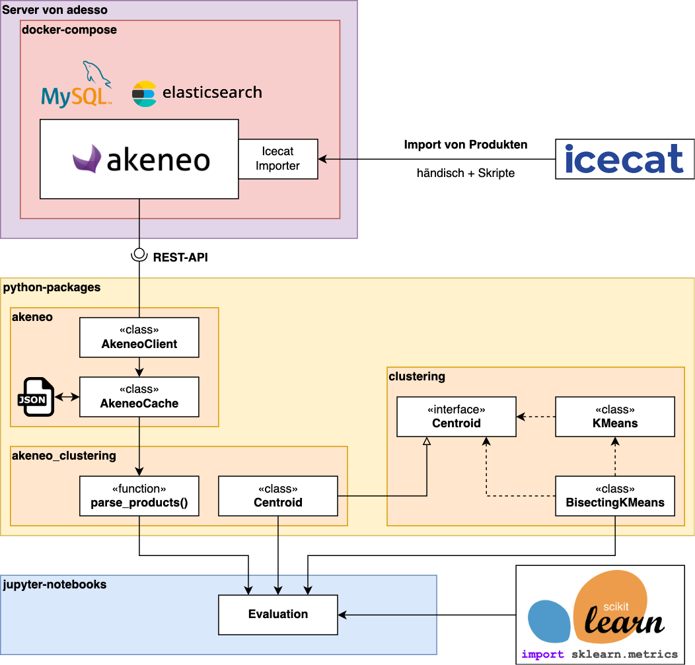

# Akeneo-PIM Clustering-Engine

## Hintergrund

In meiner Masterarbeit, die ich in Kooperation mit der adesso SE geschrieben habe, ging es um die Clusteranalyse von Produktdaten, wie sie in PIM-Systemen am Beispiel von Akeneo-PIM vorkommen. Clusteranalyse wurde in der Vergangenheit für verschiedene Anwendungen genutzt – bspw. bei Empfehlungsalgorithmen oder zur Verbesserung von Suchergebnisse. Genauere Detail dazu sind in der Masterarbeit nachzulesen.

Bevor man sich Gedanken über Anwendungen machen kann, muss aber vorher geklärt werden, ob und wie die Clusteranalyse mit Produktdaten durchführbar ist. Die Daten in Akeneo-PIM sind sehr komplex und weisen eine Vielzahl von Datentypen auf. Ebenso können an jeder Stelle fehlende Werte auftreten. All das können klassische Clustering-Verfahren und die typischen Implementierungen in gängigen Libraries nicht abdecken. Deshalb wurde im Rahmen der Masterarbeit ein Clustering-Verfahren entwickelt, welches für solche komplexeren Datenstrukturen geeignet ist.

Für genauere Details und Erläuterungen zu dem hergeleiteten Clustering-Verfahren sei in dem Zusammenhang auf die Masterarbeit verwiesen. Bei weiteren Rückfragen, kann man mich auch gerne kontaktieren.

Die gesamte Arbeit und alle praktischen Ergebnisse und Evaluationen befinden sich im folgenden Git-Repository:

<https://github.com/hd-code/ma-product-clustering>

Im folgenden wird dargelegt, wie das Projekt und das Repo aufgebaut ist. Außerdem werden Hinweise und Inspirationen für die Weiterentwicklung gegeben.

## Projektstand

### Überblick und Architektur

Auf einem Server von adesso wurde ein Instanz von Akeneo-PIM Community Edition in der Version 5.0 installiert. Dazu wurde der Weg mittels Docker-Installation gewählt. Die Instanz enthält außerdem das Plugin [Icecat Importer](https://marketplace.akeneo.com/extension/akeneo-icecat-connector). Anschließend sind Beispiel-Datensets für den Praxisteil von Icecat importiert worden.

Als nächstes wurde ein Python-Package geschrieben, welches aus verschiedenen Modules besteht:

- `akeneo` liefert zum einen die Klasse `Client`, welche die Verbindung zu Akeneo-PIM über die REST-Api aufbaut. Zum anderen können mit der Klasse `Cache` alle Endpunkte von Akeneo-PIM abgefragt und die JSON-Responses in JSON-Dateien zwischen gespeichert werden. Dadurch müssen die Daten nicht immerzu von Akeneo abgerufen werden.
- Das Module `clustering` enthält eine generische Implementierung des `KMeans` sowie des `BisectingKMeans`-Algorithmus. Sie arbeiten mit einer abstrakten `Centroid`-Klasse, welche den Mittelpunkt eines Clusters und deren Verhältnis zu den `Datapoint`s beschreibt. Diese Klasse muss implementiert werden, bevor geclustert werden kann.
- `akeneo_clustering` enthält nun eine solche Implementierung der `Centroid`-Klasse. Weitere Details dazu folgen später. Das Module enthält weitere Methoden wie z.B. `parse_products`, welche die Produkte aus dem `Cache` lädt und für das Clustering aufbereitet (z.B. werden numerische Attribute normalisiert, Lokalisierungen aufgelöst etc.)

Zuletzt erfolgt die Evaluation des Clustering-Verfahren auf dem Datenset mithilfe von Jupyter Notebooks. Diese sind wahrscheinlich für die Weiterentwicklung des Projektes nicht weiter von Belang.

### Ordnerstruktur

- `akeneo-pim` – Code für die Akeneo-PIM-Instanz
    - `data` – Volumes für MySQL und Elasticsearch. Dadurch bleiben die Daten auch über den Lebenszyklus der zugehörigen Container erhalten.
    - `pim` – Akeneo-PIM-Installation wie sie von der Akeneo-PIM Community Edition generiert wird. Enthält auch den "Icecat Importer"
    - `akeneo.sh` – Shell-Skript zum Starten, Stoppen, Refreshen etc. von Akeneo-PIM. Einfach das Skript ohne Argumente aufrufen, dann werden alle möglichen Befehle aufgelistet (`sh akeneo.sh`)
    - `README.md` – umfangreichere Anleitung für die Installation und den Betrieb der Akeneo-PIM-Instanz
- `cluster-analysis` – enthält das Python-Package und die Jupyter Notebooks
    - `src` – das Python-Package
    - `notebooks` – die Jupyter Notebooks
    - `data` – diverse Datendateien (CSV, JSON etc.) z.B. für das Cachen von Berechnungen etc.
    - `.env.example` – diverse Konfigurationen (z.B. die Daten der Akeneo-Api) werden über die Environment geladen. Alternativ kann die Config auch in einer `.env`-Datei hinterlegt werden. `.env.example` zeigt, wie die Konfigurationen aussehen müssen. Einfach diese Datei duplizieren, in `.env` umbenennen und die entsprechenden Configs eintragen.
    - `Pipfile` – alle Dependencies für Python und die Jupyter Notebooks. Diese Datei wird von dem Versionsverwaltungs-Tool [pipenv](https://pypi.org/project/pipenv/) benutzt.
    - `py.sh` – Shell-Skript für Aufgaben wie die Installation der Dependencies (setzt die vorherige Installation von pipenv voraus) oder das Durchführen aller Unit-Tests etc. Wenn das Skript ohne Argumente aufgerufen wird, dann erscheint eine Übersicht zu den möglichen Argumenten. (`sh py.sh`)
    - `README.md` enthält detailiertere Informationen zu diesem Ordner.
- `handover` enthält die Assets für dieses Dokument
- `skill` enthält einen Beitrag für eine wissenschaftliche Studierenden-Konferenz. Das Paper dort fasst das hergeleitete Clustering-Verfahren *Bisecting K-Prototypes* auf eine komprimierte Art zusammen. Eventuell ist das eine hilfreiche Referenz. Hier ist allerdings keine Beschreibung der Implementierung und nur eine verkürzte Form der Auswertung beschrieben.
- `thesis` enthält die Masterarbeit inklusive aller Bilder und sonstiger Ressourcen, die zur Generierung der finalen Version nötig gewesen sind.

### Branches

- `master` ist der Haupt-Branch, wo der letzte stabile Stand des gesamten Projektes zu finden ist.
- `adesso-vm` – hier wird lediglich `akeneo-pim` aktualisiert und gepflegt. Das ist also der Code, welcher auf dem Server von adesso ist.

Etwaige andere Branches können alle ignoriert werden.

### Details zur Implementierung des Clustering-Verfahrens

#### `akeneo/`

`Client` und `Cache` können aus den gesetzten Environment-Variable instanziiert werden. Das Module stellt dafür die Funktionen `create_client_from_env` und `create_cache_from_env`.

`Client` kommuniziert mit der Akeneo-Api. Alle Responses werden aber als generische Python-Strukturen zurückgegeben (also als `dict` oder `list`). `Cache` returned alle Akeneo-Datenstrukturen als spezielle `dataclass`es.

#### `clustering/`

Die Implementierung hier orientieren sich grob an der Umsetzung in [`scikit-learn`](https://scikit-learn.org/stable/modules/clustering.html#k-means). Sie sind aber nicht zwangsläufig auf höchste Effizienz optimiert. Auch fehlerhafte Aufrufe der Methoden werden nicht zwangsläufig korrekt abgefangen. Das könnte verbessert werden.

#### `akeneo-clustering/`

Die `Centroid`-Klasse hier implementiert das Interface und stellt damit die eigentliche Implementierung des Clustering-Verfahrens dar. Die Distanzfunktion ist separat mit der Funktion `distance(p1: Datapoint, p2: Datapoint) -> float` implementiert. Sie ist möglichst generisch gehalten und verarbeitet Datenpunkte folgenden Types: `Datapoint = NewType("Datapoint", dict[str, Union[float, str, set[str]]])`. Datenpunkte sind also ein `dict`, welche den Attribute-Code auf entweder einen `float`, `str` oder `set[str]` mappt. Diese Typen stehen also für numerische, kategorische und multi-kategorische Attributwerte.

Die Funktion `parse_products` extrahiert Produkte aus `akeneo.Cache`. Die Produkte können dabei nach Familie gefiltert werden. Ebenso können die zu verwendeten Attributtypen angegeben werden. Die Funktion löst außerdem die verschiedenen Lokalisierungen aus Akeneo auf. Ebenso werden hier die Strings tokenized und die numerischen Werte normalisiert. Die resultierenden Produkte entsprechen bereits fast dem `Datapoint`-Format.

Allerdings enthalten die Produkte nun noch die Einträge `__id__`, `__family__`, `__categories__`. Dies hat die Analyse in der Auswertung erleichtert. Allerdings kann das Clustering mit diesen Feldern nicht durchgeführt werden. Deswegen gibt es noch die Funktion `dataset_from_records`, welche diese Felder entfernt, sodass nur noch die für das Clustering geeigneten Felder übrig bleiben.

Zur Not einfach mal in die Jupyter Notebooks reinschauen, wie da alles aufgerufen wird für das Clustering.

## Ansätze für die Zukunft

### Empfohlene nächste Schritte

Ich würde die Software-Komponenten zunächst etwas vereinfachen. Zum Beispiel könnte `parse_products` so umgebaut werden, dass die zurückgegebenen Produkte direkt für das Clustering verwendet werden können. Dazu könnte man die `distance`-Funktion anpassen, sodass die die Felder `__id__`, `__family__`, `__categories__` einfach ignoriert. Bzw. eigentlich reicht es ja auch nur die `__id__` in den Produkten zu behalten. Man kann sie ja danach wieder den Originalen Datensätzen in Akeneo-PIM zuordnen. Auf jeden Fall fällt dann die Funktion `dataset_from_records` weg.

Außerdem würde ich vielleicht das Clustering-Verfahren überarbeiten. Anstatt eine "generische" Implementierung zu verwenden, könnte man das Verfahren direkt in den Ablauf von `KMeans` integrieren. Ebenso sollten noch Eingabefehler abgefangen werden. Mein Ziel bei dieser Implementierung war maximale Flexibilität. Nun im Nachhinein kann das vereinfacht und effizienter gemacht werden.

Als letzter Punkt wäre zu erwähnen, dass man vielleicht das caching der Daten aus Akeneo-PIM weglassen könnte. Also zum Beispiel `akeneo.Client` so umarbeiten, dass dieser direkt die `dataclass`es zurückgibt, statt den Umweg über den `akeneo.Cache` zu gehen. Vielleicht aber auch nicht. Hängt sicher etwas von den weiteren Rahmenbedingungen ab.

### Ideen

Was nun folgt, sind eher einige Ideen, die nicht unbedingt sinnvoll sein müssen.

#### Server-Anwendung mit GUI

Schön wäre, wenn die ganze Anwendung in eine Server-Anwendung gewrappt wird. Der Server könnte dann ein Frontend zur Verfügung stellen, womit Clusterings in verschiedenen Varianten durchgeführt werden kann. Hier ein paar Ideen zu möglichen Screens und was man auf diesen machen kann.

##### Screen: Connection

Hier wird die Verbindung zur Akeneo-Api konfiguriert. Also man kann hier Server-Adresse und die Credentials hinterlegen und die Verbindung testen.

##### Screen: Clustering konfigurieren

Hier konfiguriert man das Datenset, welches man clustern möchte und wie. Dabei müssten mehrere Aspekte konfiguriert werden können:

- **Produkt-Auswahl**: also welche Produkte sollen für das Clustering ausgewählt werden. Hier sind verschiedenste Filter denkbar. Zum Beispiel nach "ProductFamily", alle Produkte, die ein bestimmtes Attribut aufweisen usw.
- **Attribut-Auswahl**: welche der Attribute sollen für das Clustering verwendet werden. Das könnten auch wieder verschiedene Filter sein: nach Attribut-Typ, durch händische Auswahl der Attribute etc. Eventuell könnte hier noch die Verarbeitungsart der Attribute gewählt werden (also zum Beispiel ob multi-kategorische Attribute in einfache umgewandelt werden sollen oder nicht)

##### Screen: Clustering-Ergebnis

Hier erfolgt die Visualisierung des Clustering-Ergebnisses. Was man hier genau anzeigt, hängt sicher davon ab, was einen interessiert. Problematisch ist hier die "Multi-Dimensionalität" des Clustering. Also es gibt viele Ebenen von Informationen, die nicht in einer Grafik dargestellt werden können.

Einige Ideen dazu könnten sein:

- Dendrogramm der Produkte
- Auswahl der Menge an Clustern => Auflisten der Produkte sortiert nach den zugeordneten Clustern
- Clustering Metriken wie der Silhouettenkoeffizient, Errorwerte über die Hierarchieebenen der Cluster etc.

Hier würde aus auch sicher Sinn machen, die Ergebnisse und die Konfigurationen des Clustering zu diesen Ergebnisse irgendwie exportieren zu können.

#### Duplikat-Erkennung

Das ist vielleicht eine der interessantesten Anwendungen. Grundsätzlich gibt die `distance`-Funktion ja den "Abstand" zweier Produkte an zwischen 0 (deckungsgleich) und 1 (maximal verschieden). Eine automatische Duplikat-Erkennung wird damit nicht möglich sein. Aber man könnte in einem Datenset zum Beispiel nach Produktpaaren filtern, die nur einen sehr geringen Abstand zueinander haben (z.B. <0,001). Diese könnte man dann flaggen als potenzielle Duplikate, sodass ein Mensch schneller diese Paare findet und bewerten kann, ob es tatsächlich Duplikate sind oder nicht.
