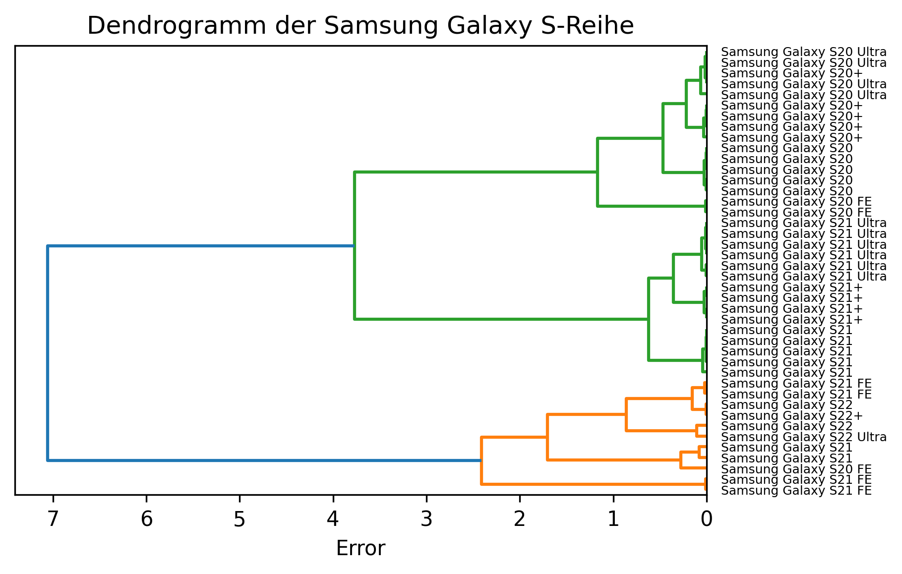

# Einleitung & Motivation

Die Clusteranalyse ist ein Verfahren des maschinellem Lernens, bei dem in einem Datenset nach "Ähnlichkeitsgruppierungen" gesucht wird [@papp2019 Kap. 5.2.3 Unüberwachtes Lernen]. Die einzelnen Objekte eines Datensets werden dabei von einem Clustering-Algorithmus in Gruppen sortiert, "[...] sodass sich die Individuen innerhalb einer Gruppe auf eine Art und Weise ähnlich sind und unähnlich denen in anderen Gruppen" [@king2015 Kap. 1.1 What Is a Cluster?]. Mit Hilfe dieser gefundenen Gruppen oder Cluster können im Anschluss neue Erkenntnisse und Anwendungen abgeleitet werden. [@papp2019, Kap. 5.2.3 Unüberwachtes Lernen]

Speziell im Bereich E-Commerce wurde die Clusteranalyse z.B. für die Entwicklung von Empfehlungsalgorithmen verwendet ([@oh2019], [@cui2021] und [@kumar2001]). Ebenso gibt es eine interessante Arbeit von Kou und Lou [@kou2012], welche mithilfe von Clusteranalyse die Suchergebnisse einer Web-Suchmaschine verbesserten.

Inspiriert durch diese Ansätze beschäftigte sich der Autor nun mit der Frage, ob es sinnvolle Anwendungen für die Clusteranalyse im Zusammenhang mit Product-Information-Management-Systemen (PIM-Systemen) gibt. Dabei handelt es sich um spezielle IT-Systeme, welche i.d.R. im Zentrum der Architektur von E-Commerce-Unternehmen zu finden sind. Sie fungieren als zentraler Produktkatalog (Single Source of Truth) für die Verwaltung, Speicherung, Anreicherung und Aufbereitung von Produktdaten. Aus diesen PIM-Systemen erfolgt die Bereitstellung des Produktsortiments für andere Anwendungen wie ERP-Systeme, die Bestellabwicklung oder das Marketing [@pimcore2021]. Mögliche Einsatzgebiete von Clustering könnten das automatische Kategorisieren von Produkten, Anomalie- und Duplikaterkennung, Anwendungen für die Produktempfehlung oder die Warenkorbanalyse sein.

Während der Recherche wurde aber deutlich, dass die Produktdaten in PIM-Systemen nicht für die klassischen Verfahren der Clusteranalyse geeignet sind. Typische Vertreter wie der K-Means-Algorithmus arbeiten nur mit Datensets, die aus numerischen Vektoren bestehen [@huang1998]. Produkte in PIM-Systemen weisen hingegen deutlich komplexere Strukturen auf. So gibt es Werte wie Single- und Multi-Select-Felder, Freitext-Attribute oder Produktbilder. Außerdem sind Produktdaten in der Praxis durchzogen mit fehlenden Werten (`null`-Values), was etablierten Clustering-Bibliotheken Probleme bereitet. [@sklearn2022]

Dadurch verschob sich der thematische Schwerpunkt: Ziel war es nun zuerst ein Clustering-Verfahren zu entwickeln, welches mit Produktdaten in PIM-Systemen umgehen kann und sinnvolle Cluster auf diesen generiert. Dabei entstand ein neuartiger Ansatz: *Bisecting K-Prototypes*. Im folgenden wird dieses Verfahren hergeleitet und seine Eigenschaften dargelegt. Anschließend erfolgt eine praktische Evaluation mit einem entsprechenden Datenset.

# Clusteranalyse

## Notation & Überblick

Die Objekte, welche es zu clustern gilt, werden im folgenden als *Datenpunkte* bzw. *Produkte* bezeichnet. Mathematisch betrachtet, handelt es sich bei einem Datenpunkt um einen Vektor. Jedes Element im Vektor steht für die Wertausprägung eines spezifischen Attributes (z.B. Preis, Titel, Gewicht etc.). Mittels Superskript werden spezifische Attribute eines Datenpunktes angesprochen. $x^i$ bezeichnet also das $i$-te Attribut von $x$.

Die Produkte oder Datenpunkte sind Teil eines *Datensets* $X$. Hierbei handelt es sich um eine simple Menge dieser Datenpunkte $x \in X$. Mittels Subskript werden einzelne Punkte des Sets angesprochen (z.B. $x_1$, $x_2$ oder $x_i$). Wenn nicht anders angegeben, gilt $n=|X|$.

Für die Einteilung des Datensets in Cluster muss nun die "Ähnlichkeit" zwischen den Datenpunkten in irgendeiner Form quantifiziert werden. Dies erfolgt über die Berechnung der "Nähe" (engl. proximity) der Objekte zueinander. Dazu werden sog. Abstands- bzw. Distanzmaße verwendet. [@kaufman2009, Kap. 1.2 Types of Data and How to Handle Them]

Der Abstand zwischen zwei Datenpunkten wird hier mit $d(x_1,x_2)$ bezeichnet. Der kleinstmögliche Abstand ist $0$, was absolute Deckungsgleichheit der Punkte signalisiert (daher ist $d(x_1,x_1) = 0$). Je größer der berechnete Abstand, desto unähnlicher sind sich die beiden Datenpunkte. Es existieren unzählige verschiedene Abstandsmaße, welche für unterschiedliche Arten und Typen von Daten geeignet sind. Für ausschließlich numerische Vektoren kommen z.B. Maße aus der Minkowski-Familie wie der euklidische Abstand oder der Manhattan-Abstand zum Einsatz. [@kaufman2009 Kap. 1.2 Types of Data and How to Handle Them]

## Clustering-Verfahren

Mithilfe einer geeigneten Distanzfunktion generiert ein Clustering-Verfahren nun eine Cluster-Zuteilung des Datensets $X$. Es existieren unzählige verschiedene Verfahren. Die meisten lassen sich grundsätzlich in partitionierende und hierarchische Verfahren unterteilen. [@kaufman2009 Kap. 1.3 Which Clustering Algorithm to Choose]

### Partitionierende Verfahren

Partitionierende Verfahren teilen ein Datenset in eine vorher festgelegte Anzahl an Cluster (i.d.R. als $k$ bezeichnet) und jeder Datenpunkt gehört schließlich zu genau einem der Cluster. [@kaufman2009 Kap. 1.3.1 Partitioning Methods]

Eines der bekanntesten Verfahren dieser Kategorie ist der *K-Means-Algorithmus*, welcher häufig als Inbegriff der Clusteranalyse selbst gilt [@huang1998]. Jedes Cluster wird in diesem Verfahren durch einen Mittelpunkt oder Centroid repräsentiert. Dieser Mittelpunkt ist kein tatsächlicher Punkt des Datensets [@steinbach2000]. Stattdessen berechnet sich jeder Attributwert aus dem Durchschnitt (engl. mean) der Werte der Cluster-Mitglieder für das jeweilige Attribut. [@king2015 Kap. 4.5 K-Means Algorithm]

Steinbach et al. [@steinbach2000] beschreiben den grundsätzlichen Ablauf dieses Algorithmus wie folgt:

1. zufällige Wahl von $k$ Punkten aus dem Datenset als initiale Mittelpunkte
2. Zuordnung aller Datenpunkte des Datensets zum jeweils nächstgelegen Mittelpunkt (mittels einer Distanzfunktion – klassisch: euklidischer Abstand)
3. Neuberechnung aller Mittelpunkte aus den Durchschnitten der zugeordneten Datenpunkte
4. Wiederholung der Schritte 2 und 3; solange bis sich die Cluster-Zuordnungen nicht mehr verändern oder ein Höchstlimit an Iterationen überschritten ist

Der große Vorteil dieser Verfahren ist eine lineare Laufzeit von $\mathcal{O}(n)$ [@huang1998]. Nachteilig ist, dass die gesuchte Anzahl an Clustern vorher bekannt sein muss und jeder Datenpunkt nur genau einem Cluster zugeordnet sein kann. [@kaufman2009 Kap. 1.3.1 Partitioning Methods]

Um den K-Means auch auf gemischte (numerische und kategorische) Datensets anwenden zu können, entwickelte Huang [@huang1998] den *K-Prototypes-Algorithmus*. Dieser arbeitet grundsätzlich wie der K-Means. Zur Berechnung der Cluster-Mittelpunkte wird aber für die kategorischen Attribute nicht der Durchschnitt, sondern der Modus – also der am häufigsten auftretende Wert – verwendet. Für die Berechnung des Abstands zwischen Mittel- und Datenpunkten wird eine kombinierte Abstandsfunktion genutzt:

\begin{equation}
    d(x_1,x_2) = d_{num}(x^{num}_1,x^{num}_2) + w \cdot d_{cat}(x^{cat}_1,x^{cat}_2)
\end{equation}

Die numerischen und kategorischen Werte werden also separat mit einer jeweils geeigneten Abstandfunktion verarbeitet und die Ergebnisse addiert. Über den Faktor $w$ lässt sich die Gewichtung beider Abstände zueinander regeln. [@huang1998]

### Hierarchische Verfahren

Hierarchische Verfahren produzieren eine ineinander verschachtelte Struktur von Clustern. Diese Cluster werden entweder nach dem Top-down- oder Bottom-up-Ansatz generiert [@kaufman2009 Kap. 1.3.2 Hierarchical Methods]:

- *Bottom-up- oder agglomerative Verfahren* starten mit jedem Datenpunkt in einem eigenen Cluster. Anschließend werden die beiden nächstgelegenen Cluster zu einem größeren kombiniert. Dieser Prozess wird solange wiederholt bis im letzten Schritt die beiden verbliebenen Cluster zu einem großen verschmolzen werden, welches also alle Datenpunkte enthält.
- *Top-down- oder divisive Verfahren* arbeiten genau andersrum. Sie starten mit allen Datenpunkten in einem Cluster. Anschließend wird immer wieder das größte der verbleibenden Cluster in zwei kleinere aufgesplittet, bis schließlich jeder Datenpunkt seinem eigenen Cluster zugeordnet ist.

Durch dieses Vorgehen wird faktisch eine Cluster-Zuteilung für jede mögliche Anzahl an Clustern ($1 \leq k \leq n$) generiert. Jeder Datenpunkt gehört dadurch mehreren Clustern auf den unterschiedlichen Hierarchieebenen an, was sehr umfangreiche Analysen der Cluster erlaubt [@dogan2022]. Eine alternative Visualisierung der Ergebnisse besteht in Form einer Baumstruktur – einem sog. Dendrogramm. [@steinbach2000]

{width=33%}

Der größte Nachteil dieser Verfahren ist die Laufzeit. Für die meisten Verfahren liegt diese bei mindestens $\mathcal{O}(n^2)$ und reicht teilweise bis zu $\mathcal{O}(n^3)$. [@dogan2022]

Deshalb entwickelten Steinbach et al. [@steinbach2000] den *Bisecting K-Means-Algorithmus*. Dabei handelt sich um ein Top-down-Clustering-Verfahren, welches für den Split eines größeren Clusters in zwei kleinere den K-Means mit $k=2$ benutzen. Da es nur beim ersten Split ein Cluster mit allen Datenpunkten gibt und in allen folgenden Splits die Cluster immer weniger Datenpunkte enthalten, bestimmt dieser erste Split die Laufzeit des Verfahrens, welche dadurch linear $\mathcal{O}(n)$ ist.

# Bisecting K-Prototypes

## Herleitung

Für die beschriebenen möglichen Anwendungen der Clusteranalyse in PIM-Systemen sind hierarchische Verfahren zu bevorzugen. Aufgrund der Cluster-Hierarchie lassen sich hieraus umfangreichere Erkenntnisse aus den Ergebnissen ableiten [@dogan2022]. Außerdem entfällt eine vorherige Bestimmung der erwarteten Anzahl an Clustern, wie sie partitionierende Verfahren benötigen.

Gleichzeitig ist die quadratische oder noch schlechtere Laufzeit vieler hierarchischer Verfahren problematisch. Produktkataloge umfassen gerne mehrere tausend oder sogar einige Millionen Produkte, sodass die Laufzeit nicht ins Unermessliche steigen kann.

Der naheliegendste Ansatz besteht nun darin, den Bisecting K-Means-Algorithmus zu verwenden. Allerdings kann dieser nur numerische Vektoren verarbeiten. Grundsätzlich können natürlich kategorische Werte in numerische umgewandelt werden (z.B. durch Nummerierung also Rot = 1, Grün = 2, Blau = 3). Jede Form von solchen Umwandlungen verzerren und verfälschen aber das Datenset (in diesem Beispiel würden sich rote und blaue Produkte stärker voneinander unterscheiden als rote und grüne). Daher wäre es besser ein Clustering-Verfahren zu nutzen, welches entsprechend mit gemischten Daten umgehen kann. [@kaufman2009 Kap. 1.2.6 Mixed Variables]

Schließlich wurde zur Lösung die Grundidee des Bisecting K-Means mit dem K-Prototypes-Algorithmus kombiniert. Das Clustering erfolgt also nach dem Ablauf des Bisecting K-Means, allerdings wird für den Zweier-Split eines großen Clusters in zwei kleineren stattdessen der K-Prototypes-Algorithmus verwendet. Das daraus resultierende Verfahren *Bisecting K-Prototypes* ist ein hierarchisches Top-down-Clustering-Verfahren für gemischte Datensets mit linearer Laufzeit. Diese Kombination der beiden Ansätze ist so noch nicht in der Literatur beschrieben worden und neuartig.

## Erweiterungen

### fehlende Werte

Mit dem Bisecting K-Prototypes lassen sich bereits sehr viele Attribute der Produkte in PIM-Systemen für das Clustering verwenden. Klassische Implementierungen von Clustering-Verfahren können allerdings nicht mit fehlenden Werten umgehen [siehe diverse Python-Libraries wie @apache2022bikmeans; @nicodv2022; @sklearn2022]. Füllt man diese allerdings mit einem Pseudowert, so werden die Datensets wieder entsprechend verzerrt. In PIM-Systemen kommen außerdem häufig Produkte aus den verschiedensten Kategorien mit sehr unterschiedlichen Attributen vor. Dadurch werden die meisten Produkte in den meisten Attributen keinen Wert aufweisen. Eine gesonderte Betrachtung von fehlenden Werten ist also vonnöten.

Die folgende Formel zeigt die Distanzfunktion, welche für das Clustering verwendet wurde:

\begin{align}
    d(x_1, x_2) &= \frac{\sum d'(x_1^i, x_2^i)}{|x_1^{\text{non }null} \cup x_2^{\text{non }null}|} \\
    d'(x_1^i, x_2^i) &= \begin{cases}
        0 &, x_1^i \text{ is } null \wedge x_2^i \text{ is } null \\
        1 &, x_1^i \text{ is } null \vee x_2^i \text{ is } null \\
        |x_1^i - x_2^i| &, i \text{ is } numerical \\
        0 &, i \text{ is } categorical \wedge x_1^i = x_2^i \\
        1 &, i \text{ is } categorical \wedge x_1^i \neq x_2^i
    \end{cases}
\end{align}

Für numerische Attribute empfiehlt sich eine Normalisierung der Werte, damit alle Attribute in etwa das gleiche Gewicht zueinander haben [@kaufman2009 Kap. 1.2.1 Interval-Scaled Variables]. Die Werte werden also auf das Interval $[0,1]$ skaliert. Der Abstand wird nun mittels Manhatten-Abstand berechnet und liefert damit ebenfalls Abstände im Interval $[0,1]$.

Die kategorischen Attribute werden nach dem Prinzip des Simple Matchings verarbeitet. Weisen beide Produkte den gleichen Wert auf, so wird $0$ und im Falle von Ungleichheit $1$ addiert.

Attribute, in denen beide Produkte keinen Wert aufweisen, werden ignoriert. Für jedes Attribut, wo nur eines der beiden Produkte einen Wert aufweist, wird die maximale Distanz von $1$ addiert.

Die gesamte Summe wird schließlich durch die Anzahl an Attributen geteilt, in denen mindestens eines der Produkte einen Wert aufweist. Dadurch liegt der Abstand zweier Produkte als ganzes ebenfalls im Interval $[0,1]$. Dieses Vorgehen ist durch den Jaccard-Koeffizienten inspiriert, welche für asymmetrische binäre Attribute verwendet wird und ebenfalls die Attribute ignoriert, wo beide Werte $false$ sind [siehe @kaufman2009 Kap. 1.2.4 Binary Variables]

### Multi-kategorische Attribute

Eine weitere Form von Attributen in PIM-Systemen sind sog. Multi-Select-Felder. Das sind Attribute, wo eine Liste an Auswahlmöglichkeiten definiert wird. Anschließend kann für ein Produkt ein oder mehrere dieser Optionen ausgewählt werden. Dies könnte z.B. die Farbe sein, da Produkte auch mehrfarbig sein können.

Diese Attribute könnten zum einen in einfache kategorische Attribute umgewandelt werden, indem die gewählten Optionen sortiert und mittels Kon­ka­te­na­ti­on verbunden werden. Dadurch würden sich aber zwei Produkte, die z.B. $\{\text{Rot}\}$ und $\{\text{Rot},\text{Grün}\}$ sind, maximal voneinander unterscheiden.

Daher wurde ein alternativer Ansatz erdacht und die Distanzfunktion wie folgt erweitert:

\begin{equation}
d'(x_1^i, x_2^i) = \begin{cases}
    ... \\
    1 - \frac{|x_1^i \cap x_2^i|}{|x_1^i \cup x_2^i|} &, i \text{ is } multi-categorical
\end{cases}
\end{equation}

Diese multi-kategorischen Attribute werden mit einem "inversen Jaccard-Koeffizient" verrechnet. Normalerweise wird der Jaccard-Koeffizient zur Bewertung der Ähnlichkeit zweier Produkte als ganzes verwendet. Hier wird für jedes multi-kategorische Attribut der Jaccard-Koeffizient für die Werte des jeweiligen Attributes einzeln berechnet und aufaddiert.

Dieses Vorgehen ist ebenfalls neuartig und wird mit dem alternativen Vorgehen (Umwandlung in einfache kategorische Attribute) im praktischen Teil verglichen werden.

### String-Attribute

Schließlich gibt es noch Freitext-Felder in den Produktdaten wie z.B. den Produkttitel. Dies sind keine klassischen kategorische Werte, da kaum ein Wert dem anderen gleicht. [@rajalingam2011]

Zur Verarbeitung werden die Strings zunächst in Tokens zerlegt (Tokenization), ihre Endungen entfernt (Stemming) und schließlich Stop-Words entfernt (Stop-Word-Removal). Das alles sind typische Verarbeitungsschritte aus dem Document Retrieval [@cohen2003]. Aus einem Titel wie "Samsung Galaxy S20 128GB" wird nun $\{\text{samsung}, \text{galaxi}, \text{s20}, \text{128gb}\}$.

Durch die Umwandlung in Tokens, sind die String-Attribute equivalent zu den multi-kategorischen Attributen und können mit dem gleichen Verfahren verarbeitet werden.

Mit den hergeleiteten Erweiterungen können nun fast alle Arten von Attributen in PIM-Systemen für das Clustering verwendet werden.

# Experimentelle Überprüfung

## Überblick

Für die praktische Evaluation ist Akeneo-PIM [@akeneo2022about] (ein Open-Source PIM-System mit weiter Verbreitung) verwendet worden. Dieses System wurde mit Produkten aus dem sehr umfangreichen Online-Katalog Icecat [@icecat2021] gefüllt, wo Hersteller aus der ganzen Welt ihre Produktdatenblätter für die Verteilung an Händler hochladen.

Anschließend wurde das hergeleitete Clustering-Verfahren implementiert. Nun wurde das Datenset geclustert, wobei verschiedene Kombinationen an Attributen für das Clustering verwendet worden sind. Diese Clustering-Ergebnisse wurde schließlich mittels einiger Metriken evaluiert und bewertet.

## Datenset

Es wurden 42 Smartphones der Samsung Galaxy S-Reihe importiert. Dabei waren 17 Smartphones der Generation S20, 21 der Generation S21 und 4 der Generation S22 vertreten. Es wurden sowohl Modelle der Produktausführungen Standard, Plus und Ultra sowie einige Modelle der sog. Fan Edition (FE) importiert.

Die Smartphones zeichnen sich durch ein große Menge an verschiedenen Attributen der unterschiedlichsten Typen aus. Die folgende Tabelle gibt eine Übersicht dazu:

| Typ | Anzahl | Ø non-`null` | Ø unique | Beispiele |
|---|-:|-:|-:|------|
| numerisch   | $56$ | $21.8$ | $3.7$ | Weight, Width, Depth, Height |
| kategorisch |$106$ | $28.2$ | $1.3$ | OS installed, SIM Card Type |
| multi-kat.  | $22$ | $25.2$ | $3.5$ | Product Color, 3G standards |
| String      | $11$ | $28.4$ |$13.5$ | Title, Description |
| *alle:*     |*195* | *25.9* | *2.9* | |
: Übersicht zu den Attributen der 42 Smartphones

Die Spalte "Anzahl" zeigt, wie viele Attribute je Typ vorkommen. Die numerischen und kategorischen Attribute dominieren hierbei das Datenset.

Die Spalte "Ø non-`null`" zeigt, wie viele der 42 Produkte im Schnitt in diesem Typ einen Wert aufweisen. Es kommen also fast so viele fehlende wie gefüllte Werte vor.

Die Spalte "Ø unique" gibt an, wie viele verschiedene Wertausprägungen im Schnitt in der jeweiligen Attributart vorkommen. Die Strings weisen hierbei die höchste Menge an unterschiedlichen Werten auf, was in der Natur dieses Types liegt. Aufgrund des recht kleinen Datensets mit vielen ähnlichen Produkten, ist die Variation an Werten eher überschaubar.

## Evaluation & Metriken

Für die Bewertung des Clustering-Verfahrens sind eine ganze Reihe von Metriken verwendet worden, welche die Arbeitsweise des Verfahrens überprüfen:

Die **Stabilität** zeigt die Übereinstimmung der Clustering-Ergebnisse von zehn verschiedenen Durchläufen des Bisecting K-Prototypes. Da das Verfahren mit zufälligen Startpunkten arbeitet, sind die Ergebnisse von zwei Durchläufe nicht immer deckungsgleich. Ein sinnvolles Clustering-Verfahren sollte aber dennoch einen gewissen Determinismus aufweisen. Die Übereinstimmung der Clusterings wurde mittel Adjusted-Rand-Index [@hubert1985] berechnet. Er liefert Werte zwischen $-1$ und $1$ und je näher der Wert an der $1$ liegt, desto höher ist die Übereinstimmung zweier Cluster-Zuteilungen.

Die **Qualität** wird mittels des Silhouetten-Koeffizienten [@rousseeuw1987] gemessen. Er berechnet den durchschnittlichen Abstand der Datenpunkte zu den Punkten im selben Cluster im Verhältnis zu den Punkten des unmittelbar benachbarten Clusters. Auch hier können Werte zwischen $-1$ und $1$ entstehen. Je näher an $1$, desto besser sind die Cluster voneinander getrennt.

Mit der **Erkennung** wird geprüft, ob das Clustering-Verfahren die inhärenten Strukturen des Datensets erkennen kann. Die Smartphones stammen aus drei verschiedenen Generationen und es gibt elf verschiedene Modelle (unter Berücksichtigung der Generationen). Auf der Hierarchiestufe $k=3$ sollten also die Smartphones der gleichen Generationen im gleichen Cluster landen. Ebenso bei $k=11$ für die Smartphone-Modelle. Die Übereinstimmung der Cluster-Zuteilung mit den erwarteten wurde mittels Adjusted-Rand-Index berechnet.

Schließlich befinden sich im Datenset sechs Paare an **Duplikaten** – also faktisch das gleiche Produkt unter verschiedenen Ids. Ein sinnvolles Clustering-Verfahren sollte die Duplikate stets in die gleichen Cluster sortieren und erst am Ende beim allerletzten Split die Duplikate schließlich voneinander trennen. Ist dies der Fall, so wird ein Duplikate als erfolgreich erkannt gezählt.

# Auswertung

Die folgende Tabelle zeigt die Ergebnisse des Clustering für verschiedene (ausgewählte) Kombinationen an Attributen. Im Versuch "Strings" sind nur die String-Attribute für das Clustering benutzt worden – bei "num+kat" entsprechend die numerischen und kategorischen Attribute. Alle weiteren Versuche (mit "+" beginnend) haben die numerischen und kategorischen um multi-kategorische (mul) oder die String-Attribute (str) erweitert. Der Versuch "mul_k" zeigt die Ergebnisse, wenn die multi-kategorischen Attribute nicht nach dem hergeleiteten Verfahren verarbeitet, sondern in einfache kategorische Attribute umgewandelt werden.

| Versuch | Stabilität | Qualität | | | Erkennung | | Duplikate |
|--|-:|-:|-:|-:|-:|-:|-:|
| | | *Ø* | $k=3$ | $k=11$ | $k=3$ | $k=11$ | |
| Strings   | 0.91 | 0.34 | 0.26 | 0.40 | 0.64 | **0.87** | **6 / 6** |
| num+kat   | **0.98** | **0.43** | 0.31 | **0.60** | **0.65** | 0.71 | 5 / 6 |
| +mul      | **0.98** | 0.41 | **0.37** | 0.57 | 0.16 | 0.70 | 5 / 6 |
| +mul_k    | 0.97 | 0.40 | 0.30 | 0.53 | 0.52 | 0.68 | 5 / 6 |
| +str      | **0.98** | 0.41 | 0.30 | 0.58 | **0.65** | 0.66 | 5 / 6 |
| +mul+str  | 0.92 | 0.39 | 0.35 | 0.56 | 0.16 | 0.70 | **6 / 6** |
: Ergebnisse des Clustering

Die Stabilität und die Erkennung von Duplikaten erreicht für alle Versuche sehr hohe Werte.

Die Erkennung von Smartphone-Generationen ($k=3$) ist mit Werten zwischen $0.16$ und $0.65$ eher mittelmäßig. Abbildung \ref{fig:result} zeigt das Dendrogramm zum Clustering mit numerischen und kategorischen Attributen. Hier wird deutlich, dass die Trennung in die Generationen S20 und S21 sehr gut funktioniert. In der Gruppe mit den S22-ern (orange) finden sich hingegen auch Smartphones, die nicht in diese Generation gehören.

Die Erkennung der Smartphone-Modelle ($k=11$) funktioniert mit Werten zwischen $0.66$ und $0.87$ wesentlich besser. Perfekt ist diese Zuteilung nicht. Allerdings weisen die importierten Daten aus Icecat nicht die höchste Datenqualität auf. Mit einem hochwertigeren Datenset könnten sich diese Ergebnisse noch einmal verbessern.

Die Qualität ist einmal als Durchschnitt für alle möglichen Werte von $k$ gegeben sowie für die beiden relevanten Hierarchiestufen. Sie liegt in allen Versuchen eher in mittelmäßigen Bereichen zwischen $0.26$ und $0.60$. Dies könnte daran liegen, dass sich die Produkte des Datensets insgesamt ziemlich ähnlich sind (alle vom gleichen Hersteller, recht geringe Anzahl an verschiedenen Wertausprägungen), sodass die Abstände zwischen den Clustern eben nicht sehr groß und gut getrennt ausfallen können.

Auffällig bei den Versuchen ist, dass die ausschließliche Verwendung von numerischen und kategorischen Attributen auf fast allen Metriken die besten Werte liefert. Die Hinzunahme von multi-kategorischen und String-Attributen hingegen verschlechtert diese Ergebnisse wieder.

Die Verarbeitung der multi-kategorischen Attribute nach dem hergeleiteten Verfahren (+mul) bringt etwas besser Stabilität und Qualität als die Umwandlung in einfache kategorische Attribute (+mul_k). Die Erkennung der Generationen hingegen ist mit dem hergeleiteten Verfahren drastisch schlechter. Die Modelle werden dann wiederum etwa gleich gut erkannt. Insgesamt haben die multi-kategorischen Attribute keinen positiven Einfluss auf das Clustering. Eine klare Überlegenheit des hergeleiteten Verfahrens zur Umwandlung in einfache kategorische Attribute ist ebenfalls nicht erkennbar.

Die String-Attribute mit den numerischen und kategorischen Attributen zu kombinieren verschlechtert die Clustering-Ergebnisse. Werden allerdings nur die String-Attribute verwendet, so liefern sie adäquate Cluster. Zwar ist die Qualität dieser Cluster im Vergleich sehr schlecht, aber vor allem die Erkennung und die Duplikate erreichen etwas bessere Werte als die Kombination aus numerischen und kategorischen Attributen. Dies lässt sich dadurch erklären, dass z.B. im Produkttitel die wesentlichen Informationen des Produkten komprimiert – wenn auch unstrukturiert – hinterlegt sind. 

# Fazit und Ausblick

In diesem Paper wurde ein neuartiges effizientes hierarchisches Clustering-Verfahren für gemischte Datensets hergeleitet: *Bisecting K-Prototypes*. Das Verfahren wurde entsprechend erweitert, um ohne großartige Verzerrung der Daten mit fehlenden Werten (`null`-Values) umgehen zu können.

In der anschließenden praktischen Evaluation zeigte sich, dass das Verfahren tatsächlich funktioniert und sinnvolle Cluster für ein Datenset mit recht komplexen Datenpunkten (Smartphones mit über 100 verschiedenen Attributen) finden kann.

Es ist außerdem eine Erweiterung des Verfahrens für sog. multi-kategorische Attribute vorgestellt worden, welche sich ebenfalls für String-Attribute verwenden lässt. In der praktischen Evaluation hat die Hinzunahme dieser Attributtypen die Cluster allerdings nicht verbessert. Die Verwendung der simplen numerischen und kategorischen Attribute allein brachte die besten Ergebnisse. Allerdings liefert das Clustering mit ausschließlicher Verwendung der String-Attribute ebenfalls recht adäquate Ergebnisse. U.U. ist das hergeleitete Verfahren besonders für die Verarbeitung von Datensets geeignet, welche aus Freitext-Feldern bestehen. Hier könnte zukünftige Forschung anknüpfen.

Es ist wichtig zu beachten, dass das verwendete Datenset für die Evaluation sehr klein gewesen ist und eine sehr beschränkte Auswahl an Produkten enthalten hat. Alle Ergebnisse dieser Arbeit sind also bestenfalls als vorläufig anzusehen und sollten in Zukunft mit weiteren Datensets überprüft werden. Speziell sollte dabei geprüft werden, ob die multi-kategorischen Attribute in anderen Datensets einen positiven Einfluss auf das Clustering haben und welche Variante der Verarbeitung dabei bessere Ergebnisse liefert.

Weitere Versuche in der Zukunft könnten den Bisecting K-Prototypes mit alternativen Verfahren vergleichen. Im Speziellen wäre hier ein Vergleich der nötigen Vorverarbeitungen der Datensets für die verschiedenen Verfahren und deren Einfluss auf die Cluster-Ergebnisse interessant.

Erweisen sich diese Versuche ebenfalls als erfolgreich, so könnte mit dem Bisecting K-Prototypes ein solides, effizientes und vor allem flexibles Verfahren für das hierarchische Clustern einer Vielzahl von Datensets gefunden worden sein.
