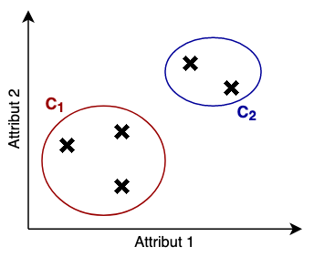
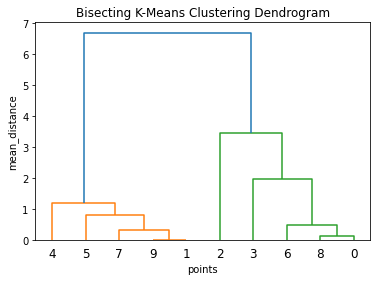

# Clusteranalyse

## Begriff und Einordnung

King definiert die *Clusteranalyse* als die "[...] Generierung eines Klassifizierungsschemas, welches Individuen in eine feste Anzahl an Gruppen einteilt, so dass sich die Individuen innerhalb einer Gruppe auf eine Art und Weise ähnlich sind und unähnlich denen in anderen Gruppen" [@king2015, Kap. 1.1 What Is a Cluster?]. Diese Gruppen werden auch als Cluster bezeichnet.

Die Objekte, welche es zu clustern gilt, werden in dieser Arbeit auch als *Datenpunkte* oder *Produkte* (da dies die Anwendung im Praxisteil ist) bezeichnet. Mathematisch werden sie i.d.R. mittels $x$ definiert. Diese Produkte bestehen aus einer festen Menge an Attributen (z.B. Farbe, Gewicht etc.). Mathematisch ist so ein Datenpunkt als ein Vektor definiert und jedes Element im Vektor steht für die Wertausprägung eines spezifischen Attributes. Mittels Superskript werden spezifische Attribute eines Datenpunktes angesprochen. $x^i$ bezeichnet also das $i$-te Attribut von $x$.

\begin{equation}
  x=(a | a \text{ is attribute})
\end{equation}

Die Produkte oder Datenpunkte sind Teil eines *Datensets* $X$. Hierbei handelt es sich um eine simple Menge dieser Datenpunkte $x \in X$. Mittels Subskript werden einzelne Punkte des Sets angesprochen (z.B. $x_1$, $x_2$ oder $x_i$). Wenn nicht anders angegeben, gilt $n=|X|$.

Als *Cluster* $C$ wird nun eine Teilgruppe aus dem Datenset bezeichnet: $C \subset X$. Allerdings können Cluster auch "hierarchisch" strukturiert sein. D.h. ein Cluster kann sowohl Datenpunkte als auch andere Cluster enthalten.

\begin{equation}
  C = \{e | e = C_i \vee e \in X\}
\end{equation}

Die *Menge aller Cluster* wird mit $K = \{C_1, C_2, ...\}$ bezeichnet. Dabei wird die Anzahl der Cluster mit $k=|K|$ angegeben.

Schlussendlich gibt es noch das *Clustering-Ergebnis* $Y$. Dies ist ein Vektor der Länge $n$, welches jeden Datenpunkt im Set einem entsprechenden Cluster zuordnet.

\begin{equation}
  Y = (l | l_i = \text{ label for } x_i \in X)
\end{equation}

Dieser Prozess des Clusterings ist eine Methode des *unüberwachten Lernens (unsupervised learning)* – einem Teilgebiet des maschinellen Lernens. Papp et al. schreiben dazu: "Machine Learning beschäftigt sich mit der Entwicklung von Methoden, die Modelle von Zusammenhängen aus Daten erlernen, anstatt sie *per Hand* zu implementieren" [@papp2019, Kap. 5 Statistik-Grundlagen]. Unüberwachtes Lernen bedeutet dabei, dass die verwendeten Daten nicht im Vorhinein gekennzeichnet sind (Unlabeled Data). Stattdessen werden Ähnlichkeiten und Muster in den Daten selbst gesucht ohne eine vorgegebene Zielgröße. Häufig dienen diese Analysen als erste Schritte der *Data Exploration*, aus denen im Anschluss neue Erkenntnisse und Anwendungen abgeleitet werden. [@papp2019, Kap. 5.2.3 Unüberwachtes Lernen]

## Distanz- und Ähnlichkeitsmaße

### Definition

Die Forderung, dass Objekte in gleichen Clustern sich "ähnlich" sein sollen und unähnlich zu den Objekten in anderen Clustern, muss in irgendeiner Form quantifiziert werden. Dies erfolgt über die Berechnung der "Nähe" (engl. proximity) der Objekte zueinander. Dazu werden sog. Abstands- bzw. Distanzmaße verwendet. [@kaufman2009, Kap. 1.2 Types of Data and How to Handle Them]

{width=40%}

Mathematisch wird dieses Distanzmaß mittels der Funktion $d(x_1,x_2)$ (engl. distance) definiert, welche die Distanz zwischen zwei Datenpunkten $x_1$ und $x_2$ als skalaren Wert zurückgibt. Zusätzlich geben Kaufmann und Rousseeuw folgende Eigenschaften für $d$ an [@kaufman2009, Kap. 1.2.1 Interval-Scaled Variables]:

||||
|-|---------------------------|------------------------------------------------|
| 1. | $d(x_1,x_2) \geq 0$ | Distanzen sind stets positiv |
| 2. | $d(x_1,x_1) = 0$ | die Distanz eines Objektes zu sich selbst ist $0$ |
| 3. | $d(x_1,x_2) = d(x_2,x_1)$ | die Distanzfunktion ist kommutativ bzw. symmetrisch |
| 4. | $d(x_1,x_3) \leq d(x_1,x_2) + d(x_2,x_3)$ | Distanzen geben stets den kürzesten Weg an |
: Eigenschaften der Abstandfunktion $d$

Anstatt des Abstandes kann alternativ auch die Ähnlichkeit zweier Objekte berechnet werden. Solche Ähnlichkeitsmaße $s(x_1,x_2)$ (engl. similarity) sind häufig im Intervall $[0;1]$ angegeben, wobei $1$ die maximale Ähnlichkeit angibt. Ist nun eine entsprechende Distanzfunktion z.B. durch Normalisierung ebenfalls im Intervall $[0;1]$ definiert, so können Distanzen und Ähnlichkeiten einfach ineinander überführt werden [@kaufman2009, Kap. 1.2.3 Similarities]:

\begin{equation}
  d(x_1,x_2) = 1 - s(x_1,x_2)
\end{equation}

Distanzen und Ähnlichkeiten sind dadurch beliebig austauschbar. Daher ist dieses Vorgehen stets empfehlenswert.

Es existieren eine Vielzahl an Distanz- und Ähnlichkeitsmaßen. Welche zur Anwendung kommen, hängt maßgeblich von den Attributen und vor allem den Attributtypen ab, aus denen die Datenpunkte bestehen. [@kaufman2009, Kap. 1.2 Types of Data and How to Handle Them]

### Numerische Attribute

Numerische Attribute sind im Allgemeinen alle Arten von (rationalen) Zahlen [@kaufman2009, Kap. 1.2 Types of Data and How to Handle Them] mit stetigen (engl. continuous) Werten [@huang1998]. Es kann sich dabei sowohl um Intervall- als auch um Verhältnisskalen handeln (engl. interval and ratio data). [@boslaugh2012, Kap. 1 Basic Concepts of Measurement]

Datenpunkte, die nur aus numerischen Attributen bestehen, sind die klassischste Form von Daten, mit denen Clusteranalyse durchgeführt wird. Die meisten Algorithmen und Verfahren sind damit speziell auf diesen Attributtyp ausgelegt. [@king2015, Kap. 1.2 Capturing the Clusters]

#### Minkowski-Familie

Der Abstand zwischen reinen numerischen Vektoren wird mittels Maßen aus der sog. Minkowski-Familie berechnet. Das älteste dieser Metriken ist der *euklidische Abstand* (auch pythagoreische Metrik genannt), welcher den Abstand zwischen zwei Punkten über eine gerade Linie zwischen diesen beiden bestimmt. Im 19. Jahrhundert verallgemeinerte Hermann Minkowski dieses Maß zu einer ganzen Familie. [@cha2007]

| Name | $p$-Norm | Formel |
|--|-|---|
| allgemeine Form | | $d(x_1,x_2) = \sqrt[p]{\sum_{i=1}^n |x_1^i - x_2^i|^p}$ |
| Manhattan-Abstand | $p=1$ | $d(x_1,x_2) = \sum_{i=1}^n |x_1^i - x_2^i|$ |
| euklidischer Abstand | $p=2$ | $d(x_1,x_2) = \sqrt{\sum_{i=1}^n |x_1^i - x_2^i|^2}$ |
| Chebyshev-Abstand | $p=\infty$ | $d(x_1,x_2) = \max |x_1^i - x_2^i|$ |
: Übersicht über die gängigen Maße aus der Minkowski-Familie [@cha2007]

Die allgemeine Form ist über den Ausdruck $p$ parametrisiert. Die konkreten Vertreter der Familie kommen nun durch ein spezifisch gewähltes $p$ zustande. Daher wird bei diesen Maßen auch von der sog. $p$-Norm gesprochen. Eine höhere $p$-Norm steht dabei im Allgemeinen für eine robustere bzw. eindeutigere Bestimmung des Abstandes. [@king2015, Kap. 12.3 Which Proximity Measure Should Be Used?]

Dies sind bei weitem nicht alle Arten von Maßen für numerische Attribute. Cha [@cha2007] hat eine Vielzahl solcher Maße zusammengetragen, analysiert und miteinander verglichen. Dabei kam er zu folgenden Erkenntnissen:

Die meisten dieser Maße sind Abwandlungen eines Vertreters aus der Minkowski-Familie bzw. lassen sich auf einen solchen abbilden (z.B. basieren einige Maße auf der Pearson-Korrelation, welche ihrerseits wiederum auf dem euklidischen Abstand beruht). In seinen anschließenden Versuchen zeigte er, dass Maße, die auf einander basieren, auch stets ähnliche Abstände liefern. [@cha2007]

Daraus lässt sich ableiten, dass die Vertreter der Minkowski-Familie ausreichend sind, um den Abstand numerischer Vektoren zu bestimmen.

#### Vorverarbeitung

Häufig macht eine Vorverarbeitung der numerischen Attribute Sinn, um verschiedene Arten von Problemen zu vermeiden. [@kaufman2009, Kap. 1.2.1 Interval-Scaled Variables]

##### Logarithmische Attribute

Die Abstandsmaße der Minkowski-Familie gehen i.d.R. von linearen Verhältnissen der Zahlen zueinander aus (Punkte mit einem Abstand von $2$ sind doppelt so weit entfernt, wie Punkte mit einem Abstand von $1$). Es kann aber vorkommen, dass die vorliegenden Daten eigentlich einen logarithmischen Zusammenhang aufweisen (der Abstand von $10$ zu $20$ ist exakt gleichbedeutend mit dem Abstand von $100$ zu $200$). Damit die Abstandsmaße richtig arbeiten können, sollten solche Attribute vorher in eine lineare Abbildung überführt werden [@kaufman2009, Kap. 1.2.5 Nominal, Ordinal, and Ratio Variables]. Dies wird folgendermaßen bewerkstelligt:

\begin{equation}
  x'^i = \log x^i
\end{equation}

##### Standardisierung

Weitere Probleme können entstehen, wenn die absoluten Werte in den verschiedenen Dimensionen der Vektoren stark voneinander abweichen. Angenommen, das Datenset besteht aus zwei-dimensionalen Vektoren. Die Werte in der ersten Dimension liegen im Bereich $[0;1]$ und in der zweiten im Bereich $[100;200]$. Dadurch würden die Unterschiede zwischen den Werten in der zweiten Dimension viel stärker ins Gewicht fallen, da hier die Differenzen zwischen den Werten bis zu $100$ Mal höher ausfallen. Um eine Gleichgewichtung zu erzeugen, sollten diese Attribute jeweils auf die gleiche Art standardisiert werden. [@kaufman2009, Kap. 1.2.1 Interval-Scaled Variables]

Milligan und Cooper [@milligan1988] haben eine Vielzahl solcher Methoden der Standardisierung analysiert und experimentell miteinander verglichen.

\begin{equation}
\label{eqn:zscore}
  x'^i = \frac{x^i - \textrm{avg }X^i}{\sigma(X^i)}
\end{equation}

Die Formel \ref{eqn:zscore} zeigt die Standardisierung mittels des klassischen z-Wertes. Die auftretenden Werte werden dadurch auf die $0$ zentriert und mit einer Varianz von $1$ drumherum verteilt. Dieses Maß ist besonders anfällig für Outliers (stark von der Hauptmenge abweichende Werte). In Milligan und Coopers Versuchen schnitt es daher eher mittelmäßig ab. [@milligan1988]

\begin{align}
   x'^i &= \frac{x^i - \textrm{avg }X^i}{\textrm{mad }(X^i)} \\
  mad(X^i) &= \frac{1}{n} \sum_j |x^i_j - \textrm{avg }X^i|
\end{align}

Kaufmann und Rousseeuw empfehlen eine modifizierte Form des z-Wertes nach Hartigan [@hartigan1975]. Statt durch die Standardabweichung $\sigma(X^i)$ zu teilen, wird durch die mittlere absolute Abweichung (engl. *mean absolute deviation*) $mad(X^i)$ dividiert. Dieses Vorgehen soll den Einfluss von Outliern dämpfen. [@kaufman2009, Kap. 1.2.1 Interval-Scaled Variables]

\begin{equation}
  x'^i = \frac{x^i - \min X^i}{\max X^i - \min X^i}
\end{equation}

Eine weitere Methode ist die Skalierung aller Werte auf das Intervall $[0;1]$. Obwohl Outliers bei dieser Methode ebenfalls die restlichen Werte in einen kleineren Bereich komprimieren, war dieser Ansatz in Milligan und Coopers Versuchen äußerst robust und lieferte über alle Versuche akzeptable Ergebnisse. [@milligan1988]

Kaufmann und Rousseeuw geben zu bedenken, dass die unterschiedlichen Gewichtungen der Werte echte Zusammenhänge der realen Welt widerspiegeln könnten. Durch Standardisierung gehen diese entsprechend verloren. Weiterhin ist sogar denkbar, bewusst einige Attribute stärker zu gewichten als andere (indem sie mit entsprechenden Gewichten multipliziert werden). Dies sind allerdings eher speziellere Fälle, in denen im Vorfeld bereits Domänenwissen zum Datenset vorliegen muss. [@kaufman2009, Kap. 1.2.1 Interval-Scaled Variables]

### Kategorische Attribute

Kategorische Attribute bilden die zweite große Gruppe von Attributtypen. Sie zeichnen sich dadurch aus, dass als Wertausprägungen Labels verwendet werden, die verschiedene Kategorien repräsentieren. Diese Labels können in Form von Zeichenketten (z.B. "red", "green", "blue"), Bool-Werten ($true$/$false$, Ja/Nein, $0$/$1$) oder auch diskreten Ziffern auftreten. Es ist eine weitere Unterscheidung in die zwei Teilgruppen ordinale und nominale Attribute möglich. [@boslaugh2012, Kap. 5 Categorical Data]

#### Ordinale Attribute

Lassen sich die vorkommenden Labels eines Attributes in eine sinnvolle Reihenfolge bringen (z.B. "XS", "S", "M", "L", "XL"), so werden sie als *ordinal* bezeichnet. Wichtig dabei ist, dass nur eine sinnvolle Reihenfolge besteht. Eine Aussage über die Intervalle zwischen den Labels ("XS" zu "S" ist genauso weit wie "M" zu "L") oder über deren quantitativen Verhältnisse ($3\cdot$"XS" $=2\cdot$"S") macht aber keinen Sinn. [@boslaugh2012, Kap. 1 Basic Concepts of Measurement]

Für die Berechnung des Abstandes gibt es grundsätzlich zwei Möglichkeiten: Zum einen können ordinale Attribute genauso wie nominale verarbeitet werden (siehe nächster Abschnitt). Zum anderen kann die Reihenfolge der Labels verwendet werden, um die Labels in numerische Werte umzuwandeln. Anschließend kann der Abstand mittels der Maße für numerische Attribute berechnet werden. [@kaufman2009, Kap. 1.2.5 Nominal, Ordinal, and Ratio Variables]

Die Umwandlung erfolgt dabei so, dass die Labels entsprechend ihrer natürlichen Reihenfolge – beginnend mit $1$ – nummeriert werden. Der finale numerische Wert berechnet sich dann wie folgt:

\begin{equation}
  x'^i = \frac{x^i - 1}{|\{x \in X^i\}| - 1}
\end{equation}

$|\{x \in X^i\}|$ ist dabei die Menge an auftretenden Labels. Dadurch liegen alle Werte erneut im Intervall $[0;1]$, welches in $|\{x \in X^i\}| - 1$ gleichmäßige Schritte unterteilt ist. [@kaufman2009, Kap. 1.2.5 Nominal, Ordinal, and Ratio Variables]

#### Nominale Attribute

Die Verarbeitung von nominalen Attributen geschieht über die vorherige Umwandlung in sog. binäre Attribute. Diese Attribute sind dadurch gekennzeichnet, dass sie nur zwei verschiedene Werte annehmen können (i.d.R. $0$/$1$ bzw. $false$/$true$) [@kaufman2009, Kap. 1.2.5 Nominal, Ordinal, and Ratio Variables]. Hier gilt es zwei Fälle zu unterscheiden:

Kommen in den Labels eines Attributs maximal zwei verschiedene Werte vor (z.B. Ja/Nein, schwarz/weiß etc.), so werden diese in ein einzelnes binäres Attribut umgewandelt. Solche Attribute werden auch als *symmetrische* binäre Attribute bezeichnet. [@kaufman2009, Kap. 1.2.4 Binary Variables]

Bei mehr als zwei Wertausprägungen gibt es hingegen wiederum zwei Möglichkeiten:

- Zum einen können die vorkommenden Labels auf genau zwei verschiedene Wertausprägungen komprimiert werden, sodass wieder ein einzelnes binäres Attribut verwendet werden kann. Dieser Vorgang geht aber mit einem Informationsverlust einher. [@kaufman2009, Kap. 1.2.5 Nominal, Ordinal, and Ratio Variables]
- Zum anderen kann für jedes vorkommende Label ein eigenes binäres Attribut angelegt werden. Das Attribut, welches das tatsächlich vorkommende Label eines Datenpunktes repräsentiert, wird entsprechend auf $true$ gesetzt und alle anderen auf $false$. Diese Umwandlung resultiert in sog. *asymmetrische* binäre Attribute. [@kaufman2009, Kap. 1.2.4 Binary Variables]

Kennzeichnend für die symmetrischen binären Attribute ist, dass beide Wertausprägungen eine konkrete Eigenschaft des Objektes darstellen (z.B. $0=\text{schwarz}$ und $1=\text{weiß}$). Asymmetrische zeigen hingegen nur das Vorhanden- oder Nicht-Vorhandensein einer bestimmten Eigenschaft an und müssen stets im Kontext der gesamten Gruppe betrachtet werden. Für beide Arten gibt es jeweils eigene Distanzmaße. [@kaufman2009, Kap. 1.2.4 Binary Variables]

##### Simple Matching

Das sog. Simple Matching ist für die Bewertung der Ähnlichkeit von Objekten mit ausschließlich symmetrischen binären Attributen geeignet. [@kaufman2009, Kap. 1.2.4 Binary Variables]. Es berechnet sich wie folgt:

\begin{align}
  s(x_1, x_2) &= \frac{\sum_i^n s'(x_1^i, x_2^i)}{n} \\
  s'(x_1^i, x_2^i) &= \begin{cases}
    1 &, x_1^i = x_2^i \\
    0 &, x_1^i \neq x_2^i \\
  \end{cases}
\end{align}

Es wird also die Anzahl an Attributen, in denen beide Datenpunkte den gleichen Wert aufweisen, durch die Gesamtzahl der Attribute von $x_1$ und $x_2$ ($n$) geteilt. Es handelt sich damit um ein Ähnlichkeitsmaß im Intervall $[0;1]$, wobei die $1$ für perfekte Übereinstimmung steht. [kombiniert aus @huang1998; und @kaufman2009, Kap. 1.2.5 Nominal, Ordinal, and Ratio Variables]

Wenn in der Implementierung die Labels der Datenpunkte direkt auf Gleichheit bzw. Ungleichheit überprüft werden können (also $x_1^i = x_2^i$ und $x_1^i \neq x_2^i$), so kann die vorherige Umwandlung in binäre Attribute auch entfallen. [@kaufman2009, Kap. 1.2.5 Nominal, Ordinal, and Ratio Variables]

Es gibt von diesem Verfahren eine Reihe von Abwandlungen, welche die Ausprägungen bestimmter Wertekombinationen gesondert gewichten. Alle diese Varianten basieren im Kern auf dem Simple Matching und liefern stets ähnliche Ergebnisse. [@kaufman2009, Kap. 1.2.4 Binary Variables]

##### Jaccard-Koeffizient

Für die Bewertung der Ähnlichkeit von Objekten mit asymmetrischen binären Attributen eignet sich hingegen der Jaccard-Koeffizient besser [@kaufman2009, Kap. 1.2.4 Binary Variables]. Er berechnet sich wie folgt:

\begin{equation}
  s(x_1,x_2) = \frac{|x_1 \cap x_2|}{|x_1 \cup x_2|}
\end{equation}

Im Gegensatz zum Simple Matching werden hier alle Attribute, in denen beide Objekte den Wert $false$ aufweisen, ignoriert. Die Übereinstimmung wird nur mit den Attributen berechnet, wo wenigstens eines von beiden Objekten den Wert $true$ aufweist. [@kaufman2009, Kap. 1.2.4 Binary Variables]

Angenommen, für ein kategorisches Attribut treten im Datenset bis zu drei verschiedene Labels auf (z.B. "red", "green" und "blue"). $x_1$ hat das Label "red" und $x_2$ hat "blue". Nach der Umwandlung in binäre Werte wäre $x_1=(1,0,0)$ und $x_2=(0,0,1)$. Das Simple Matching würde nun eine Ähnlichkeit von $\frac{1}{3}$ berechnen, da beiden Objekten gemeinsam ist, dass sie *"nicht green"* sind. Bei asymmetrischen binären Attributen sind aber zwangsläufig mit steigender Anzahl an vorkommenden Labels die meisten Werte $0$ bzw. $false$. Dies treibt das Ergebnis vom Simple Matching künstlich in die Höhe, macht aber inhaltlich in diesem Kontext keinen Sinn. [@kaufman2009, Kap. 1.2.4 Binary Variables]

Auch hier ist die dargestellte Formel ohne eine vorherige Umwandlung in binäre Attribute nutzbar, sofern die Gleichheit und Ungleichheit zwischen den Labels direkt bestimmt werden kann. Bspw. beträgt für $x_1=(red, xl, up)$ und $x_2=(blue, xl, up)$ der Jaccard-Koeffizient $\frac{|\{xl, up\}|}{|\{red, blue, xl, up\}|} = \frac{1}{2}$. [@king2015, Kap. 9.2 ROCK]

### String-Attribute

Manche Autoren (z.B. [@rajalingam2011]) definieren eine weitere Gruppe sog. String-Attribute. Streng genommen sind dies ebenfalls nominale bzw. kategorische Attribute. Sie zeichnen sich aber durch eine hohe Variation an Werten aus, sodass häufig keine einzige Wertausprägung mehr als einmal vorkommt. Gleichzeitig sind String-Werte häufig zwar nicht exakt identisch, aber dennoch gibt es große Ähnlichkeiten zwischen ihnen. Ein klassisches Beispiel wäre der Produkttitel. Die Strings "Samsung Galaxy S20 128GB" und "Samsung Galaxy S20 256GB" sind "kategorisch-betrachtet" zwei komplett verschiedene Labels. Dennoch herrscht augenscheinlich eine hohe Ähnlichkeit zwischen diesen beiden Werten vor. Zur Quantifizierung dieser Übereinstimmung gibt es eine Reihe von verschiedenen Ansätzen.

#### String-Metrics

Eine Methode besteht aus dem Vergleich übereinstimmender Buchstaben zwischen zwei String-Werten. Dazu existieren eine Reihe sog. "String-Metriken" von verschiedenen Autoren. [@cohen2003]

Hamming [@hamming1950] entwickelte 1950 ein Verfahren zur Fehlererkennung binärer Codes. Es bildet die Grundlage des sog. *Hamming-Abstands*, welches sich später in abgewandelter Form im Bereich der String-Metrics als Distanzmaß etablierte [@rajalingam2011]. Der Hamming-Abstand ist die Anzahl an Buchstaben zwischen zwei Zeichenketten gleicher Länge, welche **nicht** identisch sind. Er kann nur zum Vergleich von Strings mit exakt identischer Anzahl an Buchstaben verwendet werden und liefert Abstände von $0$ bis $n$ (Anzahl an Buchstaben im jeweiligen String).

Ein Verfahren, welches auch für Strings unterschiedlicher Länge geeignet ist, ist der *Levensthein-Abstand*. Zur Berechnung wird gezählt, wie viele Buchstaben eingefügt, entfernt oder umgewandelt werden müssen, um einen String in den anderen umzuwandeln. Dabei wird stets die kleinstmögliche Zahl an Ersetzungen bevorzugt. Die Ergebnisse liegen damit ebenfalls zwischen $0$ (geringster Abstand, da kein einziger Schritt zur Umwandlung nötig ist) und $n$, was die Anzahl an Buchstaben des längeren Strings ist. Der Nachteil dieses Verfahrens ist die recht aufwendige Berechnung, da stets mehrere Arten der Buchstabentransformation durchgerechnet werden müssen, um die kürzeste Kette an Transformationen zu finden. [@rajalingam2011]

Mit deutlich weniger Rechenaufwand kommt die *Jaro-Metrik* [@jaro1995] aus. Sie berechnet sich aus der Menge an Buchstaben, welche in beiden Wörtern in der gleichen Reihenfolge vorkommen, zu der Menge aller Buchstaben je Wort (Dies ist eine verkürzte Darstellung. Siehe [@jaro1995] oder [@cohen2003] für die genaue Berechnung). Das Ergebnis gibt die Ähnlichkeit beider Strings zwischen $0$ (komplett unähnlich) und $1$ (maximale Übereinstimmung). [@cohen2003]

Eine Variante des eben erklärten Maßes ist die *Jaro-Winkler-Metrik*, welche eine etwas höhere Ähnlichkeit feststellt, wenn die ersten Buchstaben (Prefix) identisch sind. [@cohen2003]

In den Versuchen von Cohen [@cohen2003] lieferte der Jaro-Winkler-Abstand die besten Ergebnisse bei der Verwendung für das Clustering.

#### Tokenization

String-Metrics sind eher für den Vergleich kürzerer Zeichenketten geeignet. Für ganze Textzeilen und -blöcke werden eher Verfahren aus dem Document Retrieval angewandt. [@steinbach2000]

Wesentlich im Document Retrieval ist die Zerlegung eines Textes in die einzelnen Wörter, aus denen sich der Text zusammensetzt. Da in vielen Sprachen das gleiche Wort je nach Fall verschiedene Endungen (engl. stemming) aufweisen kann, werden diese Endungen häufig entfernt (z.B. mit Verfahren wie Porters Stemming Algorithmus). Ebenso weisen alle Sprachen kleine Füllwörter (z.B. Artikel, Bindewörter etc.) auf, die sehr häufig in eigentlich jedem Text vorkommen. Auch diese werden i.d.R. entfernt (engl. stop-word removal), da sie keine Relevanz für die Unterscheidung der Texte haben. Das Ergebnis ist eine Menge aus den Grundwörtern eines Textes, welche auch "Tokens" genannt werden. [@steinbach2000; und @cohen2003]

Nach dieser "Tokenization" können zwei Texte z.B. auf ihre Ähnlichkeit überprüft werden, indem man die auftretenden Token beider Texte miteinander vergleicht. Für die Berechnung können bereits erklärte Metriken wie der Jaccard-Koeffizient eingesetzt werden. Die Tokens repräsentieren dann "Kategorien" oder Themenfelder der Texte. [@cohen2003]

Eine andere Möglichkeit besteht darin, die Tokens in numerische Vektoren umzuwandeln. Jedes Element im Vektor repräsentiert eines der Token und der Wert des Elementes entspricht der Anzahl, wie häufig dieses Token im ursprünglichen Text vorkommt. Dieser Vorgang wird auch als Transformation der Texte in das *Vector-Space-Model* bezeichnet. [@steinbach2000]

Diese numerischen Vektoren können nun wie numerische Attribute verarbeitet werden. Allerdings existieren auch gesonderte Metriken speziell für den Bereich des Document Retrieval. Bspw. wird statt des euklidischen Abstandes häufig der *cosine-Abstand* zur Bestimmung der Distanz verwendet. [@steinbach2000]

\begin{equation}
  cosine(x_1,x_2) = \frac{|x_1 \cdot x_2|}{|x_1| \cdot |x_2|}
\end{equation}

### Gemischte Attribute

In einem Datenset können nicht nur Attribute des gleichen Types (z.B. ausschließlich numerisch) vorkommen. Gibt es Attribute mit unterschiedlichen Typen, so spricht man von gemischten Daten oder gemischten Attributen. Der Umgang mit diesen ist sehr vielfältig. [@kaufman2009, Kap. 1.2.6 Mixed Variables]

#### Umwandlung aller Attribute in den selben Typ

Eine der einfachsten Varianten besteht darin, alle Attribute in den gleichen Typ umzuwandeln. [@kaufman2009, Kap. 1.2.6 Mixed Variables]

##### Umwandlung in numerische Werte

Für ordinale Attribute ist diese Umwandlung bereits beschrieben worden. Nominale Attribute können in eine künstliche Reihenfolge gebracht werden, wodurch sie ihren ordinalen Brüdern gleichen und entsprechend umgewandelt werden können. Diese Transformation verzerrt u.U. die Daten, da nun z.B. "rote" und "grüne" Produkte als ähnlicher betrachtet werden als "rote" und "blaue" (aufgrund der künstlichen Reihenfolge). Nichtsdestotrotz kann dieses Verfahren gute Ergebnisse produzieren. [@kaufman2009, Kap. 1.2.6 Mixed Variables]

Die Transformation von String-Attributen in numerische Vektoren ist ebenfalls bereits dargelegt worden.

##### Umwandlung in kategorische Werte

Auch der umgekehrte Weg ist denkbar. Ordinale Attribute können als nominal betrachtet und verarbeitet werden. Ebenso können numerische Werte durch Diskretisierung in feste Gruppen oder Bänder eingeteilt werden (z.B. in Alterspannen "unter 18", "18-35" usw.). [@kaufman2009, Kap. 1.2.6 Mixed Variables]

Diese Umwandlung geht aber mit einem massiven Verlust an Informationen einher. Bspw. brachte die Diskretisierung numerischer Attribute in den Versuchen von Milligan und Cooper die schlechtesten Clustering-Ergebnisse. [@milligan1988]

#### Subspace-Clustering

Ein ganz anderer Ansatz besteht darin, das Clustering mehrmals durchzuführen, jeweils mit jedem Attributtypen separat. Anschließend werden die Ergebnisse verglichen und entsprechende Erkenntnisse abgeleitet. Allerdings ist hier der Interpretationsspielraum sehr groß, sodass i.d.R. andere Arten des Vorgehens empfehlenswerter sind. [@kaufman2009, Kap. 1.2.6 Mixed Variables]

Dieser Ansatz wird auch als *Subspace-Clustering* bezeichnet und kann sehr weit ausgeführt werden. So werden teilweise mehrmalige Clusterings mit verschiedenen Kombinationen an Attributen (beliebigen Types) durchgeführt und bewertet. Solche Ansätze sind sehr aufwendig sowohl in Sachen Laufzeit als auch in der Interpretation der eigentlichen Ergebnisse. [@jia2017]

#### Kombinierte Distanzfunktion

Schließlich besteht die Möglichkeit, verschiedene Distanzmaße zu kombinieren, die verschiedenen Attribute also mit einer Metrik ihres Types zu verrechnen und diese Ergebnisse anschließend zu addieren. [@kaufman2009, Kap. 1.2.6 Mixed Variables]

Ein geläufiges Beispiel ist das kombinierte Distanzmaß des [K-Prototypes-Algorithmus](#k-prototypes) [@huang1998], welches wie folgt definiert ist:

\begin{equation}
  d(x_1,x_2) = d_{num}(x^{num}_1,x^{num}_2) + w \cdot d_{cat}(x^{cat}_1,x^{cat}_2)
\end{equation}

Dieser Algorithmus kann numerische und kategorische Attribute gemeinsam verarbeiten. Die spezifischen Distanzmaße für jeden Attributtyp sind dabei frei wählbar (im Original: euklidisch für die numerischen und Simple Matching für die kategorischen). Der Faktor $w$ soll Unterschiede in der Gewichtung der Distanzmaße ausgleichen. So hat der euklidische Abstand umso höhere Werte, je mehr numerische Attribute vorkommen. Das Simple Matching hingegen liegt immer im Intervall $[0;1]$. [@huang1998]

## Clustering-Verfahren

### Partitionierendes Clustering

#### Überblick

Partitionierende Verfahren betrachten die Cluster-Zuteilung als ein Minimierungsproblem. Auf verschiedene Arten starten die jeweiligen Verfahren mit einer initialen Gruppierung der Datenpunkte. Anschließend werden die Cluster-Zuteilungen wiederholt verändert, bis ein lokales Optimum erreicht ist [@king2015, Kap. 4.1 Partition Clustering – Introduction]. Wichtig zu erwähnen ist, dass jeder Datenpunkt nur genau einem Cluster zugeordnet werden kann [@kaufman2009, Kap. 1.3.1 Partitioning Methods]. Die konkreten Verfahren unterscheiden sich dabei in der Art der Initialisierung der Cluster, dem genauen Ablauf der Minimierung sowie in der Definition, wann ein Clustering "besser" ist [@king2015, Kap. 4.1 Partition Clustering – Introduction]. Ebenso gibt es spezielle Verfahren für das Clustern von Daten, welche nicht ausschließlich numerisch sind. [@huang1998]

Kennzeichnend für diese Verfahren ist außerdem, dass die Anzahl der erwarteten Cluster im Vorfeld bekannt sein muss. Dies ist zum Teil problematisch, wenn kaum Informationen zum Datenset vorliegen. Eine mögliche Lösung ist das mehrmalige Clustern mit verschiedenen Werten für die Cluster-Anzahl. Anschließend kann mittels verschiedener Metriken (siehe Abschnitt [Cluster-Validität](#cluster-validität)) eine adäquate Cluster-Anzahl aus den Ergebnissen ausgewählt werden. Ebenso könnte zuerst ein [hierarchisches Clustering](#hierarchisches-clustering) zur Bestimmung der Cluster-Zahl durchgeführt werden. [@king2015, Kap. 4.1 Partition Clustering – Introduction]

Diese Verfahren neigen dazu, in lokalen Minima während des Clusterings hängen zu bleiben. Deswegen ist es empfehlenswert, das jeweilige Verfahren mehrmals mit unterschiedlichen Start-Partitionierungen durchzuführen und anschließend das "beste" Ergebnis aus diesen Durchläufen auszuwählen. Trotz der mehrfachen Durchläufe sind partitionierende Verfahren allgemein recht effizient in ihrer Laufzeit. Die Komplexität beträgt $\mathcal{O}(n \cdot k \cdot l)$. $n$ ist die Anzahl an Datenpunkten, $k$ die Menge an gesuchten Clustern und $l$ die mehrmalige Wiederholung des Verfahrens. $k$ und $l$ sind typischerweise recht kleine Werte, die auch mit steigender Anzahl von Datenpunkten im Datenset nicht zunehmen. Daher handelt es sich unterm Strich um eine lineare Laufzeit von $\mathcal{O}(n)$. [@huang1998]

#### K-Means

K-Means ist das bekannteste partitionierende Clustering-Verfahren und gilt häufig als Inbegriff der Clusteranalyse selbst. [@huang1998]

Jedes Cluster wird in diesem Verfahren durch einen Mittelpunkt $c$ repräsentiert. Dieser Mittelpunkt oder Centroid ist kein tatsächlicher Punkt des Datensets [@steinbach2000], sondern wird aus den Punkten des Clusters berechnet. Konkret wird für jedes einzelne Attribut der Durchschnitt (engl. mean) aus den Werten der Cluster-Mitglieder für das jeweilige Attribut gebildet [@king2015, Kap. 4.5 K-Means Algorithm]:

\begin{equation}
  c(C) = \frac{1}{|C|} \sum_{x_i \in C} x_i
\end{equation}

Durch das Verändern der Cluster-Zuordnungen ändern sich entsprechend auch die Mittelpunkte der Cluster. Ziel dieser Verschiebung ist, dass die Summe der Abstände der Datenpunkte zu ihrem jeweiligen Mittelpunkt minimal wird. Der Abstand wird mit einem Distanzmaß für numerische Attribute (meist der euklidische Abstand) berechnet. [@king2015, Kap. 4.5 K-Means Algorithm]

Dieses Verfahren funktioniert also ausschließlich mit numerischen Attributen, da nur hier aus den Werten ein Durchschnitt berechnet werden kann. [@huang1998]

Steinbach et al. [@steinbach2000] beschreiben den typischen Ablauf des Verfahrens folgendermaßen:

1. Wahl von $k$ Punkten aus dem Datenset als initiale Mittelpunkte
2. Zuordnung aller Datenpunkte des Datensets zum jeweils nächstgelegen Mittelpunkt (mit dem geringsten Abstand)
3. Neuberechnung aller Mittelpunkte aus den Durchschnitten der zugeordneten Datenpunkte (wodurch sich diese verschieben)
4. Wiederholung der Schritte 2 und 3; solange bis sich die Cluster-Zuordnungen nicht mehr verändern oder ein Höchstlimit an Iterationen überschritten ist

Die Wahl der initialen Punkte kann z.B. durch die Wahl der $k$ ersten oder letzten Punkte im Datenset geschehen. Ebenso möglich ist die Wahl jedes $\frac{n}{k}$-ten Punktes. Am geläufigsten ist wohl die komplett zufällige Wahl von Punkten aus dem Set. [@king2015, Kap. 4.3 The Initial Partition]

Zu diesem Basis-Verfahren gibt es eine große Vielfalt an Varianten und Abwandlungen. Bspw. muss die Neuberechnung der Mittelpunkte nicht erst am Ende eines Laufes durch das gesamte Datenset geschehen. Stattdessen können die Mittelpunkte auch unmittelbar, wenn ein neuer Punkt zum Cluster zugeordnet oder entfernt wird, aktualisiert werden. King [@king2015, Kap. 4.5 K-Means Algorithm] bezeichnet dieses alternative Vorgehen als *MacQueens-Methode*. Viele weitere Varianten sind in der Literatur beschrieben worden. Im folgenden wird nur eine kleine relevante Auswahl dessen präsentiert.

#### K-Medoids

Der K-Medioids ist eine Variante des K-Means-Algorithmus, bei dem die Centroids der Cluster tatsächliche Datenpunkte des Datensets sein müssen. Anstatt den Durchschnitt der jeweiligen Attribute aller Punkte im Cluster zu berechnen, werden die Abstände aller Punkte eines Clusters zueinander betrachtet. Der Punkt, welcher in der Summe den kleinsten Abstand zu allen anderen ausweist, muss zwangsläufig "mittig" im Cluster liegen. Fortan gilt dieser Punkt als Centroid des Clusters. Dieses Verfahren ist rechenaufwendiger als der normale K-Means. Allerdings konvergieren die Cluster häufig in weniger Durchläufen zu einem stabilen Optimum. Deshalb kann dieses Verfahren, auf den gesamten Ablauf betrachtet, dennoch Performance-Vorteile zum klassischen K-Means bringen. [@arora2016]

#### K-Modes

Der K-Modes verarbeitet ausschließlich kategorische Attribute – statt numerischen. Das Grundprinzip des K-Means bleibt bestehen. Als Distanzmaß muss eine entsprechend geeignete Metrik verwendet werden (im Original das Simple Matching). Außerdem erfolgt die Berechnung der Cluster-Mittelpunkte nicht über den Durchschnitt, da zwischen kategorischen Attributen kein Durchschnitt berechnet werden kann. Daher bilden sich die Centroids aus dem Modus (engl. mode), also dem am häufigsten auftretenden Label im jeweiligen Attribut. [@huang1998]

Dieser Algorithmus verwendet außerdem den MacQueens-Ansatz. D.h. dass sich der Modus für jedes Attribut direkt aktualisiert, wenn ein Objekt dem Cluster neu zugeordnet oder entfernt wird. Auch hier wird dieser Prozess mehrmals durchlaufen, solange bis sich die Cluster-Zuteilungen nach einem kompletten Durchlauf durch das Datenset nicht mehr verändert haben. [@huang1998]

#### K-Prototypes

Der K-Prototypes kombiniert den K-Means- und K-Modes-Algorithmus zum Clustern gemischter Datensets. Die Centroids berechnen sich entsprechend aus dem Durchschnitt der Werte numerischer und aus dem Modus der Werte kategorischer Attribute. Die Distanz wird mittels einer [kombinierten Distanzfunktion](#kombinierte-distanzfunktion) (siehe der entsprechende Abschnitt) berechnet. [@huang1998]

### Hierarchisches Clustering

#### Überblick

Hierarchische Verfahren produzieren eine ineinander verschachtelte Partitionierung der Datenpunkte in Cluster. Dabei werden zwei grundlegende Arten von Verfahren unterschieden [@steinbach2000; und @king2015, Kap. 3.1 Hierarchical Clustering – Introduction]:

- *Top-down- oder divisive Verfahren* beginnen mit einem Cluster, welches alle Datenpunkte enthält. Anschließend wird dieses Cluster in zwei kleinere Cluster aufgesplittet, danach werden die beiden resultierenden Cluster wiederum jeweils in zwei kleinere aufgeteilt usw. Dieses Verfahren wird fortgesetzt, bis nur noch Cluster übrig bleiben, die genau einen Datenpunkt enthalten.
- *Bottom-up- oder agglomerative Verfahren* starten exakt andersrum mit jeweils einem Cluster für jeden Datenpunkt. Anschließend werden immer wieder zwei Cluster zu einem größeren kombiniert, bis final ein Cluster entsteht, welches wiederum alle Datenpunkte enthält.

Das bedeutet, dass jeder Datenpunkt mehreren verschiedenen Clustern zugeteilt ist, je nachdem welche Stufe in der Hierarchie betrachtet wird. Alternativ können die Ergebnisse auch als Baumstruktur in einem sog. Dendrogram dargestellt werden. [@steinbach2000]

{width=50%}

Ein großer Vorteil von diesem Verfahren ist, dass die Anzahl an gesuchten Clustern nicht vorher bekannt sein muss. Stattdessen wird eine Cluster-Zuteilung für alle möglichen Cluster-Zahlen ($1 \leq k \leq n$) im Zuge der Berechnung ermittelt [@kaufman2009, Kap. 1.3.2 Hierarchical Methods]. Dadurch können die verschiedenen Hierarchieebenen mit geeigneten Metriken (siehe Abschnitt [Cluster-Validität](#cluster-validität)) bewertet und anschließend z.B. eine geeignete Cluster-Anzahl für die Durchführung eines partitionierenden Verfahrens ausgewählt werden. [@king2015, Kap. 4.1 Partition Clustering – Introduction]

Weiterhin bringt die hierarchische Struktur vielfältige Möglichkeiten der Analyse. So kann nicht nur festgestellt werden, welche Objekte in verschiedene Cluster sortiert werden, sondern auch welche der Cluster sich ähnlicher sind (aufgrund ihrer Position in der Hierarchie). Das Ermitteln von Outliern wird ebenfalls möglich, da diese meistens recht früh in der Hierarchie in ihr eigenes Cluster platziert werden. [@dogan2022]

Ein großer Nachteil dieser Verfahren ist, dass die Cluster-Zuteilungen im Laufe der Berechnung nicht mehr nachträglich korrigiert werden. Nachdem also zwei Datenpunkte in einem Top-down-Verfahren in verschiedene Cluster gesplittet worden sind, werden sie in den nachfolgenden Hierarchieebenen niemals wieder im selben Cluster landen (für Bottom-up-Verfahren gilt das gleiche entsprechend umgekehrt). Dies führt u.U. zu einer ungeeigneten Cluster-Zuteilung je nach betrachteter Hierarchieebene. [@kaufman2009, Kap. 1.3.2 Hierarchical Methods]

#### Agglomeratives Clustering (Bottom-up)

Wie bereits erklärt, beginnt das agglomerative Clustering mit jedem Datenpunkt in einem eigenen Cluster. Anschließend werden stets die beiden "am nächsten gelegenen" bzw. "ähnlichsten" Cluster zu einem größeren zusammengefasst. Dieser Prozess wird wiederholt, bis sich zum Schluss alle Datenpunkte in einem großen Cluster befinden. [@steinbach2000]

Von zentraler Bedeutung dabei ist die Frage, wie zwei Cluster miteinander auf ihre Ähnlichkeit untersucht werden. Für die vorkommenden Datenpunkte wird dazu ein geeignetes Distanz- oder Ähnlichkeitsmaß gewählt. Die Berechnung der Ähnlichkeit zwischen zwei Clustern (welche ja potenziell aus mehreren Punkten bestehen können) geschieht dann mit Hilfe sog. Fusionierungsverfahren (engl. linkage functions). Ein bekannter Vertreter ist z.B. der *Single-Link*, welcher den Abstand zwischen zwei Clustern über den Abstand der zwei am nächsten gelegenen Punkte der Cluster definiert [@dogan2022]. Nachfolgend sind einige typische Vertreter aufgelistet:

Single-Link
: $d(C_1,C_2) = \min_{x_i \in C_1, x_j \in C_2} d(x_i, x_j)$
: Abstand wird durch die beiden dichtesten Punkte definiert; neigt zur Bildung von langen Ketten (chaining effect); anfällig gegen Outlier

Complete-Link
: $d(C_1,C_2) = \max_{x_i \in C_1, x_j \in C_2} d(x_i, x_j)$
: Abstand wird durch die beiden am entferntesten liegenden Punkte definiert; neigt zur Bildung von vielen sehr kleinen Clustern; anfällig gegen Outlier

Average-Link
: $d(C_1,C_2) = \frac{1}{|C_1|} \frac{1}{|C_2|} \sum_{x_i \in C_1} \sum_{x_j \in C_2} d(x_i, x_j)$
: durchschnittlicher Abstand aller Punkte der beiden Cluster zueinander; ähnlich dem Mittelpunkt von k-Means, aber viel aufwendiger, da immerzu jeder Punkt eines Clusters mit jedem anderen Punkt der anderen Clustern verglichen werden muss

Centroid-Link
: $d(C_1,C_2) = d([\frac{1}{|C_1|} \sum_{x_i \in C_1} x_i],[\frac{1}{|C_2|} \sum_{x_j \in C_2} x_j])$
: Abstand der Mittelpunkte der Cluster zueinander (Berechnung des Mittelpunktes wie bei K-Means); ähnliches Verhalten wie Average-Link, aber effizienter zu berechnen, da der Mittelpunkt nur einmal pro Cluster berechnet werden muss

Ward-Methode
: $d(C_1,C_2) = \frac{|C_1| |C_2|}{|C_1| + |C_2|} d([\frac{1}{|C_1|} \sum_{x_i \in C_1} x_i],[\frac{1}{|C_2|} \sum_{x_j \in C_2} x_j])$
: berechnet die Zunahme der Varianz durch den jeweiligen Merge; neigt zur Bildung von kreis- oder kugelförmigen Clustern; recht effizient; anfällig gegen Outlier

Da für den Centroid-Link und die Ward-Methode die Mittelpunkte der Cluster gebildet werden müssen, sind diese Verfahren primär nur für numerische Datensets geeignet [@dogan2022]. Die Verwendung dieser Verfahren für gemischte Attribute (z.B. durch Verwendung des Modus für kategorische) ist in der Literatur nicht beschrieben worden.

Ein großer Nachteil dieser Verfahren ist die Laufzeit. Da im ersten Schritt jeder Datenpunkt mit jedem anderen verglichen werden muss (es sind ja zu Beginn $n$ Cluster), beträgt die Laufzeit immer mindestens $\mathcal{O}(n^2)$. Durch geschickte Implementierung kann diese Laufzeit auch für einige Verfahren (z.B. für Single- [@sibson1973] oder Complete-Link [@defays1977]) tatsächlich erreicht werden. Häufig liegen die Laufzeiten aber bei $\mathcal{O}(n^2 \log n)$ oder sogar $\mathcal{O}(n^3)$. [@dogan2022]

#### Divisives Clustering (Top-down)

##### Überblick

Divisives Clustering startet mit allen Datenpunkten in einem großen Cluster. Anschließend werden immer wieder Zweier-Splits der Cluster durchgeführt, bis final jeder Datenpunkt in genau einem eigenen Cluster platziert ist. [@kaufman2009, Kap. 6 Divisive Analysis (Program DIANA)]

Lange Zeit wurde dieser Ansatz des hierarchischen Clusterings ignoriert, da das Verfahren auf den ersten Blick sehr rechenintensiv erscheint. Im ersten Zustand, wenn alle Punkte in einem Cluster sind, gibt es theoretisch $2^n - 1$ verschiedene Möglichkeiten, dieses große Cluster in zwei kleinere zu teilen. Eine solche exponentielle Laufzeit könnte niemals für Datensets auch nur mittlerer Größe verwendet werden. Allerdings ist es nicht nötig alle dieses Splits zu betrachten und durchzurechnen. Mittlerweile gibt es einige Ansätze für diese Art von Clustering-Verfahren, welche dieses Problem geschickt umgehen. [@kaufman2009, Kap. 6 Divisive Analysis (Program DIANA)]

Außerdem zeigt die Praxis, dass Top-down-Clusterings i.d.R. bessere und intuitivere Cluster generiert. Der Grund ist vermutlich, dass wir Menschen beim Clustering per Hand automatisch eine Art Top-down-Denkweise an den Tag legen. [@king2015, Kap. 3.3 Agglomerative versus Divisive Clustering]

##### DIANA

*DIANA* steht für "divisive analysis" und wurde von Kaufman und Rousseeuw [@kaufman2009, Kap. 6 Divisive Analysis (Program DIANA)] nach einer Idee von Macnaughton-Smith et al. [@macnaughton1964] entwickelt.

Sie beschreiben den Ablauf über die Analogie einer politischen Partei, welche sich durch Meinungsverschiedenheiten aufsplittet. Zuerst tritt das Mitglied mit den größten Differenzen zum Rest der Partei aus derselbigen aus und gründet eine eigene. Anschließend entscheiden sich nach und nach die restlichen Mitglieder, ob sie ebenfalls "die Fronten wechseln" oder in der ursprünglichen Partei verbleiben wollen [@kaufman2009, Kap. 6 Divisive Analysis (Program DIANA)]. Aufgrund dieser Analogie wird das Verfahren auch als "Splitterpartei-Methode" bezeichnet [@rajalingam2011].

Konkret lässt sich das Verfahren von Kaufman und Rousseeuw, wie folgt beschreiben:

1. Start mit allen Punkten in einem großen Cluster
2. Berechnung des durchschnittlichen Abstandes jedes Datenpunktes zu den restlichen Punkten im Cluster
3. der Punkt mit der größten mittleren Abweichung verlässt das große Cluster und bildet ein neues
4. alle restlichen Punkte aktualisieren ihren durschnittlichen Abstand
5. die Punkte, deren durchschnittlicher Abstand zum Cluster größer ist als ihr Abstand zum neu herausgelösten (also der Splittergruppe), verlassen das ursprüngliche Cluster ebenfalls und werden dem neuen Cluster zugeordnet
6. Wiederholgung der Schritte ab 4., bis keine Punkte mehr das Cluster wechseln
7. aus den entstandenen Clustern wird das größte (mit dem größten Durchmesser) ausgewählt und die Schritte ab 2. wiederholt, bis jeder Datenpunkt in einem eigenen Cluster gelandet ist

Der *durchschnittliche Abstand* $md$ eines Datenpunktes $x_i$ zu den anderen Punkten $x_j$ im Cluster $C$ berechnet sich aus dem Durchschnitt der einzelnen Abstände zu den jeweils anderen Punkten. Diese Abstände werden mit einem geeigneten Distanzmaß berechnet. Damit ist dieses Verfahren für jede Art von Datentypen geeignet, zu denen auch ein Distanzmaß konzipiert werden kann. Mathematisch berechnet sich $md$ für den Datenpunkt $x_i \in C$, wie folgt:

\begin{equation}
  md(x_i, C) = \frac{1}{|C| - 1} \sum_{x_j \in C, x_i \neq x_j} d(x_i, x_j)
\end{equation}

Im Ablauf des Verfahrens ist von einem *Cluster-Durchschnitt* die Rede. Es dient zur Bestimmung, welches Cluster als nächstes geteilt werden soll. Der Clusterdurchschnitt $cd$ ist der Abstand der beiden Datenpunkte im Cluster, die am weitesten voneinander entfernt sind:

\begin{equation}
  cd(C) = \max_{x_i \in C, x_j \in C} d(x_i, x_j)
\end{equation}

Die genaue Laufzeit des Verfahrens ist nirgendwo beschrieben worden. Am maßgeblichsten müsste der Split des ersten großen Clusters für die Laufzeit sein. Hier werden initial alle Datenpunkte miteinander verrechnet, sodass mindestens eine Laufzeit von $\mathcal{O}(n^2)$ zustande kommt. Die nachfolgenden Splits sind zunehmend weniger aufwendig in der Berechnung, da die Cluster mit jedem Durchlauf kleiner werden. Dadurch sinkt die Menge an Datenpunkten, die miteinander verrechnet werden müssen, immer weiter ab.

Rajalingam und Ranjini [@rajalingam2011] verglichen die Performance einiger Bottom-up-Verfahren mit einem Top-down-Verfahren, welches dem beschriebenen DIANA entweder identisch oder sehr ähnlich ist. In ihren Versuchen war das Top-down-Verfahren fast doppelt so schnell in der Berechnung der Cluster.

##### Bisecting K-Means

Dieser Algorithmus wurde von Steinbach et al. [@steinbach2000] zum Clustern von Dokumenten entwickelt. Ihr ursprünglicher Plan war der Vergleich von agglomerativen Verfahren mit dem klassichen K-Means-Algorithmus. In diesem Prozess entwickelten sie die Idee für das divise Verfahren *Bisecting K-Means*.

Initial befinden sich wieder alle Datenpunkte in einem großen Cluster. Für den Split in zwei kleinere Cluster wird nun der klassische K-Means-Algorithmus mit $k=2$ ausgeführt. Aus den resultierenden kleineren Clustern gilt es nun, einen Kandidaten für den nächsten Split auszuwählen. Das kann das Cluster mit dem größeren Durchschnitt oder mit der höheren Anzahl an Datenpunkten sein (in ihren Versuchen ergab sich zwischen beiden Vorgehen kein Unterschied). Der Split wird wiederum durch K-Means mit $k=2$ ausgeführt usw. Das Verfahren endet, wie gewohnt, wenn alle Punkte in ihrem eigenen Cluster gelandet sind. [@steinbach2000]

Das Verfahren besticht durch seine Laufzeit $\mathcal{O}(n)$, welche durch den K-Means für den allerersten Split bestimmt wird. Alle folgenden Splits sind durch die kleinere Menge an Datenpunkten je Cluster zu vernachlässigen. [@steinbach2000]

## Cluster-Validität

### Überblick

Die Clusteranalyse selbst ist ein Verfahren des unüberwachten Lernens und findet interne Muster in Daten ohne Referenz zu externen Zuweisungen (Labels). Dennoch finden verschiedene Clustering-Verfahren unterschiedliche Gruppenzuteilungen. Auch die verschiedenen Parameter, die für ein jeweiliges Clustering-Verfahren gesetzt werden, beeinflussen das Ergebnis. Daher bedarf es Methoden zur Evaluation und Vergleich der Clusterings miteinander. [@rendon2011]

**Externe Indizes** (engl. External Indices) sind Metriken, welche die berechnete Gruppenzuteilung mit einer extern vorgegeben Zuteilung vergleicht. Das heißt, es gibt eine erwartete Art der Gruppierung, welche nicht Teil des Datensets selbst ist. Diese Indizes messen nun den Grad der Übereinstimmung zwischen berechnetem und gewünschten Clustering-Ergebnis. [@rendon2011]

**Interne Indizes** (engl. Internal Indices) messen die Qualität des Clusterings ohne externe Informationen. Die Cluster sollten möglichst "kompakt" gruppiert und die verschiedenen Gruppen "gut von einander getrennt" sein. Diese Indizes versuchen diese Anforderungen zu quantifizieren. [@rendon2011; und @king2015, Kap. 8.1. Cluster Validity – Introduction]

Die **Stabilität** ist ebenfalls ein wichtiger Faktor. Hierbei wird das Datenset mehrmals mit verschiedenen Modifikationen geclustert. Solche Modifikationen können die Änderung einzelner Werte oder das Weglassen ganzer Spalten sein. Ein "stabiles" Clustering erzeugt auch mit diesen Veränderungen ähnliche Ergebnisse. Für die konkrete Bewertung der Stabilität werden externe oder interne Indizes verwendet und ihre Ergebnisse über die verschiedenen Clusterings miteinander verglichen. [@king2015, Kap. 8.1. Cluster Validity – Introduction]

Manche Autoren (z.B. [@rendon2011] und auch [@king2015]) führen formal noch sog. **Relative Inidzes** an. Hiermit wird die Performance verschiedener Clustering-Verfahren und verschiedener Meta-Parameter der Clusterings über das gleiche Datenset verglichen. In der Praxis erfolgt dies aber stets über den Vergleich der externen oder internen Indizes der Clustering-Ergebnisse miteinander.

### External Indices

#### Überblick

Zur Bewertung der Übereinstimmung zweier Clustering-Ergebnisse können grundsätzlich Metriken aus dem Bereich der Klassifikation verwendet werden [@hubert1985]. Beispiele dafür wären Maße wie die Entropie oder ihr Gegensatz die Reinheit (engl. purity), welche analysieren, wie viele falsche zu richtigen Zuordnungen innerhalb einer Klasse aufgetreten sind [@rendon2011]. Ebenso das F-Maß (engl. F-Measure), welches aus dem Bereich des Document Retrievals bekannt ist. Es simuliert durchgeführte "Suchen" und vergleicht die gefundenen mit den erwarteten Suchergebnissen [@rendon2011; und @steinbach2000].

Das Problem mit diesen Maßen ist, dass die Benennung der Labels im Ergebnis von entscheidender Bedeutung in der Bewertung ist. Nehmen wir an, wir haben ein Datenset $X$ mit vier Datenpunkten. Die berechnete Cluster-Zuordnung ist $Y = (0, 0, 1, 1)$ und die erwartete Zuordnung ist $Y' = (1, 1, 0, 0)$. Metriken der Klassifikation würden eine Übereinstimmung von null Prozent feststellen, da keines der Labels in $Y$ und $Y'$ den gleichen Klassen zugeordnet worden ist. Im Kontext der Clusteranalyse weisen $Y$ und $Y'$ aber eine perfekte Übereinstimmung auf, denn es geht alleine um die Zuordnung der Datenpunkte in die gleichen Gruppen. Wie diese Gruppen benannt werden (in diesem Beispiel $0$ und $1$), spielt dabei keine Rolle. Daher sind für die Clusteranalyse eigene Metriken entwickelt worden, welche unabhängig von der Benennung der Labels die Übereinstimmung zwischen den Zuordnungen berechnen können. [@rand1971; und @hubert1985]

#### Rand-Index

Der Rand-Index war einer der ersten Metriken, die speziell für die Clusteranalyse entwickelt worden sind [@king2015, Kap. 8.4 Indices of Cluster Validity]. William M. Rand veröffentlichte dieses Maß 1971 [@rand1971] und es ist immer noch eines der populärsten und weitverbreitetsten (bzw. vor allem die Verbesserungen dieses Indexes siehe [nächster Abschnitt](#adjusted-rand-index)). [@hubert1985; und @steinley2004]

Um unabhängig von der Benennung der Labels zu werden, vergleicht man nicht wie in der Klassifikation die gefundenen Labels eins zu eins miteinander. Stattdessen werden alle möglichen Paarungen der Datenpunkte in $X$ betrachtet und die Zuordnung der Paare in $Y$ und $Y'$ miteinander verglichen. [@rand1971]

| $Y$ \\ $Y'$ | Paar im gleichen Cluster | Paar in anderem Cluster |
|-|:-:|:-:|
| Paar im gleichen Cluster | $a$ | $b$ |
| Paar in anderem Cluster | $c$ | $d$ |
: Kontingenz der Datenpunkt-Paare in $Y$ und $Y'$ [@steinley2004]

Die Tabelle zeigt die möglichen Fälle: Ein Paar aus Datenpunkten kann entweder dem gleichen Cluster oder zwei unterschiedlichen Clustern zugeordnet worden sein. Haben sowohl $Y$ als auch $Y'$ das Paar jeweils in das gleiche Cluster (mit dem gleichen Label wie auch immer dieses benannt ist) zugordnet, so wird dieses Paar zu $a$ gezählt. Haben beide jeweils ein unterschiedliches Cluster zugeordnet, so wird das Paar in $d$ gezählt usw. [@steinley2004]

\begin{equation}
  rand = \frac{a+d}{a+b+c+d} = \frac{a+d}{\binom{n}{2}}
\end{equation}

Der Rand-Index teilt nun die Menge an Paaren, welche die gleiche Zuordnung erhalten haben ($a$ und $d$) durch die Anzahl aller möglichen Paarungen. Das Ergebnis ist ein Wert zwischen $0$ (keine Übereinstimmung) und $1$ (perfekte Übereinstimmung). [@rand1971]

Der Rand-Index weist eine Reihe von Problemen auf, welche teilweise von Rand selbst erkannt oder später ermittelt worden sind:

- Je höher die Anzahl an Clustern ist, desto höher (näher an der $1$) liegt der Rand-Index standardmäßig. Das kommt daher, dass bei einer hohen Anzahl an Clustern die meisten Paare unterschiedlichen Clustern zugewiesen sein müssen. Das treibt den Index künstlich in die Höhe. [@steinley2004; teilweise zitiert nach @rand1971]
- Zum Vergleich verschiedener Clustering-Verfahren werden häufig Monte-Carlo-Simulationen mit großen Mengen an zufällig generierten Datensätzen und Clusterings verwendet. Werden zwei Zufallszuordnung miteinander verglichen, so gibt der Rand-Index keine Werte nahe der $0$, was aber wünschenswert wäre. Das liegt daran, dass die Anzahl an zufälligen Übereinstimmungen nicht adäquat herausgerechnet wird. [@hubert1985; und @king2015, Kap. 8.4 Indices of Cluster Validity]

#### Adjusted-Rand-Index

Aus den genannten Problemen haben eine Vielzahl von Autoren versucht, eine bessere Variante des Rand-Indexes zu finden. Vor allem das "Herausrechnen" von angeblichen hohen Übereinstimmungen bei zufälligen Zuteilungen (engl. correction for chance) ist eines der Hauptanliegen gewesen [@hubert1985]. Von allen vorgestellten Lösungen scheint die Variante von Hubert und Arabie [@hubert1985] diejenige, mit den wünschenwertesten Eigenschaften zu sein. (siehe die Versuche z.B. von Steinley [@steinley2004])

\begin{equation}
  arand = \frac{rand - rand_{expected}}{rand_{max} - rand_{expected}}
\end{equation}

Im Allgemeinen geht es darum, den Rand-Index zu berechnen und anschließend den "erwarteten Rand-Index" für zufällige Zuordnungen davon abzuziehen. Verschiedene Autoren haben nun unterschiedliche Methoden hergeleitet, um diesen "erwarteten Rand-Index" zu berechnen. [@hubert1985]

\begin{equation}
  arand = \frac{\binom{n}{2}(a+d)-[(a+b)(a+c)+(c+d)(b+d)]}{\binom{n}{2}^2 - [(a+b)(a+c)+(c+d)(b+d)]}
\end{equation}

Hubert und Arabie berechnen den "erwarteten Rand-Index" aus der Menge aller möglichen Permutationen der Paarungen und ihrer Übereinstimmung $\frac{(a+b)(a+c)+(c+d)(b+d)}{\binom{n}{2}}$. Die gegebene Formel zeigt eine breits vereinfachte Umstellung von Steinley. [@hubert1985; und vereinfachte Formel aus @steinley2004]

Dieser *Adjusted-Rand-Index* liefert Werte zwischen $-1$ und $1$. Negative Ergebnisse oder Werte um die $0$ zeigen, dass die Übereinstimmung der beiden Clusterings eher auf den Zufall zurückzuführen und damit nicht signifikant ist. Höhere Zahlen nahe der $1$ stehen nach wie vor für eine perfekte Übereinstimmung, welche zusätzlich statistische Signifikanz aufweist. Auch der Bias zu hohen Werten bei einer hohen Anzahl an Clustern wird dadurch ausgeglichen. [@hubert1985; und @steinley2004]

### Internal Indices

In der Literatur werden eine Vielzahl von Indizes beschrieben, welche die Qualität der gefundenen Cluster messen können. Einen Überblick dazu geben Rendón et al. [@rendon2011]. An dieser Stellen sollen nur ein paar Vertreter vorgestellt werden, welche für diese Arbeit von besonderer Relevanz sind.

#### Silhouettenkoeffizient

Der *Silhouettenkoeffizient* wurde von Peter J. Rousseeuw entwickelt [@rousseeuw1987] und ist ein häufig verwendetes Maß für die Qualität von Clusterings.

\begin{align}
  s(x) &= \frac{b(x) - a(x)}{\max{a(x), b(x)}} \\
  a(x) &= d(x, C_x) \\
  b(x) &= \min_{C_x \neq C_i} d(x, C_i)
\end{align}

Für jeden Datenpunkt $x$ im Datenset wird die *Silhouettenweite* $s(x)$ berechnet. Diese ergibt sich aus der Differenz zwischen dem durchschnittlichen Abstand zu allen Datenpunkten im selben Cluster ($a(x)$) und dem durchschnittlichen Abstand zu allen Datenpunkten im direkt benachbarten Cluster ($b(x)$). Anschließend wird der Wert zwischen $-1$ und $1$ normiert. [@rousseeuw1987]

- Eine negative Silhouettenweite gibt an, dass der Datenpunkt näher am benachbarten als an seinem eigenen Cluster liegt und somit falsch zugeordnet worden ist.
- Werte um die $0$ zeigen, dass der Datenpunkt fast mittig zwischen beiden Clustern platziert ist.
- Befindet sich die Weite nahe der $1$, so liegt der Datenpunkt mittig in seinem eigenen Cluster und das benachbarte Cluster ist ordentlich weit entfernt.

\begin{equation}
  sil = \frac{1}{n}\sum_{i=1}^n s(x_i)
\end{equation}

Der Koeffizient ergibt sich schließlich aus dem Durchschnitt aller Silhouettenweiten aller Datenpunkte. Werte nahe der $1$ deuten auf kompakte und wohl-separierte Cluster hin. [@rousseeuw1987]

In den Versuchen von Rendón et al [@rendon2011] erwies sich dieser Index als einer der besten Indikatoren für ein gutes Clustering-Ergebnis. Er ist die direkte mathematische Definition für die Anforderung, dass Datenpunkte im gleichen Cluster möglichst ähnlich und zu den Punkten der anderen Cluster möglichst unähnlich sein sollen. Ein Nachteil dieses Indizes ist die quadratische Laufzeit, da jeder Punkt mit jedem anderen verglichen werden muss.

#### Davies-Bouldin-Index

Der *Davies-Bouldin-Index* wurde von seinen Namesgebern David L. Davies und Donald W. Bouldin [@davies1979] entwickelt. Ziel war es, eine Metrik zu konstruieren, welche die durchschnittliche Ähnlichkeit zwischen benachbarten Clustern berechnet.

\begin{equation}
  dbi = \frac{1}{k} \sum_{i=1}^{k} \max_{i \neq j}{\frac{d(c_i, C_i) + d(c_j, C_j)}{d(c_i, c_j)}}
\end{equation}

Die Ähnlichkeit zwischen den Clustern $K$ berechnet sich aus dem durchschnittlichen Abstand der Punkte eines Clusters zu ihrem Cluster-Mittelpunkt ($d(c_i, C_i)$ und $d(c_j, C_j)$) geteilt durch den Abstand der beiden Cluster-Mittelpunkte zueinander ($d(c_i, c_j)$). [@davies1979]

Je kleiner der Wert des Indexes, desto enger liegen die Datenpunkte um ihren Cluster-Mittelpunkt im Verhältnis zum benachbarten Cluster. Möglichst niedrige Werte nahe der $0$ sind also als optimal anzusehen. [@davies1979]

Der große Vorteil von diesem Verfahren ist die geringere Laufzeit, da die Punkte der Cluster nur mit ihrem Mittelpunkt verrechnet werden. Nachteilig ist, dass die Be- und Verrechnung der Mittelpunkte primär nur für numerische Vektoren definiert ist. In den Versuchen von Rendón et al. [@rendon2011] schnitt dieser Index genauso gut ab wie der Silhouettenkoeffizient.

---

In diesem Kapitel wurde ein breiter Überblick zu den verschiedenen Abstanzmaßen, Clustering-Verfahren und Metriken zur Bewertung der gefundenen Cluster gegeben. Daraus wird im folgenden Kapitel ein geeignetes Clustering-Verfahren zur Beantwortung der Kernfrage hergeleitet sowie passende Metriken für eine praktische Überprüfung des Verfahrens ausgewählt.
