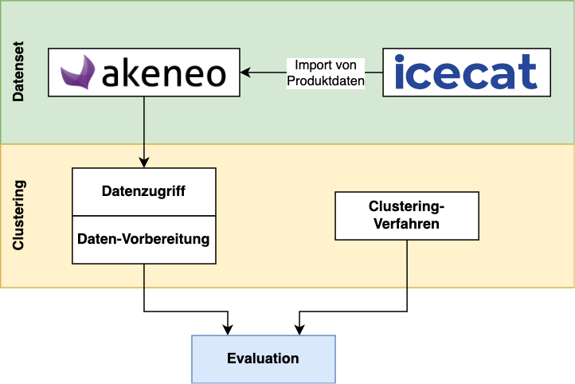

# Konzeption

## Überblick

Zur Beantwortung der Kernfrage wird ein Konzept für das Clustern komplexerer Datenstrukturen erarbeitet und anschließend evaluiert. Diese Herleitung soll aber nicht nur theoretischer Natur sein. Daher wird die Überprüfung des Konzeptes an einem möglichst realen Beispiel mit realitätsnahen Daten erfolgen. Die folgende Grafik zeigt einen Überblick zum Praxisteil dieser Arbeit:

{width=80%}

Um ein authentisches *Datenset* in den typischen Datenstrukturen zu erhalten, wird eine Instanz des Product-Information-Management-Systems Akeneo-PIM aufgesetzt und mit Produktdaten aus dem umfangreichen Online-Katalog Icecat gefüllt. Im Abschnitt [Datenquellen & -sets](#datenquellen---sets) werden beide Komponenten genauer erläutert. Außerdem werden genaue Anforderung für die Auswahl der Produkte, welche importiert werden, definiert.

Parallel wird ein Konzept für ein *Clustering-Verfahren* erarbeitet, welches die vielfältigen Datenstrukturen verarbeiten kann. Dies setzt i.d.R. eine entsprechende Vorverarbeitung der Daten voraus. Das entsprechende Konzept wird im Abschnitt [Clustering-Verfahren](#clustering-verfahren) hergeleitet.

In der *Evaluation* kommt schließlich das erstellte Datenset mit dem erarbeiteten Clustering-Verfahren zusammen. Es wird überprüft, inwiefern das Verfahren "sinnvolle" Cluster in den Produktdaten findet. Eine genaue Definition von "sinnvollem" Clustering sowieso die konkrete Berechnung entsprechender Metriken usw. wird im Abschnitt [Evaluation](#evaluation) dargelegt.

## Datenquellen & -sets

### Akeneo-PIM

Als realistische Datenquelle ist das Product-Information-Management-System Akeneo-PIM <https://www.akeneo.com/de/akeneo-pim-community-edition/> ausgewählt worden.

#### Überblick

Der Ursprung von Product-Information-Management-Systemen liegt in gedruckten Produktkatalogen. Speziell im letzten Jahrhundert waren diese die zentrale Form, wie Produktdaten verteilt und verwaltet worden sind. Mit beginnender Digitalisierung und dem Aufkommen des E-Commerce in den 1990er-Jahren wurden zunehmend computer-basierte Systeme zur Warenhaltung und Bestellabwicklung, sog. ERP-Systeme, verwendet. Anfangs wurden in diesen Systemen auch die Produktdaten gespeichert. Dieses Vorgehen stieß aber zunehmend an Grenzen, da die schiere Vielfalt an Daten (Produkte, Bestellungen, Transaktionen, Warenbestand usw.) schwer zu verwalten war. Mitte der 2000er kamen spezielle Systeme zum Einsatz, die lediglich die Produktdaten enthielten. Somit konnte der "Produktkatalog" zentral verwaltet, angereichert, übersetzt und aufbereitet werden. Weitere Systeme (z.B. besagte ERP-Systeme) konnten nun auf diesen zentralen Katalog zugreifen und müssen selbst nur minimale Informationen zu den Produkten vorhalten. PIM-Systeme sitzen daher heute häufig im Zentrum der Unternehmens-Architektur und dienen als zentrale Datenquelle für die angeknüpften Systeme. [@pimcore2021]

"Akeneo-PIM" der gleichnamigen Firma ist ein solches PIM-System, welches heute breite Anwendung findet. Es ist in einer betreuten Enterprise Edition erhältlich sowie als Open-Source-Variante "Akeneo-PIM Community Edition" (verfügbar unter <https://github.com/akeneo/pim-community-dev>), welche selbst gehostet werden muss. Die Community-Variante ist frei erhältlich und daher sehr populär. [@akeneo2022about]

![Schematische Darstellung der Funktionen von Akeneo-PIM [@akeneo2022overview]](img/akeneo-pim-integrations.png)

Ein weiterer Grund für die weite Verbreitung ist, dass Akeneo-PIM über diverse Schnittstellen an externe Systeme angebunden werden kann. Ebenso unterstützt es eine Vielzahl an Import- und Export-Möglichkeiten in unterschiedliche Datenformaten. Es gibt außerdem den "Akeneo App Store" (<https://marketplace.akeneo.com/>), wo viele Anbieter Plugins veröffentlichen, um die Funktionen und Anbindungen von Akeneo-PIM zu erweitern. [@akeneo2022overview]

Diese Gründe führten zur Verwendung von Akeneo-PIM für diese Arbeit.

#### Systemübersicht

Akeneo-PIM ist eine PHP-Applikation, welche auf dem Symfony-Framework basiert. Für die Datenspeicherung wird die Verwendung von einer MySQL-Datenbank empfohlen. Zum schnelleren Suchen und Abrufen kommt Elasticsearch zum Einsatz. [@akeneo2022config] Hinzu kommen weitere Technologien zur Generierung des Webfrontends. Um diesen verschiedenen Tools Herr zu werden, stellt Akeneo Konfigurationen für Containerization-Tools wie Docker-Compose zur Verfügung. [@akeneo2022install]

Das System kann über ein Webfrontend genutzt werden. Hier lassen sich verschiedene Nutzer und Applikationen hinterlegen, welche verschiedene Berechtigungen zum Abrufen und Bearbeiten der Daten bekommen können.


Eine Restful-API steht ebenfalls zur Verfügung, um Daten mittels HTTP-Requests abzurufen und zu verändern. In der Regel werden die Daten im JSON-Format transferiert und zurückgegeben. [@akeneo2022api]

#### Datenstrukturen

Innerhalb von Akeneo-PIM kommen eine Vielzahl von verschiedenen Datenstrukturen zum Einsatz. Im Folgenden werden nur die für diese Arbeit wichtigsten Strukturen kurz erklärt.

##### Product & Product Values

Die Produkte sind das zentrale Element in Akeneo-PIM. Aus ihnen leiten sich eine Reihe weiterer Strukturen ab. [@akeneo2022products]

Jedes Produkt wird genau einer "Family" zugeordnet. Sie bestimmt, welche Attribute dieses Produkt aufweisen sollte.

Ein Produkt kann einer oder mehreren "Categories" zugeordnet sein. Der Sinn dabei ist der Aufbau z.B. von Navigationsstrukturen. Hierbei ist die Zuordnung in mehrere verschiedene Kategorien möglich.

Die "ProductValues" sind die tatsächlichen Wertausprägungen eines Produktes. Sie werden in Form einer Hash-Map angegeben. Der Key der Einträge ist stets der "code" eines bestimmten "Attributes" (eine weitere Datenstruktur). Dieses Attribut wird separat definiert und legt verschiedene Constraints für den "ProductValue" fest. Dabei bietet Akeneo volle Flexibilität. Jedes Produkt kann jedes beliebige Attribut mit einem entsprechenden Wert aufweisen.

```json
{
  "identifier": "1111111195",
  "family": "clothing",
  "categories": ["tshirts"],
  "values": {
    "ean": [
      {"locale": null, "scope": null, "data": "1234567890207"}
    ],
    "size": [
      {"locale": null, "scope": null, "data": "s"}
    ],
    // ...
  },
  "enabled": true,
  "created": "2017-10-05T11:25:48+02:00",
  "updated": "2017-10-05T11:25:48+02:00",
  // ...
}
```

##### Category

Mit einer "Category" können Produkte in verschiedene Kategorien sortiert werden. Wichtig ist, dass "Categories" beliebig verschachtelt und hierarchisch sortiert werden können. Es gibt kein Limit für die Tiefe der Verschachtelung. [@akeneo2022catalog]

```json
{
  "code": "tvs_projectors",
  "parent": "master",
  "labels": {
    "en_US": "TVs and projectors",
    // ...
  }
}
```

*Hinweis:* Mit Ausnahme der "Products" haben die meisten Entitäten einen "code", welcher als eindeutiger Identifier fungiert.

##### Family

Eine "Family" definiert die Attribute, welches ein zugehöriges "Product" aufweisen sollte. Dies ist allerdings keine strikte Zuteilung. Produkte können auch Attribute aufweisen, welche gar nicht in ihrer "Family" vorgesehen sind. Ebenso können in der Family erforderliche (engl. required) Attribute hinterlegt werden. Produkte müssen diese aber nicht erfüllen. Das Produkt weist dann lediglich einen niedrigeren "Completeness Score" auf. Dadurch kann in Akeneo auch mit unvollständigen Produkten gearbeitet werden, bevor man diese weiter anreichert. [@akeneo2022catalog]

```json
{
  "code": "camcorders",
  "attributes":  ["description", "name", "optical_zoom"],
  "attribute_requirements": {
    "ecommerce": ["description", "name", "optical_zoom"],
    "mobile":    ["name"],
    // ...
  },
  "labels": {
    "en_US": "Camcorders",
    // ...
  }
}
```

Die Erforderlichkeit von Attributen kann für jeden Channel einzeln definiert werden. Für eine Erklärung zu Channels siehe Abschnitt [Channel, Currency, Locale](#channel-currency-locale).

##### Attribute & Attribute Group

Die verschiedenen Wertausprägungen eines Produktes müssen einem entsprechenden "Attribute" zugeordnet sein. Ein solches Attribut muss zuerst definiert werden, bevor Produkte einen Wert darin aufweisen können. [@akeneo2022catalog]

```json
{
  "code": "auto_exposure",
  "type": "pim_catalog_boolean",
  "group": "technical",
  "localizable": false, // erlaubt andere Werte in anderen Sprachen
  "scopable": false,    // erlaubt andere Werte auf anderen Channels
  "unique": false,      // verhindert die mehrfache Verwendung eines Wertes
  // ... diverse weitere Constraints
}
```

Jedes Attribut kann einer "AttributeGroup" zugeordnet werden. Dies erlaubt das bessere Strukturieren der Attribute. [@akeneo2022catalog]

Jedes Attribut ist einem `type` zugeordnet, welches den Datentyp anzeigt. Z.B. der Typ `pim_catalog_boolean` zeigt einen booleschen Wert an, `pim_catalog_text` eine Textzeile usw. Zusätzlich können in einem Attribut auch weitere Constraints für die jeweiligen Typen definiert werden. Bspw. kann mit dem Constraint `decimals_allowed` festgelegt werden, ob ein numerisches Attribut Nachkommastellen erlaubt oder nicht [@akeneo2022catalog]. Auf diese Constraints wird allerdings nicht weiter eingegangen, da sie für diese Arbeit keine Rolle spielen. Die folgende Tabelle zeigt ein Auflistung aller möglicher Typen.

| Akeneo-Typ | Erklärung |
|-|-|
| pim_catalog_identifier | eindeutige Id |
| pim_catalog_text | Textzeile |
| pim_catalog_textarea | mehrzeiliger Textblock |
| pim_catalog_simpleselect | einfache Auswahl aus einer Liste an Optionen |
| pim_catalog_multiselect | mehrfache Auswahl aus einer Liste an Optionen |
| pim_catalog_boolean | boolescher Wert |
| pim_catalog_date | Datum |
| pim_catalog_number | einfache rationale Zahl |
| pim_catalog_metric | rationale Zahl mit Recheneinheit |
| pim_catalog_price_collection | Preise je Währung |
| pim_catalog_image | Bild |
| pim_catalog_file | sonstige Datei (z.B. Datenblatt als PDF) |
| pim_reference_data_simpleselect | einfache Auswahl einer "ReferenceEntity" |
| pim_reference_data_multiselect | mehrfache Auswahl von "ReferenceEntities" |
: Attribut-Typen in Akeneo-PIM [@akeneo2022constraints]

*Hinweis:* "ReferenceEntities" sind in dieser Arbeit ebenfalls nicht verwendet worden und können daher ignoriert werden.

##### Channel, Currency, Locale

Um maximale Flexibilität bei der Verwaltung der Daten zu gewährleisten, können verschiedene "Channels" oder "Scopes" definiert werden. Für jeden "Channel" können die erforderlichen Währungen ("Currencies") und Lokalisierungen ("Locales") hinterlegt werden. [@akeneo2022targetmarket]

```json
{
  "code": "ecommerce",
  "currencies": ["USD", "EUR"],
  "locales": ["de_DE", "en_US", "fr_FR"],
  "category_tree": "master",
  "labels": {
    "en_US": "E-Commerce",
    // ...
  }
}
```

"Attributes" können als `localizable` definiert werden. Also treten verschiedene Werte je nach gewählter Sprache und Region auf (z.B. der Produktname). Außerdem können sie als `scopable` festgelegt werden. In dem Fall können zu jedem "Channel" zusätzlich nochmal unterschiedliche Werte hinterlegt werden. Bspw. gibt es die Produktbeschreibung in den verschiedenen Sprachen und dazu für jedes Produkt eine kürzere Beschreibung im Channel "mobile" und eine längere im Channel "print". [@akeneo2022catalog]

##### Measurement Family

Für den Attribut-Typ "pim_catalog_metric" werden eine Zahl und eine Einheit hinterlegt. Jede Einheit wird einer bestimmten "Measurement Family" zugeordnet. Dort sind alle verfügbaren Einheiten sowie deren Umrechnung ineinander hinterlegt. [@akeneo2022catalog]

### Icecat

Akeneo-PIM ist nur eine Software, in der Produkte strukturiert gespeichert und aufbereitet werden können. Tatsächliche Produktdaten müssen aber erst importiert werden. Eine Möglichkeit wäre die Kreation eines komplett künstlichen Sets an Produkten. Das Ziel dieser Arbeit ist es aber, eine möglichst realitätsnahe Evaluation durchzuführen. Daher wird für den Import von realistischen Produktdaten auf Icecat (<https://icecat.biz/de>) zurückgegriffen.

Icecat ist ein sehr umfangreicher offener Online-Produktkatalog. Über 33.000 Hersteller veröffentlichen hier die Daten ihrer Produkte. Zum heutigen Stand (April 2022) sind über 11 Mio. Produkte bei Icecat gelistet. Viele dieser Daten sind nur für Premium-Nutzer zugänglich. Allerdings gibt es eine ganze Reihe von Unternehmen (u.a. große Player wie Samsung), die als "Icecat-Sposoren" ihre Produktdaten frei zugänglich zur Verfügung stellen. [@icecat2021]

Icecat bietet Herstellern damit die Möglichkeit, sehr schnell ihre neuen Produkte zu verbreiten, sodass Shops und Händler direkt die Daten automatisiert in ihr Sortiment aufnehmen können. Zusätzlich werden die Produktdaten nach der UNSPSC-Taxonomy (eine international geläufige Taxonomie zur Definition von Produkteigenschaften) von Icecat standardisiert. [@icecat2021manufacturers]

Aus diesem umfangreichen Fundus wird ein Datenset zur Beantwortung der Kernfrage erstellt. Icecat ist zudem besonders attraktiv, da es einen Importer für Akeneo gibt (<https://marketplace.akeneo.com/extension/akeneo-icecat-connector>), welcher den Import von Produktdaten größtenteils automatisieren soll.

### Datenset

#### Anforderungen

Für die Auswahl von Produkten werden zunächst einige Anforderungen definiert:

Die Menge an verschiedenen Attributen könnte sich sehr unterschiedlich auf das Clustering auswirken. Daher sollte es sowohl Produkte mit sehr **wenigen** und mit sehr **vielen** Attributen geben.

Daraus folgt, dass Produkte aus **verschiedenen Kategorien** gewählt werden sollten. Als zusätzliche Herausforderung könnten diese Kategorien am besten **miteinander verwandt** sein, sodass die Fähigkeit einer eindeutigen Trennung der Kategorien überprüft werden kann.

Innerhalb einer Produktkategorien sollten **verschiedene Variationen** des gleichen Produktes sowie **verwandte Varianten** (etwa mehrere verschiedene Generationen des Produktes) auftreten.

Zuletzt sollten **Duplikate** enthalten sein. In realen Datensets kommt häufig dasselbe Produkt mehrmals vor, etwa durch geringfügige Unterschiede der Daten beim Import aus verschiedenen Quellen. Ein Clustering-Verfahren sollte in der Lage sein, solche Duplikate zu erkennen.

#### Umsetzung

Aus den Anforderungen ist folgendes Vorgehen abgeleitet worden:

Es werden Smartphones der Firma Samsung aus der Galaxy S-Reihe importiert. Hier werden Exemplare der letzten drei Generationen ausgewählt. In jeder Generation gibt es unterschiedliche Varianten (die Standard-Ausführung, "Plus", "Ultra" und "Fan-Edition"), welche verschiedene Bildschirmgrößen und etwas unterschiedliche Komponenten verbaut haben. [@samsung2022]

Smartphones weisen sehr viele verschiedene Attribute auf und eine einfache Suche auf Icecat zeigte bereits mehrere Duplikate der Samsung-Geräte auf der Plattform.

Als nächstes werden noch Produkte aus der Kategorie "Smartphone-Hüllen" ergänzt. Es werden Hüllen von verschiedenen Herstellern für die besagten Samsung Galaxy Smartphones ausgewählt. Solche Hüllen haben eine viel geringere Menge an Attributen, sind aber trotzdem eng mit den Smartphones im Set verwandt.

Es ist damit sogar denkbar, einige Clustering mit dem Ziel durchzuführen, die Smartphones mit ihren zugehörigen Hüllen in die gleiche Gruppe einteilen zu können.

## Clustering

### Clustering-Verfahren

#### Anforderungen

Um aus den vielfältigen Ansätzen des Clusterings ein geeignetes Verfahren auswählen zu können, werden zunächst einige genauere Anforderungen für die Fragestellung dieser Arbeit definiert:

Ein **hierarchisches Verfahren** ist für diese Arbeit wünschenswert. Es ist bezeichnend, dass Akeneo beliebige Verschachtelungen der "Categories" erlaubt. In der Praxis ist die Einteilung von Produkten in Kategorien stark vom gewünschten Detail-Grad abhängig. Ein hierarchisches Verfahren bildet dieses Verhalten exakter ab. Außerdem müssen partitionierende Verfahren die gesuchte Anzahl an Clustern vorab übergeben bekommen. Damit sind zuerst andere Analysen notwendig, bevor der richtige Wert ermittelt ist. Eine hierarchische Einteilung gibt dem Anwender die Wahl, wie weit aufgefächert die Ergebnisse sein sollen.

Ebenso ist die **Laufzeit** ein wichtiger Faktor, da in der Praxis tendenziell sehr große Mengen an Produkten auftreten können.

Von Vorteil ist weiterhin, wenn das Verfahren mit relativ vielen **verschiedenen Datentypen** umgehen kann. Die meisten vorherigen Transformationen verringern tendenziell den Informationsgehalt der Daten (bspw. die Diskretierung numerischer Attribute in eine geringere Anzahl an Bändern). [@kaufman2009, Kap. 1.2.6 Mixed Variables]

#### Ansatz

Agglomerative Verfahren weisen immer mindestens eine quadratische Laufzeit auf [@sibson1973]. Diversive Ansätze sind dagegen meistens effizienter (siehe Versuche von [@rajalingam2011]) und liefern tendenziell für uns Menschen besser nachvollziehbare Einteilungen. [@king2015, Kap. 3.3 Agglomerative versus Divisive Clustering]

Das Verfahren Bisecting K-Means wird in dem Zusammenhang als sehr potent angesehen [@steinbach2000]. Allerdings muss dieser Ansatz modifiziert werden, um auch mit gemischten Attributen arbeiten zu können. Da zum K-Means eine Variante für gemischte Attribute verfügbar ist (K-Prototypes [@huang1998]), wird dieser Ansatz mit dem "Bisecting"-Prinzip kombiniert. Das eingesetzte Verfahren ist also ein **Bisecting K-Prototypes**. Aus der Literatur ist diese Kombination noch nicht bekannt und damit neuartig. Mit diesem Ansatz können sehr viele Arten von Attributen verarbeitet werden. Mehr dazu im folgenden Abschnitt.

### Distanzfunktion

#### Problemstellung

Grundsätzlich kann K-Prototypes mit gemischten Attributen (numerisch und kategorisch) arbeiten. Die Produktdaten in Akeneo-PIM können allerdings noch weitere Ausprägungen annehmen. Die folgende Tabelle zeigt die grobe Einteilung der Attribut-Typen in Typ-Klassen:

| Klasse | Akeneo-Typ |
|-|----|
| numerisch | pim_catalog_date, pim_catalog_number, pim_catalog_metric, pim_catalog_price_collection |
| kategorisch | pim_catalog_boolean, pim_catalog_simpleselect, pim_reference_data_simpleselect |
| multi-kategorisch | pim_catalog_multiselect, pim_reference_data_multiselect |
| string | pim_catalog_text, pim_catalog_textarea |
| Datei | pim_catalog_image, pim_catalog_file |
| sonstige | pim_catalog_identifier |
: Einteilung der Akeneo-Typen in übergeordnete Datenklassen

Für die numerischen und kategorischen Attribute muss überprüft werden, ob eine Art "Vorverarbeitung" vor dem Clustering sinnvoll ist. Ansonsten können diese direkt verwendet werden.

Die Klasse "multi-kategorisch" beschreibt die Möglichkeit aus einer gegeben Liste an Optionen mehrere auswählen zu können. Bspw. könnte eine Liste von Materialien gegeben sein und das jeweilige Produkt markiert alle vorkommenden (z.B. Silikon, PET & Glas). Eine solche Datenklasse ist in der Literatur nicht beschrieben. Der Umgang mit diesen Attributen muss also gesondert erarbeitet werden.

Die "string"-Klasse ist streng genommen klassisch "kategorisch". Allerdings handelt es sich hier um freie Textfelder (z.B. der Produkttitel), welche bei jedem Produkt völlig frei gefüllt werden kann. Somit ist die Betrachtung als "Kategorien" nicht zielführend. Wenn bspw. jedes Produkt einen individuellen Titel hat, dann gibt es genau so viele "Kategorien" wie Produkte. Dies ist keine sinnvolle Form der Datenverarbeitung. Auch für diese Klasse muss eine gesonderte Art des Umgangs gefunden werden.

Die Klasse "Datei" wird im Rahmen dieser Arbeit ignoriert. Die Analyse von Bildern oder Textdokumenten ist ein weites Feld mit vielen verschiedenen Ansätzen. Die tatsächliche Relevanz bspw. eines Produktbildes für das Clustering ist aber fraglich. In der Theorie müssten alle Eigenschaften eines Produktes in den anderen Attributen ebenfalls abgebildet sein. Im Bild liegen diese Information aber äußerst unstrukturiert vor, wenn überhaupt.

Der Akeneo-Typ "pim_catalog_identifier" ist die Id eines Produktes. Sie hat keine Relevanz für das Clustering. Ebenso können in Akeneo Attribute als `unique` gekennzeichnet werden. Dies ist sinnvoll für das Speichern mehrerer verschiedener Identifier (also in Akeneo wird das besagte Identifier-Attribut genutzt, aber die Id im ERP-System ist eine andere, die hier ebenfalls hinterlegt ist). Diese Identifier geben aber keine Ähnlichkeitsinformationen, sondern sind rein logistische Werte. Sie werden im Clustering stets ignoriert werden.

Ein weiteres Problem ist, dass die Definition der Attribut-Anforderungen in den Akeneo-Families keinen bindenden Charakter haben. Das heißt, jedes Produkt kann Werte für jedes beliebige Attribut aufweisen oder auch nicht. Der Umgang mit `null`-Values wird also ebenfalls eine zentrale Rolle einnehmen.

#### Ansatz

##### numerische Attribute

Viele der numerischen Attribute enthalten ihre Daten auf eine implizite Art und Weise (z.B. ein Datum). Die folgende Tabelle zeigt für die verschiedenen Typen in Akeneo, ob und wie diese Daten extrahiert werden.

| Akeneo-Typ | Vorverarbeitung |
|----|---------|
| pim_catalog_date | Umwandlung in Unix-Timestamp, Normalisierung |
| pim_catalog_number | Normalisierung |
| pim_catalog_metric | Umrechnung in Standard-Unit des Attributs, Normalisierung |
| pim_catalog_price_collection | Filter nach einer Währung z.B. USD, Normalisierung |

: Vorverarbeitung der numerischen Attribute in Akeneo

Die Verarbeitungsschritte sind recht selbsterklärend. Alle Attribute werden auf das Interval zwischen $[0,1]$ normalisiert, um eine stärkere Gewichtung von Attributen mit tendenziell höheren Zahlen (z.B. Unix-Timestamps) zu vermeiden. Für die Normalisierung werden nur die tatsächlich vorkommenden Werte genutzt. Werte, welche in den Constraints der Akeneo-Attribute definiert sind (z.B. `date_min` und `date_max`), werden nicht betrachtet.

\begin{equation}
  x'^i = \frac{x^i - \min X^i}{\max X^i - \min X^i}
\end{equation}

##### kategorische Attribute

Es könnte bei ordinalen Attributen sinnvoll sein, diese u.U. als numerische Attribute anzusehen. Allerdings geben die Daten in Akeneo keinen direkten Rückschluss her, ob es sich z.B. bei einem Single-Select eigentlich um ein ordinales Attribut handelt. Somit müssten hier alle Attribute (knapp hundert) händisch analysiert werden, was den Rahmen dieser Arbeit weit gesprengt hätte.

Der K-Prototypes verlangt keine spezielle Vorverarbeitung kategorischer Attribute abseits von der Umwandlung der Labels in symmetrische bzw. asymmetrische binäre Werte. Der Akeneo-Typ "Bool" ist theoretisch symmetrisch. Praktisch kann aber in Akeneo jedes Attribut auch `null` sein. Somit können tatsächlich drei Wertausprägungen ($true$, $false$ oder `null`) vorkommen. Daher werden diese Attribute genauso wie alle anderen (z.B. Single-Selects) in asymmetrische binäre Attribute umgewandelt.

Zu beachten ist aber, dass kategorische Attribute auf ihre Ähnlichkeit und numerische auf ihre Distanz überprüft werden. Da die numerischen im Interval $[0;1]$ liegen, können die Ergebnisse der Ähnlichkeitsmaße (z.B. Jaccard-Koeffizient) einfach invertiert werden.

\begin{equation}
  d(x_1^{cat}, x_2^{cat}) = 1 - \frac{|x_1^{cat} \cap x_2^{cat}|}{|x_1^{cat} \cup x_2^{cat}|}
\end{equation}

##### multi-kategorische Attribute

Der naheliegendste Ansatz besteht darin, die verschiedenen auftretenden Kombinationen an gewählten Optionen in eigene Kategorien zu fassen und sie wie normale kategorische Attribute zu behandeln. Dies geht allerdings mit einem Verlust an Informationen einher: Angenommen ein Produkt besteht aus den Materialien $\{\text{silicone}, \text{pet}\}$ und ein anderes aus $\{\text{silicone}, \text{glass}\}$. Beide würden nun unterschiedlichen Kategorien zugeordnet und ihre Ähnlichkeit ist $0$, obwohl sie zumindest eines der Materialien gemeinsam haben. Besser wäre, wenn dieses Attribut z.B. mittels Jaccard-Koeffizient analysiert werden würde. Hier würde eine Ähnlichkeit von $\frac{1}{3}$ herauskommen.

Dieser Ansatz ist neuartig und so noch nicht beschrieben worden. Daher wird er im Rahmen dieser Arbeit mit dem naheliegenderem Ansatz verglichen werden.

##### String-Attribute

Für diese Attribute gibt sehr vielfältige Ansätze:

Die einfache Verwendung als kategorische Attribute fällt, wie bereits in der Problemstellung dargelegt, weg.

Eine weitere Möglichkeit wäre der Vergleich mittels String-Metrics (wie Jaro-Winkler oder Levensthein-Distance). Dieser Ansatz birgt ein Hauptproblem: Der K-Prototypes-Algorithmus berechnet für jedes Cluster einen Mittelpunkt. Die String-Metrics sind aber nur für einen paarweisen Vergleich von Strings geeignet. Ein "Mittelpunkt" kann hieraus nicht abgeleitet werden. Die Verwendung des Modus (wie bei kategorischen Attributen) scheidet ebenfalls aus. Wenn jeder Produkttitel individuell ist, dann ist der Modus immer $1$. Dieser Ansatz funktioniert für das gewählte Clustering-Verfahren also nicht ohne weiteres.

Schließlich besteht der Ansatz, mit Tokenization zu arbeiten. In der Literatur wird dieser Ansatz aber lediglich für Datensets beschrieben, deren Datenpunkte aus ausschließlich einem String-Wert bestehen. Datensets mit mehreren String-Attributen oder in gemischter Form sind hingegen noch nicht zusammen verarbeitet worden.

Zur Lösung kam die Idee folgende auf: Zuvor wurde ein Ansatz zur Evaluation multi-kategorischer Attribute hergeleitet. Dieser Ansatz könnte für Strings ebenfalls verwendet werden. Zerlegt man einen solchen String in Tokens, so erhält man eine Art multi-kategorischen Wert. Bsp.: aus "Samsung Galaxy S20 128GB" wird $\{\text{samsung}, \text{galaxi}, \text{s20}, \text{128gb}\}$. Solche Tokens lassen sich wieder mittels Jaccard-Koeffizienten vergleichen.

Auch dieser Ansatz wird mit der Verwendung der Strings als einfaches kategorisches Attribute verglichen werden.

#### Mathematische Formulierung

Aus den genannten Ansätzen lässt sich insgesamt folgende Formell für die finale Distanz-Funktion ableiten:

\begin{equation}
  d(x_1, x_2) = \frac{d_{num}(x_1, x_2) + |x_1^{num_{null}}| + |x_2^{num_{null}}| + n_{cat} \cdot d_{cat}(x_1, x_2) + d_{mul}(x_1, x_2)}{|attributes \text{ in }x_1 \cup x_2|}
\end{equation}

\begin{align}
  d_{num}(x_1, x_2) &= \sum_{i \in num} |x_1^{i} - x_2^{i}| \\
  d_{cat}(x_1, x_2) &= 1 - \frac{|x_1^{cat} \cap x_2^{cat}|}{|x_1^{cat} \cup x_2^{cat}|} \\
  d_{mul}(x_1, x_2) &= \sum_{i \in mul} \frac{|x_1^i \cap x_2^i|}{|x_1^i \cup x_2^i|}
\end{align}

Die numerischen Attribute werden mittels Manhatten-Distanz verrechnet. Da die Attribute vorher normalisiert worden sind, kann so maximal eine Distanz von $1$ je numerischem Attribut entstehen. Die kategorischen Attribute werden mit dem beschriebenen inversen Jaccard-Koeffizienten berechnet (da asynchron). Der Koeffizient wird außerdem mit der Anzahl an kategorischen Attributen $n_{cat}$ multipliziert, um ihn mit den anderen Metriken gleich zu gewichten. Die multi-kategorischen Attribute werden jeweils einzeln mittels inversem Jaccard-Koeffizienten verglichen.

Wie bereits ausführlich dargelegt, können in den Produktdaten von Akeneo immerzu `null`-Values vorkommen. Die kategorischen und multi-kategorischen Distanzmaße können danke des Jaccard-Koeffizienten problemlos damit umgehen. Die Minkowski-Metriken sind allerdings nur für tatsächlich vorhandene numerische Werte in beiden Produkten definiert. Daher wird $d_{num}$ ausschließlich in diesem Fall aufgerufen. Für den Fall, dass `null`-Values in den numerischen Attributen von einem der beiden Produkte vorkommen, wird für jedes dieser Attribute $1$ addiert. Die Attribute sind sich ja maximal unähnlich, da das eine Produkt es definiert und das andere nicht. In der Formel ist das mit $|x_1^{num_{null}}|$ und $|x_2^{num_{null}}|$ hinterlegt.

Der Divisor $|attributes \text{ in }x_1 \cup x_2|$ sorgt für eine Normalisierung der Distanz in das Interval $[0;1]$. Dadurch werden Unterschiede zwischen Produkten, welche alleine aus der verschiedenen Anzahl an definierten Attributen entstehen, ausgeglichen.

Eine vereinfachte (serialisierte) Form dieser Funktion sieht folgendermaßen aus:

\begin{align}
  d(x_1, x_2) &= \frac{\sum d'(x_1^i, x_2^i)}{|attributes \text{ in }x_1 \cup x_2|} \\
  d'(x_1^i, x_2^i) &= \begin{cases}
    1 &, x_1^i \text{ is } null \vee x_2^i \text{ is } null \\
    |x_1^i - x_2^i| &, i \text{ is } numerical \\
    0 &, i \text{ is } categorical \wedge x_1^i = x_2^i \\
    1 &, i \text{ is } categorical \wedge x_1^i \neq x_2^i \\
    1 - \frac{|x_1^i \cap x_2^i|}{|x_1^i \cup x_2^i|} &, i \text{ is } multi-categorical \\
  \end{cases}
\end{align}

## Evaluation

### Kriterien

Das hergeleitete Clustering-Verfahren in seinen Varianten sollte auf seine Validität überprüft werden. Speziell wird getestet, ob mit diesem Verfahren "sinnvolle" Cluster gefunden werden. Die verschiedenen Aspekte dieser Sinnhaftigkeit werden nun anhand von drei Hauptkriterien definiert: Stabilität, Qualität und Erkennungsfähigkeit.

#### Stabilität

Der K-Prototypes-Algorithmus nutzt wie alle Verfahren dieser Klasse ein Initialisierungsverfahren, welches auf dem Zufall beruht. Da es sich um ein klassisches Minimierungsverfahren mit eventuellen lokalen Minima handelt, können mehrmalige Durchläufe über das gleiche Datenset verschiedene Clusterzuteilungen finden. Ein Verfahren, welches keinerlei Determinismus aufweist und je nach Uhrzeit komplett andere Ergebnisse liefert, ist allerdings in der Praxis nicht zu gebrauchen. Zudem sollte eine wohldefinierte Distanzfunktion in der Lage sein, die Datenpunkte eindeutig genug voneinander zu trennen, sodass trotz verschiedener Startpunkte die Zuteilung in Cluster stets ähnlich abläuft.

Zur Prüfung der Stabilität wird also wie folgt vorgegangen: Das Clustering wird stets mehrmals hintereinander ausgeführt. Anschließend wird die Ähnlichkeit der gefundenen Cluster mittels Adjusted-Rand-Index berechnet. Da ein hierarchisches Verfahren verwendet wird, wird jede Hierarchie-Ebene der verschiedenen Durchläufe betrachtet und anschließend der Durchschnitt aus allen Ähnlichkeitsmessungen über alle Hierarchie-Stufen und alle Durchläufe berechnet. Die Ähnlichkeit der Cluster sollte dabei nahe $100$% sein.

#### Qualität

Ziel des Clusterings ist es, ordentlich voneinander getrennte Gruppen zu finden. Dies ist zum einen wichtig, um mit den Ergebnissen überhaupt weiterarbeiten und belastbare Aussagen zu den Gruppierungen finden zu können. Zum anderen sind wohl-separierte Cluster aber auch ein Garant für eine gewisse Resilienz vor neuen Datenpunkten, welche in Zukunft zum Datenset hinzugefügt werden. Schließlich ist es nicht sinnvoll, wenn sich jedes mal bei einem neu hinzugefügten Produkt die Cluster stark verschieben. Sind sie ordentlich voneinander getrennt, so ist dies unwahrscheinlicher.

Daher wird ein gefundenes Clustering-Ergebnis mittels eines internen Index auf seine Qualität überprüft. Zum Einsatz können entweder der Silhouetten-Koeffizient oder Davies-Bouldin-Index kommen. Um bei der Evaluation keine zusätzlichen Fehlerquellen zu erzeugen, wird für die Berechnung der Metriken auf externe Bibliotheken zurückgegriffen werden. Es wird dabei der Index zum Einsatz kommen, der besser nutzbar ist.

Da das Clustering ein hierarchisches Verfahren verwendet, wird der interne Index für jede sinnvolle Hierarchie-Stufe ($2 \leq k \leq n$) berechnet und anschließend der Durchschnitt gebildet.

#### Erkennungsfähigkeit

Stabile und wohl-separierte Cluster zu finden, sind sehr sinnvolle Kriterien. Allerdings bewerten sie eher das Clustering an sich ohne einen wirklichen Bezug zur Realität. Dies soll mit diesem dritten Kriterium umgesetzt werden.

##### Generationen und Modelle

In dem erstellten Datenset kommen objektiv erkennbare natürliche "Gruppen" vor. Die verschiedenen Generationen der Smartphones sowie die verschiedenen Modelle innerhalb einer Serie sind für uns Menschen offensichtliche Unterscheidungsmerkmale dieser Produkte. Daher sollte das Clustering-Verfahren ebenfalls in der Lage sein, diese Unterteilung zu finden.

Konkret werden die Generationen und Modelle in den "Akeneo-Categories" hinterlegt werden. Nach einem Cluster-Durchlauf werden anschließend die Hierarchie-Ebenen für die jeweiligen Kategorien abgefragt (z.B. wenn es drei Generationen im Datenset gibt, dann sollte das Clustering bei $k=3$ jedes Produkt der gleichen Generation in die gleiche Gruppe positioniert haben). Der Vergleich der Übereinstimmung mit "Akeneo-Categories" und Clustering-Ergebnis erfolgt über den Adjusted-Rand-Index.

##### Duplikate

Außerdem befinden sich unter den Smartphones einige Duplikate. Diese werden ebenfalls mit einer entsprechenden "Category" in Akeneo markiert. Anschließend wird geprüft, ob die Duplikate über alle Hierarchie-Ebenen stets dem gleichen Cluster zugeordnet worden sind (was man von einem sinnvollen Clustering-Verfahren erwarten würde). Je nach Implementierung könnte hier der Jaccard-Koeffizient zum Einsatz kommen. Der Vergleich erfolgt nun über die Menge an zugeteilten Clustern beider Produkte. Diese sollte bei beiden sehr ähnlich sein und der Koeffizient entsprechend eine Ähnlichkeit nahe der $1$ feststellen.

### Aspekte

Für die Evaluation spielen eine Reihe von Teilaspekten bei der Auswertung eine besondere Rolle:

#### Verarbeitung multi-kategorischer Attribute

Im vorherigen Abschnitt ist ein alternativer Ansatz zur Verarbeitung multi-kategorischer Attribute vorgestellt worden, welcher mit weniger Informationsverlust einhergeht. Daher sollte diese Art der Verarbeitung bessere Cluster produzieren, als wenn die multi-kategorischen Attribute in normale kategorische Attribute umgewandelt werden.

Zusätzlich kann diese Art der Verarbeitung auch auf String-Attribute angewendet werden, welches ebenfalls zu besseren Ergebnissen führen sollte.

#### Auswahl der Attribute

Produkte in einem PIM-System weisen gerne mehrere hundert Attribute auf. Dadurch stellt sich die Frage, wie sich die Menge an Attributen auf das Clustering auswirkt. Dieser Einfluss wird zum einen mit den verschiedenen Produktfamilien (Smartphones und Hüllen) überprüft. Zum anderen könnte aber auch das gezielte Weglassen von vorhandenen Attributen ebenfalls die Ergebnisse verändern. Dabei sind verschiedene Ebenen denkbar:

Manche Typen von Attributen könnten wichtiger sein als andere. Z.B. stecken in String-Attribute potenziell mehr Informationen als in einem einfachen kategorischen Attribut. Andererseits könnte die "Unstrukturiertheit" der Strings diese Informationen verwaschen. Daher werden die **verschiedenen Typen** in unterschiedlichen Kombinationen geclustert und verglichen.

Über die Families in Akeneo können Attribute als **optional oder erforderlich** gekennzeichnet werden. Attribute mit vielen `null`-Werten könnten für das Clustering womöglich keine Rolle spielen. Daher werden die Cluster mit und ohne Verwendung optionaler Attribute überprüft.

Als letztes wird überprüft, ob eine **menschliche "Vorauswahl"** der Attribute sinnvollere Ergebnisse liefern kann. Um den Rahmen dieser Arbeit nicht komplett zu sprengen, wird der Autor die Auswahl nach persönlichem Ermessen treffen. Es ist aber denkbar, in Zukunft z.B. externe Statistiken heranzuziehen, um vor allem Attribute zu verwenden, welche für Kunden von besonderer Relevanz sind.

#### Gewichtung der Attribute

In der gesamten bisherigen Herleitung ist stets die "Gleichgewichtung" der Attribute angestrebt worden (z.B. durch Normalisierung der numerischen Attribute etc.). Es ist aber denkbar, dass der komplette Ausschluss von Attributen mit zu viel Verlust an Informationen einhergeht. Daher wird gesondert überprüft, ob sich bessere Cluster bilden, wenn bestimmte Attribute (z.B. die menschliche "Vorauswahl" im vorherigen Absatz) im Verhältnis zu den anderen übergewichtet werden.

Die Übergewichtung lässt sich bewerkstelligen, indem die entsprechenden Attribute im Datenset während der Vorverarbeitung dupliziert werden.

### Vorgehen

Die genannten Aspekte werden mit Hilfe der definierten Kriterien und Metriken evaluiert. Das Vorgehen ist dabei wie folgt:

Als erstes werden nur die "Smartphone-Hüllen" geclustert und in den genannten Aspekten überprüft. Da hier die Anzahl an Attributen überschaubar ist, können Fehler in der Implementierung leichter identifiziert und verbessert werden. Auch lässt sich der Einfluss einzelner Attribute auf das Endergebnis leichter bewerten.

Diese initialen Ergebnisse werden nun mit dem Datenset, welches nur aus den "Samsung Smartphones" besteht, gegengeprüft. Hier kommen deutlich mehr Attribute vor, sodass interessant zu sehen sein wird, ob sich die Ergebnisse aus "einfacheren" Produkten auch auf komplexere übertragen lassen.

Schließlich werden alle Produkte (Smartphones und Hüllen) gleichzeitig geclustert mithilfe der zuvor gewonnen Erkenntnisse (bspw. welche Attribut-Typen oder Gewichtungen die besten Ergebnisse geliefert haben etc.). Ziel hierbei ist es, dass die Ergebnisse des Clusterings der Teilsets und des Gesamtsets möglichst identisch sind. Ist das der Fall, so ist das gefundene Clustering-Verfahren tatsächlich "generisch", da nicht einmal eine vorherige Trennung der Produktfamilien nötig ist.

Eine letzte Teilfrage wird in diesem Zusammenhang ebenfalls evaluiert: Wird das Clustering nur mit Attributen durchgeführt, welche in beiden Familien vorkommen, so könnten u.U. die "passenden" Smartphones und Hüllen in gemeinsame Gruppen sortiert werden. Dieser Versuch stellt eher eine Spekulation dar. Die Überprüfung ist in diesem Rahmen aber leicht durchführbar und bildet damit den Abschluss der Evaluation.
