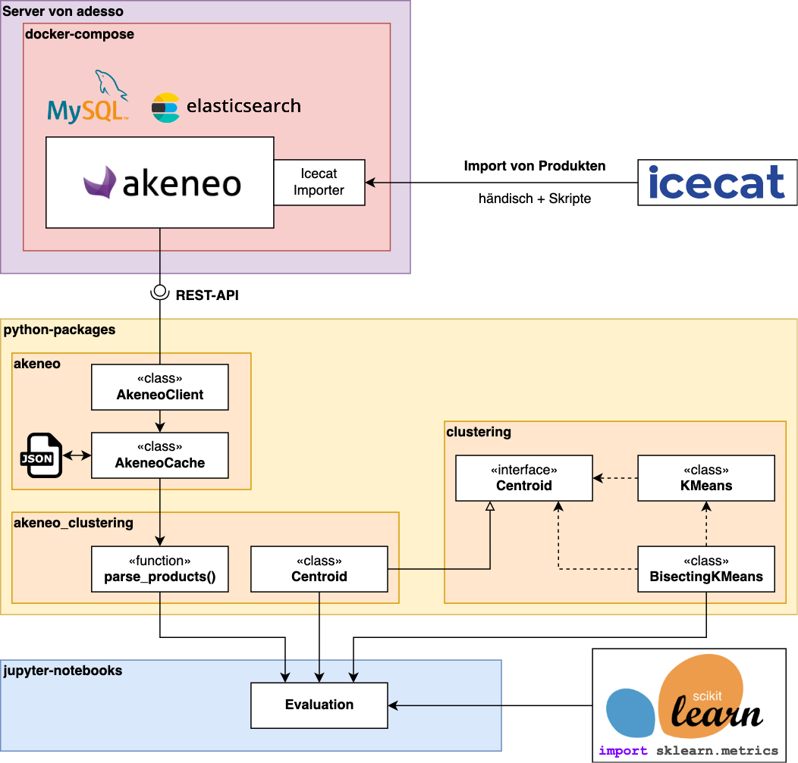

# Implementierung

## Überblick

Nach der Konzeption folgte die Umsetzung und Implementierung des Praxisteils. Für eine bessere Übersicht ist in der folgenden Grafik die Architektur in detaillierterer Form inklusive implementierter Klassen und sonstigen Software-Komponenten dargestellt.

adesso stellte für diesen Teil einen Server bereit, welcher für das Hosting von Akeneo-PIM genutzt wurde. Anschließend erfolgte die Installation von Akeneo-PIM Community Edition Version 5.0 auf diesem Server. Dazu wurde die offizielle Installationsanleitung von Akeneo unter Verwendung der Containerization-Lösung Docker (<https://www.docker.com/>) befolgt [@akeneo2022install]. Zusätzlich wurde das Akeneo-Plugin "Akeneo Icecat Connector" Version 2.0.0 [@akeneo2022icecat] in die Instanz integriert. Das kostenpflichtige Plugin wurde von adesso gesponsert.

Nun musste Akeneo-PIM mit Produktdaten gefüllt werden, welche aus dem Online-Katalog Icecat stammen. Eine genaue Übersicht zur Auswahl der Produkte sowie der weiteren Aufbereitung innerhalb von Akeneo siehe Abschnitt [Datenset](#datenset).

Anschließend erfolgte die Implementierung diverser Klassen und Packages, welche das hergeleitete Konzept umsetzen oder wichtige Hilfsfunktionalitäten für die spätere Evaluation liefern. Alle diese Komponenten sind in der Programmiersprache Python (<https://www.python.org/>) implementiert worden. Python ist sehr weit verbreitet für Aufgaben der Datenanalyse bzw. Data Science allgemein. Das liegt daran, dass es eine Vielzahl nützlicher Bibliotheken für die Analyse und Aufbereitung von Daten gibt. Ebenso sind Implementierungen vieler Algorithmen und Verfahren in Python verfügbar [@papp2019, Kap. 2.4.2 Programmierung]. Zu den meisten umgesetzten Elementen ist ebenfalls grundlegendes Unit-Testing durchgeführt worden, um die korrekte Funktionalität zu prüfen.

Das Package `akeneo` liefert zwei Hauptkomponenten. Der `AkeneoClient` kommuniziert mit der REST-API von Akeneo zum Abrufen der hinterlegten Daten. Ebenso konnten damit verschiedene Aufgaben, wie das Zuordnen der Produkte zu ihren passenden Kategorien teilweise automatisiert werden. Der `AkeneoCache` nutzt den `AkeneoClient`, um alle Endpunkte, welche Daten zurückgeben, abzufragen. Die `JSON`-Responses dieser Anfragen werden anschließend in `JSON`-Dateien gespeichert. Die REST-Anfragen dauern mit unter recht lange (mehrere Sekunden), allerdings änderte sich das Datenset nach der Erstellung nicht mehr. Durch diese Zwischenspeicherung wurde die Evaluation erheblich beschleunigt, da die Daten direkt aus den Dateien gelesen werden konnten. Der `AkeneoCache` ist ebenso für das Laden der Daten zuständig. Dazu werden die `JSON`-Objekte in Python-Datenstrukturen überführt. Dazu kam die Bibliothek `dacite` (<https://github.com/konradhalas/dacite>) zum Einsatz.

Zunächst wurde überprüft, ob externe Clustering-Bibliotheken in der Lage sind, das erarbeitete Konzept umzusetzen. Da keine Bibliothek den Anforderungen genügte, wurde im Package `clustering` eine generische Version des `KMeans` und `BisectingKMeans` implementiert. Sie nutzen ein allgemeines Interface `Centroid`, welches für eine konkrete Clustering-Anwendung vorher implementiert werden muss. Genauere Details dazu in Abschnitt [Clustering](#clustering).

Das Package `akeneo_clustering` bringt nun die beiden anderen Packages zusammen. Die Funktion `parse_products()` liest die Daten aus dem Cache aus und bereitet die Produkte für das Clustering auf. Dabei werden zum Beispiel die beschriebenen Vorverarbeitungen für numerische und String-Attribute durchgeführt. Die `Centroid`-Klasse implementiert das Interface für das `clustering`-Package. Hier ist die erarbeitete Distanzfunktion hinterlegt, ebenso der genaue Prozess, wie Mittelpunkte zu den jeweiligen Clustern berechnet werden. Weitere Details im Abschnitt [Clustering](#clustering)

Abschließend fand die Evaluation mithilfe von Jupyter-Notebooks statt. Das sind Source-Code-Dateien, die in einzelne Code-Zellen unterteilt sind. Mithilfe eines Webfrontends, welches Jupyter mitliefert, können die Notebooks interaktiv verändert und beliebig einzelne oder mehrere Code-Zellen ausgeführt werden. Die Ausgaben der Zellen erscheinen direkt darunter. Dadurch eignet sich Jupyter für Analysen, in denen wiederholt Versuche und leichte Abwandlungen dieser durchgeführt werden. Die direkte Visualisierung beschleunigt den Evaluationsprozess [@papp2019, Kap. 2.4.2 Programmierung]. Die genauen Schritte der Evaluation und welche Tools zur Berechnung der Metriken zum Einsatz kamen, ist im Abschnitt [Evaluation](#evaluation) beschrieben.

## Datenset

### Attribute

Wie bereits beschrieben, müssen die Attribute in Akeneo zu erst existieren, bevor ein Produkt einen Wert darin aufweisen kann. Icecat definiert ebenfalls eine sehr umfangreiche Liste an Icecat-Attributen. Diese können über den Icecat-Importer ausgewählt und in Akeneo importiert werden. Dabei werden die Icecat-Typen entsprechend auf äquivalente Akeneo-Attribut-Typen abgebildet. Dieser Prozess läuft grundsätzlich automatisch über den Importer. Allerdings müssen dazu vorher per Hand in der Weboberfläche des Importers alle Attribute ausgewählt werden, welche es zu importieren gilt.

Icecat stellt für jede Produktkategorie eine eigene Taxonomie zur Verfügung, welche beschreibt, was für Attribute in den Produkten der jeweiligen Kategorie vorkommen können und ob sie erforderlich oder optional sind. Entsprechend sind die Taxonomien für "mobile_phone_cases" und "smartphones" heruntergeladen worden. Die Excel-Dateien finden sich im angehängt Git-Repository im Ordner `cluster-analysis > data > icecat-taxonomy__final`. Mittels dieser Dateien sind per Hand im Importer alle benötigten Attribute ausgewählt und importiert worden.

Anschließend sind nach dem Vorbild der Icecat-Taxonomien in Akeneo 2 "Families" (eine für die Hüllen und eine für die Smartphones) angelegt worden. Über die "Family" kann in Akeneo festgelegt werden, welche Attribute bei Produkten dieser Art vorkommen können sowie ob sie erforderlich oder optional sind. Dieser Prozess ließ sich weitestgehend per Skript lösen. Im Repository im Ordner `cluster-analysis > reports > dataset` sind die ausgeführten Schritte, samt Code in PDF-Dateien hinterlegt.

Es folgten ein paare kleinere weitere Schritte, wie die Strukturierung der Attribute in Gruppen zur besseren Übersicht. Diese sind aber nicht weiter von Belang.

### Produkte

Als nächstes sind Produkte für den Import ausgewählt worden. In der kostenlosen Version von Icecat stehen nur Produkte von einigen wenigen Herstellern (sog. Sponsoren) zur Verfügung. Zu diesen Sponsoren zählen auch Samsung und einige Hersteller von Smartphone-Hüllen für Samsung-Smartphones. Über die Suchfunktion von Icecat sind nun Samsung-Smartphones der S-Reihe aus den Generationen S20, S21 und S22 gesucht und ausgewählt worden – ebenso zu den Modellen passende Hüllen. Im angehängten Git-Repository gibt es den Ordner `cluster-analysis > data > dataset__final`. Dieser enthält mehrere `CSV`-Dateien, welche verschiedene Daten enthalten, die später in Akeneo importiert wurden. Die Datei `products.csv` enthält alle ausgewählten Produkten mit ihrem jeweiligen Link zu Icecat. Außerdem ist zu jedem Produkt hinterlegt, zu welcher "Family" (Hülle oder Smartphone) es gehört. Außerdem sind die Produkte verschiedenen "Categories" zugeordnet worden. Über diese Categories ist hinterlegt, zu welchem Smartphone-Modell das Produkt gehört. Ebenso ist mit entsprechenden Categories vermerkt, ob zwei Produkte Duplikate voneinander sind. Die folgende Tabelle gibt eine Übersicht über die 122 ausgewählten Produkte:

| Modell | Hüllen | Smartphones | davon Duplikate [^dups] |
|-|-:|-:|-:|
| S20       | 18 |  5 |  2 |
| S20+      | 14 |  5 |  0 |
| S20 Ultra | 11 |  4 |  2 |
| S20 FE    |  2 |  3 |  0 |
| S21       | 11 |  7 |  4 |
| S21+      | 10 |  4 |  2 |
| S21 Ultra |  5 |  6 |  2 |
| S21 FE    |  5 |  4 |  0 |
| S22       |  2 |  2 |  0 |
| S22+      |  1 |  1 |  0 |
| S22 Ultra |  1 |  1 |  0 |
| *gesamt:* |*80*|*42*|*12*|
: Importierte Produkte nach Smartphone-Modell

[^dups]: Es kommen nur Duplikate von Smartphones vor.

Schließlich ist aus der Icecat-URL die SKU und EAN der Produkte ausgelesen und per Skript in Akeneo jeweils als neues Produkt eingefügt worden. Danach wurde im Icecat-Importer der `EnrichProducts`-Job ausgeführt, welcher die restlichen noch leeren Attribute der Produkte mit den Daten aus Icecat füllt.

### Korrekturen

Nach dem Import der Attribute und Produkte wurden die Daten analysiert und auf Fehler geprüft. Dabei traten eine ganze Reihe von Problemen zutage:

- Alle 31 Attribute, welche in Icecat als Multi-Select definiert sind, wurden in Akeneo als Single-Select importiert. Unter den Labels des Attributs "Material" finden sich z.B. die Werte "Silicone, Thermoplastic polyurethane (TPU)" sowie "Thermoplastic polyurethane (TPU), Silicone". Also die gleiche Information als zwei verschiedene Labels.
- 22 numerische Attribute warfen beim Import Fehler, weshalb diese schließlich als Textzeilen importiert werden mussten.
- 10 Single-Selects sind automatisch als Textzeilen importiert worden.

Diese Fehler wurden anschließend per Skript gefixt. Dazu wurde jedes fehlerhafte Attribut ein zweites Mal in korrigierter Version in Akeneo angelegt. Anschließend wurde jedes Produkt durchgegangen und die Werte aus den fehlerhaften Attributen korrigiert und in den neuen Attributen gespeichert. Die Werte der Multi-Selects enthielten die verschiedenen Optionen als Komma-getrennte Liste, welche entsprechend aufgeteilt worden ist. Die fehlerhaften numerischen Attribute und Single-Selects konnten ohne Problem direkt auf den richtigen Typ übertragen werden.

Zum Schluss sind alle fehlerhaften Attribute in eine Attribut-Gruppe names "Faulty" sortiert worden. Dadurch können sie in der Evaluation direkt herausgefiltert werden, sodass nur die korrekten Attribute bei der Verarbeitung übrig bleiben.

Etwas später wurde noch offenkundig, dass alle numerischen Attribute mit einer "MeasurementUnit" ebenfalls fehlerhaft sind. Die Einheit ist falsch importiert worden, sodass bspw. die Smartphones zwischen 5 und 6 Kilogramm wiegen. Da dieser Fehler aber bei allen Attributen "konsistent" aufgetreten ist und die numerischen Attribute im Zuge der Vorverarbeitung sowieso normalisiert werden, kann dieser Fehler ignoriert werden.

| Attribut-Klasse | Hüllen |  | Smartphones | | davon in beiden |
|--|-:|-:|-:|-:|-:|
| | *erforderlich* | *optional* | *erforderlich* | *optional* | |
| numerisch         | 1 | 22 | 10 | 106 | 10 |
| kategorisch       | 2 | 16 | 18 | 157 |  1 |
| multi-kategorisch | 1 |  4 |  3 |  26 |  3 |
| strings           | 6 |  5 |  7 |  27 | 10 |
| andere            | 5 |  0 |  4 |   2 |  4 |
: Anzahl an Attributen je Attribut-Klasse und Produktfamilie

Die Tabelle zeigt die jeweilige Menge an Attributen für die Hüllen und die Smartphones nach der Durchführung der Korrekturen.

## Clustering

### Überblick zu externen Libraries

- biescting kmean apache pyspark => nur numerisch [@apache2022bikmeans]
- sklearn [@sklearn2022], nicovk [@nicodv2022]
- erlauben keine null-Values !
- Umsetzung von Multi-Selects nicht möglich
- Orientierung an diesen Bibliotheken, aber keine Verwendung

### Clustering-Library

- KMeans & Bisecting KMeans mit generischer Centroid-Klasse
- Centroid-Klasse erklären
- KMeans => Überblick
- Bisecting KMeans => Überblick

### Distanzfunktionen

- Implementierung der Centroid-Klasse
- Map aus Attribut-Code zu Wert in Datentypen: float, string, set of strings
- Verarbeitung des Typs entsprechend
- Tracking des Means und der Modes je nach Attribut => Generierung eines künstlichen Datenpunktes für Distanzfunktion
- Gewichtung der Attribute möglich

### Datenvorbereitung

- Produkte parsen:
- mit Filtern
- Normalisierung von float
- Tokenization von strings => Umwandlung in set of strings, genauso wie Multi-Selects

## Evaluation

- Verwendung von metrics Funktionen aus SKLearn
- Durchführung mit Python-Packages in Jupyter-Notebooks
- Generierung aller möglichen Versuche
- Stabilität => 10 mal wiederholen da KMeans mit random-init, Vergleich mit adj_rand_index
- Qualität => Silhouettenkoeffizient, da in SKLearn am flexibelsten einsetzbar
- Korrektheit => Vergleich mit Categories (Smartphone Serien und Modellen) mit adj_rand_index
