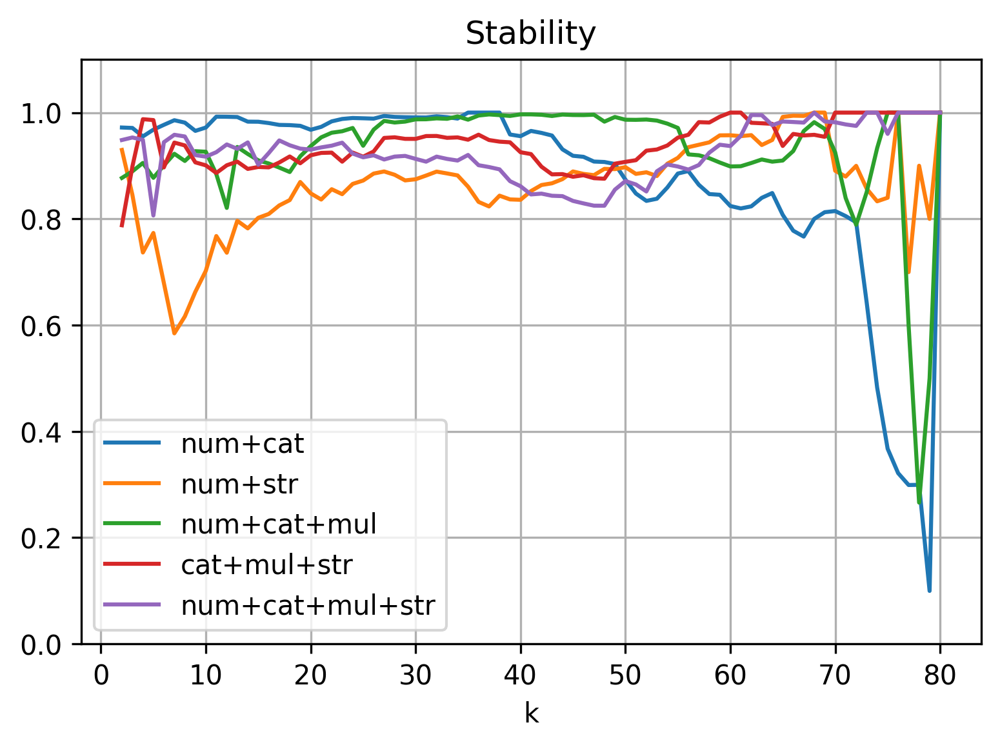
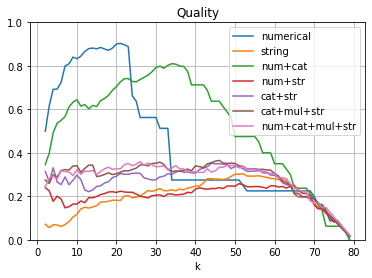
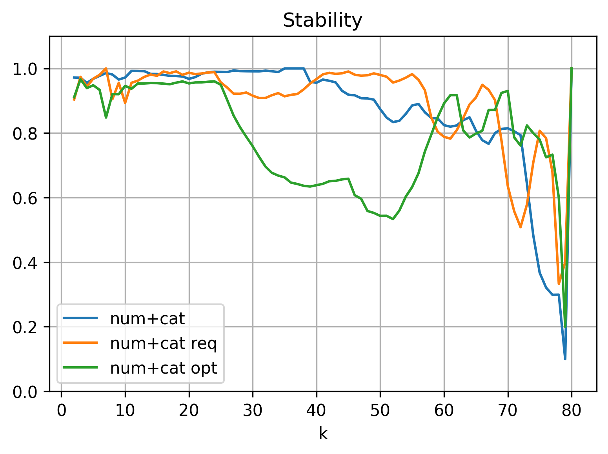
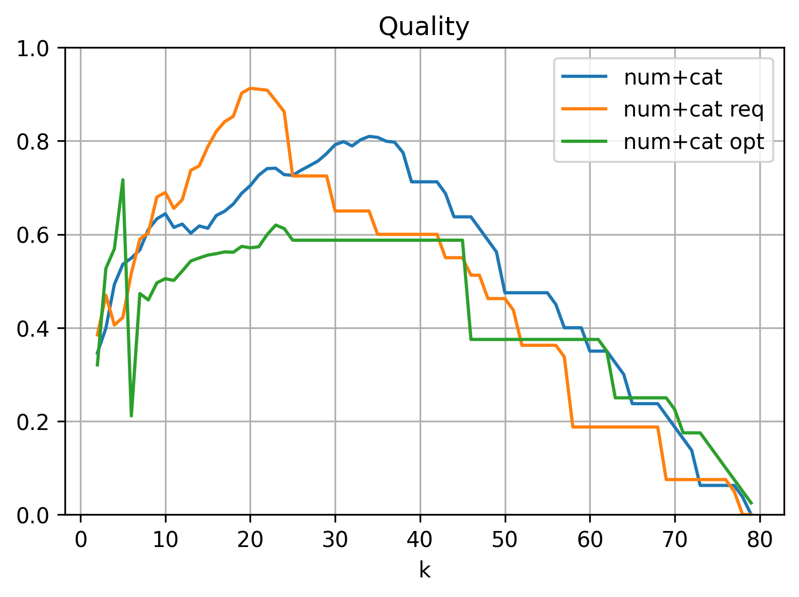
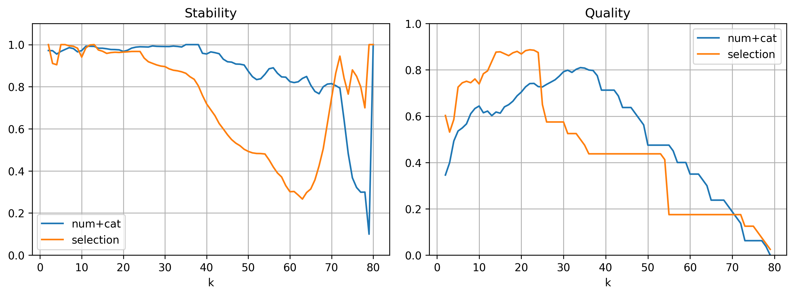
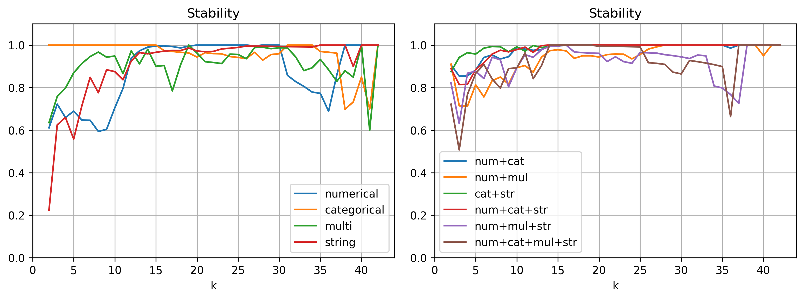
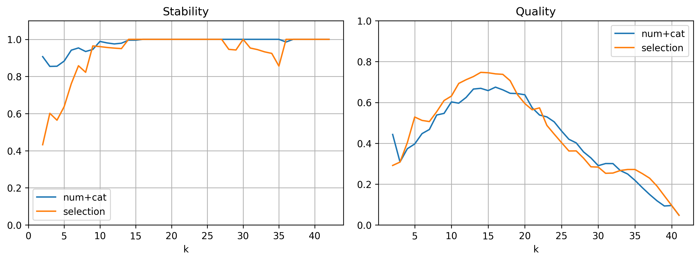
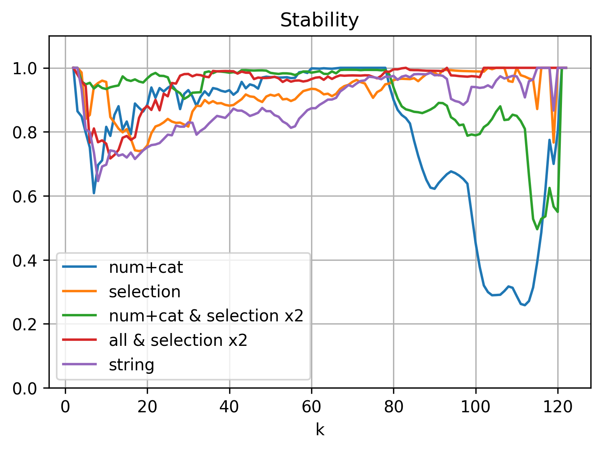
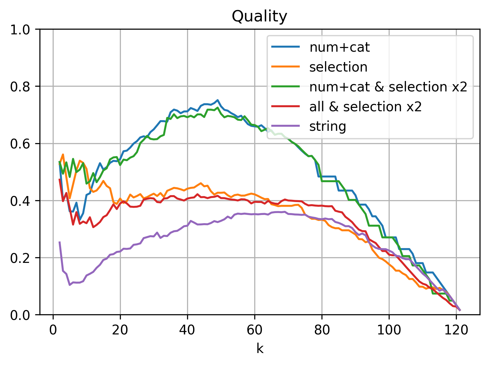

# Auswertung

## Datenset "Smartphone-Hüllen"

### Überblick

Das hergeleitete Clustering-Verfahren wurde zuerst auf die Smartphone-Hüllen des Datensets angewendet. Es enthält 80 verschiedene Produkte von vier verschiedenen Herstellern. Die nachfolgende Tabelle zeigte einige Informationen zu den Attributen dieser Produktkategorie.

| Typ | Art | Anzahl | Ø non-`null` | Ø unique |
|-|-|-:|-:|-:|
| numerisch   | erf. | $1$ | $76.0$ |  $7.0$ |
|             | opt. | $5$ | $19.4$ |  $9.2$ |
| kategorisch | erf. | $3$ | $78.3$ |  $2.7$ |
|             | opt. | $8$ | $28.5$ |  $1.4$ |
| multi-kat.  | erf. | $1$ | $57.0$ | $10.0$ |
| string      | erf. | $4$ | $79.2$ | $69.2$ |
: Übersicht zu den Attributen der Smartphone-Hüllen

Die Smartphone-Hüllen zeichnen sich vor allem durch eine überschaubare Anzahl von 22 verschiedenen Attributen aus. In der Tabelle sind die Attribute nach ihrem Typen und der Erforderlichkeit (erforderlich oder optional) gruppiert dargestellt. Für jede Gruppe ist in der dritten Spalte die Anzahl an Attributen der entsprechenden Gruppe aufgeführt. Attribute, in denen keine einzige Wertausprägung in den Produkten vorkommt, sind bereits entfernt. Ebenso sind nur Attribute betrachtet worden, die mit dem hergeleiteten Verfahren verarbeitet werden können.

Die multi-kategorischen und String-Attribute sind allesamt erforderlich in dieser Produktgruppe. Für numerische und kategorische Werte existieren sowohl erforderliche als auch optionale Attribute.

Die Spalte "Ø non-`null`" gibt an, wie viele der 80 Produkte im Schnitt in der jeweiligen Attributart einen Wert ausweisen (also nicht `null` sind). Erforderliche Attribute liegen hier stets bei etwas unter 80 mit Ausnahme des einen multi-kategorischen Attributs. Das heißt, dass die erforderlichen Attribute tatsächlich meistens mit Werten gefüllt sind – wenn auch nicht immer.

Die Spalte "Ø unique" gibt an, wie viele unterschiedliche Wertausprägungen im Schnitt in der jeweiligen Attributart vorkommen. `null`-Werte zählen in diese Spalte nicht mit hinein. Besonders die String-Attribute weisen in praktisch jedem Produkt einen anderen Wert auf, was aber auch in der Natur dieser Attributart liegt. Die multi-kategorischen und numerischen Attribute weisen im Schnitt knapp 10 unterschiedliche Wertausprägungen auf. Das liegt daran, dass das Datenset Hüllen für 11 verschiedene Smartphone-Modelle enthält. Die kategorischen weisen die geringste Vielfalt an unterschiedlichen Werten auf. Das erklärt sich daraus, dass viele dieser Attribute boolesche Werte in Akeneo sind.

### Verarbeitung multi-kategorischer Attribute

Da in der klassischen Clusteranalyse keine multi-kategorischen Attribute beschrieben sind, ist ein spezielles Verfahren zur Verarbeitung dieser Attribute erarbeitet worden. Diese Verarbeitung wird nun mit einem alternativen Ansatz verglichen. Dazu ist das Clustering nur mit dem einen multi-kategorischen Attribut (Material) im Datenset durchgeführt worden. Das erste Mal wurde die hergeleitete Verarbeitung verwendet. Beim zweiten Durchlauf sind alle multi-kategorischen Werte in kategorische umgewandelt worden (durch einfache Komma-separierte Verkettung). Die folgende Tabelle zeigt die berechneten Metriken zu beiden Clusterings:

| Verarbeitung | Stabilität | Qualität | Erkennung | |
|-|-:|-:|-:|-:|-:|
| | | | *Generation* | *Modell* |
| multi-kategorisch    | $0.71$ | $0.44$ | $0.02$ | $0.04$ |
| (single) kategorisch | $0.61$ | $0.44$ | $0.00$ | $0.04$ |
: Clustering der Hüllen mit einem multi-kategorischen Attribut

Die Ergebnisse beider Clusterings unterscheiden sich kaum voneinander. Lediglich die Stabilität ist mit der hergeleiteten Verarbeitungsart etwas höher. Insgesamt liegt die Stabilität aber recht niedrig, was daran liegen könnte, dass nur ein einziges Attribut für das Clustering verwendet worden ist mit ungefähr $10$ verschiedenen Wertausprägungen. Entsprechend sind viele Produkte komplett identisch zueinander, was zu einer schlechteren Stabilität führt. Die Qualität liegt auf einem mittleren Niveau und ist in beiden Versuchen identisch gewesen. Die Erkennung der Smartphone-Generation ($k=3$) und des Modells ($k=11$) liegt faktisch bei $0$. Bei dem einen multi-kategorischen Attribut, welches hier verwendet wurde, handelt es sich um das Material. Das ist augenscheinlich kein gutes Attribut, um festzustellen, zu welchem Smartphone die entsprechende Hülle passt.

Als nächstes sind die gleichen Versuche mit den String-Attributen durchgeführt worden. Zuerst wurden die Strings also in Tokens umgewandelt und als multi-kategorische Attribute betrachtet und geclustert. Im zweiten Versuch blieben die Strings unverändert und wurden einfach direkt als kategorische Attribute angesehen.

| Name | Stabilität | Qualität | Erkennung | |
|-|-:|-:|-:|-:|-:|
| | | | *Generation* | *Modell* |
| Strings als multi-kat.  | $0.87$ | $0.20$ | $0.54$ | $0.16$ |
| Strings als single-kat. | $0.64$ | $0.15$ | $0.03$ |$-0.01$ |
: Clustering der Hüllen mit String-Attributen

Die Tabelle zeigt die Ergebnisse dieser Versuche. Für die Strings macht die Verarbeitung als multi-kategorische Attribute einen enormen Unterschied. Alle Metriken verbessern sich drastisch durch die hergeleitete Art der Verarbeitung. Das Aufteilen der Strings in Tokens und der anschließende Vergleich der Ähnlichkeit der auftretenden Tokens steigert vor allem die Erkennung der Smartphone-Generation. Bei den vier Attributen handelt sich um "Name", "Titel", "Short Description", "Short Summary". "Name" enthält eher willkürlich vergebene Zahlen- und Buchstabenkombinationen, die keinem erkennbaren Muster folgen. In den drei anderen Attributen steckt aber stets die jeweilige Smartphone-Generation, für welche die Hülle ausgelegt ist (also die Token "s20", "s21" und "s22"), was die hohe Erkennung erklärt.

Vor allem der zweite Versuch mit den String-Attributen legt nahe, dass das hergeleitete Verfahren für die Verarbeitung multi-kategorischer Attribute sinnvolle Ergebnisse für die Clusteranalyse bringen und einen alternativen Ansatz für die Verarbeitung von String-Werten darstellen kann.

### Attributauswahl

Als nächstes geht es darum, das hergeleitete Clustering-Verfahren als ganzes zu bewerten. Dabei geht es auch um die Auswahl an Attributen. Eventuell funktioniert das Verfahren besser, wenn nur Attribute eines bestimmten Types verwendet werden etc. In allen Versuchen mit den multi-kategorischen und String-Attributen ist von hier an die hergeleitete Verarbeitung verwendet worden.

#### Vergleich nach Datentypen

Zuerst ist geprüft worden, ob bestimmte Typen von Attributen und Typen-Kombinationen besser für das Clustern des Datensets geeignet sind als andere. Insgesamt gibt es vier verschiedene Typen (numerisch, kategorisch, multi-kategorisch und Strings). Das Clustering wurde nun in allen möglichen Kombinationen an Attributtypen durchgeführt. Zuerst wurden nur die numerischen Attribute für das Clustering verwendet, dann nur die kategorischen usw. Im letzten Durchlauf wurden schließlich alle Attributtypen benutzt.

Zuerst werden die Ergebnisse des Clusterings mit jeweils einem Attributtyp betrachtet. Die folgende Tabelle zeigt diese Ergebnisse:

| Typen | Stabilität | Qualität | Erkennung | |
|-|-:|-:|-:|-:|-:|
| | | | *Generation* | *Modell* |
| numerisch   | 0.85 | 0.43 | 0.15 | 0.45 |
| kategorisch | 0.44 | 0.39 | 0.08 | 0.12 |
| multi-kat.  | 0.71 | 0.44 | 0.02 | 0.04 |
| string      | 0.87 | 0.20 | 0.54 | 0.16 |
: Clustering der Hüllen mit jeweils einem Attributtyp

Die ausschließliche Verwendung numerischer Attribute liefert adäquate Werte für Stabilität und Qualität. In der Erkennung der passenden Smartphone-Generation erreicht diese Attributgruppe im Vergleich sogar die besten Ergebnisse, wenn auch ein Wert von $0.45$ keine sonderlich gute Übereinstimmung anzeigt.

Die kategorischen Attribute enthalten viele `null`-Values und insgesamt sehr wenig verschiedene Wertausprägungen, was die schlechten Werte auf allen Metriken erklärt. In Kombination mit anderen Attributen könnte diese Gruppe das Clustering positiv beeinflussen. Für sich alleine genommen, eigenen sie sich aber nicht für eine effektive Clusteranalyse.

Zu dem einen multi-kategorischen Attribut (Material) wurde im vorherigen Abschnitt ausführlich analysiert, warum die Erkennungsfähigkeit hier nahe $0$ liegt. Die Stabilität ist eher mittelmäßig, die Qualität liegt aber von allen Typen hier am höchsten.

Die Strings liefern die interessantesten Ergebnisse, da sie sehr ambivalent sind. Für die Stabilität wurde hier der höchste und für die Qualität der niedrigste Wert erreicht. Die Erkennung der zur Hülle gehörenden Smartphone-Generation liefert eine im Vergleich recht hohe Übereinstimmung (was ebenfalls im vorherigen Abschnitt bereits diskutiert worden ist), die Erkennung des passenden Smartphone-Modells ist wiederum sehr schlecht.

Für sich alleine genommen scheint keine Attributart sinnvolle Cluster zu produzieren. Daher werden als nächstes die Clusterings mit den verschiedenen Kombinationen von Attributtypen betrachtet. Da es hier sehr viele mögliche Paarungen gibt, zeigt die folgende Tabelle nur eine Auswahl der Versuche. I.d.R. sind die Versuche ausgewählt worden, welche in mindestens einer der Metriken den höchsten Wert errungen hat.

| Typen | Stabilität | Qualität | Erkennung | |
|-|-:|-:|-:|-:|-:|
| | | | *Generation* | *Modell* |
| num+kat     | 0.88 | **0.52** | 0.09 | 0.26 |
| num+str     | 0.86 | 0.20 | 0.14 | **0.46** |
| num+kat+mul | 0.93 | 0.46 | **0.18** | 0.22 |
| kat+mul+str | **0.94** | 0.29 | 0.09 | 0.10 |
| alle        | 0.92 | 0.29 | 0.12 | 0.25 |
: Clustering der Hüllen mit verschiedenen Kombinationen an Attributtypen

Interessant ist, dass es keine "überlegene Auswahl" an Attributen gibt, sondern je nach Metrik eine andere Kombination am besten abschneidet.

Für die Stabilität lässt sich feststellen, dass sich die Verwendung von möglichst vielen Attributtypen positiv auf diese Metrik auswirkt. Für die Qualität gilt dies allerdings nicht. Hier scheinen sich die Werte zu verschlechtern, sobald die String-Attribute Teil der Auswahl sind. Werden sie weggelassen, liegt die Qualität im Schnitt doppelt so hoch.

Die Übereinstimmung mit den zu den Hüllen gehörenden Smartphone-Generationen und Modellen ist in allen Versuchen sehr schlecht. In den Clusterings mit jedem Attributtyp allein (siehe vorherige Tabelle) konnten die numerischen am besten die Modelle erkennen und die Strings die Generationen. Die Kombination beider Attributarten liefert immer noch eine recht gute Erkennung der Modelle, aber die Generationen werden nun nicht mehr richtig zugeordnet. Generell kann keine Kombination an Attributen die Generationen so zuverlässig erkennen, wie die String-Attribute für sich alleine genommen.

Die schlechte Erkennung führte zu der Erkenntnis, dass aus den Attributen der Smartphone-Hüllen wohl eher schwierig abzuleiten ist, zu welchen Smartphones sie passen. Eine Analyse der vorkommenden Attribute bestätigt diese Annahme: Unter den Attributen gibt es lediglich "Brand compatibility" (wobei hier nur "Samsung" als einziger Wert auftritt), "Maximum Screen Size" und eventuell "Height", "Width", "Depth", welche Rückschlüsse zu den passenden Smartphones bieten. Andere Attribute wie das beschriebene "Material" oder "Number of Card Pockets" bilden hingegen ganz andere Eigenschaften ab.

Daher wird die Erkennungsfähigkeit erst einmal nicht weiter betrachtet und stärkerer Fokus auf die Stabilität und Qualität gelegt.

{width=70%}

Abbildung \ref{fig:casesstab} zeigt die Stabilität der verschiedenen Typkombinationen über die verschiedenen Hierarchieebenen ($k$) des Clusterings. Die Kombination aus numerischen und kategorischen Attributen erreicht auf den ersten Ebenen bis $k=38$ die höchste Stabilität, verschlechtert sich in den nachfolgenden Stufen aber drastisch. Die Kombinationen, welche auch String-Attribute enthalten, verhalten sich eher gegenteilig. Die Stabilität ist auf den niedrigeren Ebenen schlechter und gegen Ende des Top-down-Clusterings deutlich stabiler. Dieses Phänomen lässt sich mit der Menge an unterschiedlichen Wertausprägungen der Attributtypen erklären. Faktisch jeder String ist anders, dadurch sind die Cluster-Zuordnungen gegen Ende besonders deterministisch, da sich die Strings immer noch in Nuancen voneinander unterscheiden (dank der Verarbeitung als multi-kategorische Attribute). Die Produkte sind sich aber in den numerischen und kategorischen Attributen ab einer bestimmten Feinheit des Clusterings faktisch deckungsgleich (aufgrund der geringen Vielfalt an unterschiedlichen Wertausprägungen).

In der Praxis sind die oberen Ebenen der Hierarchie interessanter als die vielen kleinen Cluster gegen Ende. Daher ist die Kombination aus numerischen und kategorischen Attributen in dieser Betrachtung als die überlegene anzusehen.

{width=70%}

Abbildung \ref{fig:casesqual} zeigt die Qualität (also den Silhouettenkoeffizienten) der Clusterings für die verschiedenen Ebenen ($k$). Je näher die Anzahl an Clustern an die Anzahl aller Produkte kommt, desto geringer sinkt dieser Koeffizient für alle Versuche. Das liegt daran, dass viele Punkte sehr nahe zueinander liegen, aber dennoch in unterschiedliche Cluster sortiert werden müssen (aufgrund des hierarchischen Verfahrens). Die Cluster sind somit immer schlechter voneinander getrennt (da sie faktisch "aufeinander" liegen) und die Qualität sinkt auf $0$.

In den vorher gezeigten Tabellen lag der Wert für die Qualität nie über $0.5$. Das erklärt sich daraus, dass der Wert den Durchschnitt über alle Werte von $k$ darstellt. Die geringe Qualität gegen Ende des Clusterings zieht diese Ergebnisse also bei allen Verfahren runter. Auf den unteren Ebenen der Hierarchie (geringe Werte für $k$) liegt die Qualität für die Kombination aus numerischen und kategorischen Attributen sehr hoch und erreicht zwischen $k=30$ und $k=40$ Spitzenwerte über $0.8$. Damit ist diese Kombination auch in der Qualität überlegen.

Es ist eindeutig zu sehen, dass String-Attribute die Qualität sehr negativ beeinflussen. Alle Kombinationen, in denen auch die Strings verarbeitet worden sind, liefern durch die Ebenen hinweg schlechte Werte. Die Kombinationen ohne Strings sind bis zu $k=65$ stets deutlich besser bewertet. Wie bereits erwähnt, sind die hohen Hierarchieebenen weniger interessant in der Praxis. Dadurch ist Verwendung der Strings im Clustering für dieses Datenset nicht zu empfehlen.

| Brand | $Y_1$ | $Y_2$ | Title |
|-------------|:-:|:-:|------------------------------------------------------------------------------------------------------------------|
| Mobiparts | 0 | 4 | {'mobil', 'phone', 'cover', 'case', '6.2', 'black', 'mobipart', '104889'}    |
| Mobiparts | 0 | 7 | {'mobil', 'phone', 'cover', 'case', '6.2', 'gray',  'mobipart', 'mp-104926'} |
| Mobiparts | 0 | 3 | {'mobil', 'phone', 'cover', 'case', '6.7', 'black', 'mobipart', 'mp-104939'} |
| Samsung   | 0 | 0 | {'mobil', 'phone', 'cover', 'case', '6.9', 'black', 'samsung',  'ef-kg988'} |
| ...   | | | |
: Vier Beispiele für Hüllen im Datenset mit ihrem Title

In der Tabelle sind exemplarisch vier Hüllen, drei von der Firma Mobiparts und eine von Samsung dargestellt. Spalte zwei zeigt die zugeordneten Cluster für $k=3$ (Generationen) und die dritte für $k=11$ (Modelle). Die letzte Spalte zeigt den Produkttitel nach Tokenisierung und Stemming.

Es fällt auf, dass die Hälfte der Tokens bei allen Produkten gleich sind. Erst ab dem fünften Token unterscheiden sich die Produkte voneinander. Da für die Berechnung des Abstandes der inverse Jaccard-Koeffizient genutzt wird, wird die Distanz zwischen allen gezeigten Produkten maximal $0.66$ betragen. Dadurch erklärt sich auch die schlechtere Qualität bei Verwendung der String-Attribute. Die String-Werte der Produkte weisen einfach grundsätzlich eine hohe Basis-Ähnlichkeit zueinander auf. Dadurch liegen die Produkte samt ihrer Cluster insgesamt näher zusammen und die Qualität ist entsprechend niedrig.

#### Zusätzliche Erkenntnisse aus den Versuchen

Am Ende des vorherigen Abschnittes ist die Qualität des Clusterings mithilfe des Silhouettenkoeffizienten analysiert worden. Dieser Koeffizient kann genutzt werden, um die optimale Anzahl an Clustern zu finden. Dazu wird analysiert, für welche Anzahl an Clustern der Koeffizient seine maximalen Werte annimmt. An diesem Punkt in der Hierarchie ist folglich die Trennung der Cluster am schärfsten.

In Abbildung \ref{fig:casesqual} ist zu erkennen, dass die Kombination aus numerischen und kategorischen Attributen ihre höchsten Werte in der Qualität zwischen $k=20$ und $k=40$ erreicht. Dadurch kam eine Vermutung auf: Vielleicht liegen die Ergebnisse für die Erkennung der Smartphone-Generation und Modelle deshalb so niedrig, weil sich die Hüllen verschiedener Hersteller (für das gleiche Gerät) zu stark unterscheiden. U.U. ist es sinnvoller die Hüllen zuerst nach Hersteller zu gruppieren und anschließend nach Generationen und Modellen.

Die Clusterings wurden deshalb erneut auf die Erkennungsfähigkeit überprüft. Dazu wurden die Produkte auf verschiedene Arten gruppiert. Zuerst erfolgte die Gruppierung nach Hersteller ($k=4$), danach nach Hersteller und Smartphone-Generation ($k=8$) und schließlich nach Hersteller und Smartphone-Modell ($k=25$). Die Übereinstimmung der Clusterings mit diesen Gruppierungen wurde anschließend mit dem Adjusted-Rand-Index quantifiziert. Die folgende Tabelle zeigt die Ergebnisse für ausgewählte Typen-Kombinationen:

| Typen | Hersteller | Generation | Modell |
|-|-:|-:|-:|
| | $k=4$ | $k=8$ | $k=25$ |
| numerisch   | 0.32 | 0.17 | 0.27 |
| kategorisch | 0.71 | 0.61 | 0.31 |
| multi-kat.  | 0.26 | 0.35 | 0.16 |
| string      | 0.04 | 0.43 | 0.48 |
| num+kat     | **0.76** | **0.65** | **0.61** |
| num+str     | 0.34 | 0.44 | 0.60 |
| num+kat+mul | 0.55 | 0.56 | 0.55 |
| kat+mul+str | 0.73 | 0.52 | 0.31 |
| alle        | 0.69 | 0.63 | 0.55 |
: Erkennung der gewünschten Cluster auf Basis der Hersteller

Die Übereinstimmung mit dieser Art der Gruppierung liegt deutlich höher als mit der ursprünglich angenommenen (wo die Hersteller der Hüllen nicht berücksichtigt worden sind). Die Kombination aus numerischen und kategorischen Attributen erreicht für alle Ebenen die höchste Erkennungsfähigkeit.

Damit wird der entstandene Eindruck weiter untermauert, dass die numerischen und kategorischen Attribute in Kombination am besten für das Clustering der Hüllen geeignet sind. Die Hüllen der verschiedenen Hersteller unterscheiden sich sehr stark voneinander. Dadurch tritt die angenommene Struktur (Smartphone-Generationen und Modelle) erst zutage, nachdem die Produkte zuerst nach Hersteller gruppiert wurden. Die Übereinstimmung liegt mit $0.65$ bzw. $0.61$ zwar nicht überragend hoch, aber es wurde bereits geklärt, dass viele Attribute in den Hüllen generell weniger Rückschluss über die passenden Smartphones liefern.

#### Vergleich nach Erforderlichkeit

Nachdem die numerischen und kategorischen Attribute als beste Typenkombination identifiziert worden sind, stellt sich die Frage, ob sich die Metriken weiter verbessern lassen. Ein Ansatz dabei ist, die Informationen zu nutzen, welche bereits in Akeneo hinterlegt sind. In den "Families" können Attribute als erforderlich oder optional gekennzeichnet werden, was einen enormen Einfluss auf die Menge an auftretenden `null`-Values hat. Im folgenden wird analysiert, ob die Unterscheidung zwischen erforderlichen und optionalen Attributen Einfluss auf das Clustering hat.

Dazu sind zwei weitere Clusterings mit den numerischen und kategorischen Attributen durchgeführt worden. Einmal wurden nur erforderliche und einmal nur optionale Attribute verwendet. Die Ergebnisse werden nun mit dem Clustering mittels beider Arten verglichen.

{width=70%}

Abbildung \ref{fig:casesreqstab} zeigt die Stabilität für verschiedene Werte für $k$. Sobald entweder nur erforderliche oder nur optionale Attribute genutzt werden, liegt die Stabilität im Schnitt niedriger und schwankt stärker über die verschiedenen Ebenen. In Bezug auf die Stabilität ist die reduzierte Auswahl von Attributen nach ihrer Erforderlichkeit also nicht zu empfehlen.

{width=70%}

Abbildung \ref{fig:casesreqqual} zeigt die Qualität für die verschiedenen Hierarchieebenen. Wenig überraschend liefern nur optionale Attribute insgesamt eine schlechtere Qualität, da es hier weniger feine Unterschiede zwischen den Produkten gibt. Im Bereich $k=8$ bis $k=25$ produzieren die erforderlichen Attribute bessere Cluster als die Verwendung aller Attribute. Nach $k=25$ sind sie aber stets schlechter bewertet. Hieraus kann keine eindeutige Empfehlung gegeben werden.

Zuletzt sei auch die modifizierte Erkennungsfähigkeit nach Hersteller betrachtet. Die folgenden Tabelle zeigt die Übereinstimmung mit der gewünschten Clustereinteilung:

| Auswahl | Hersteller | Generation | Modell |
|-|-:|-:|-:|
| | $k=4$ | $k=8$ | $k=25$ |
| alle     | 0.76 | 0.65 | 0.61 |
| nur erf. | 0.51 | 0.27 | 0.59 |
| nur opt. | 0.72 | 0.61 | 0.27 |
: Erkennung der gewünschten Cluster auf Basis der Hersteller nach Erforderlichkeit

Auch in diesem Vergleich ergibt sich kein Vorteil durch die Beschränkung auf ausschließlich erforderliche oder optionale Attribute.

#### Vergleich nach menschlicher Auswahl {#cases-select}

Bisher ist das Clustering relativ "pauschal" durchgeführt worden. D.h. es wurden alle Attribute eines bestimmten Typs bzw. einer bestimmten Typenkombination für das Clustering verwendet. In der Praxis werden meistens bestimmte Ziele mit der Clusteranalyse verfolgt. Bspw. wird mit den Metriken zur Erkennungsfähigkeit geprüft, ob Hüllen, welche zu den gleichen Smartphones passen, auch in gleichen Clustern landen. Wie bereits erwähnt, enthalten die Hüllen aber viele Attribute, welche für diese Erkennung inhaltlich keinen Mehrwert liefern (wie das z.B. Material). Daher soll nun geprüft werden, ob eine "schlaue" Auswahl der Attribute, eher die erwarteten Cluster produziert.

Um den Rahmen dieser Arbeit nicht zu sprengen, ist die Auswahl aus der Einschätzung des Autors erfolgt. Die folgende Tabelle zeigt die gewählten Attribute:

| Name | Typ | erforderlich | non-`null` | unique |
|-|-|-|-:|-:|
| Maximum screen size | numerisch   | ja   | 76 |  7 |
| Width               | numerisch   | nein | 24 | 12 |
| Height              | numerisch   | nein | 24 | 11 |
| Depth               | numerisch   | nein | 24 | 11 |
| Brand compatibility | kategorisch | ja   | 79 |  1 |
| Case type           | kategorisch | ja   | 76 |  3 |
| Title               | string      | ja   | 80 | 80 |
: Ausgewählte Attribute für das Clustering der Hüllen

Die numerischen Attribute bilden die Abmessungen der Hüllen ab, was ein entscheidender Faktor ist, ob die Hülle zum jeweiligen Smartphone passt. Die "Brand compatibility" ist zwar inhaltlich sinnvoll, da das Datenset aber nur Hüllen für Smartphones von Samsung enthält, ist der Mehrwert dieses Attributs begrenzt. "Title" und "Case type" wurden als sinnvolle Ergänzungen zu den numerischen Attributen ausgewählt.

Abbildung \ref{fig:casesselect} zeigt die Stabilität und Qualität des Clusterings mit den ausgewählten Attributen im Vergleich zu der Kombination aus allen numerischen und kategorischen Attributen. Die Stabilität ist bis $k=24$ bei beiden etwa gleich hoch, danach wird die händische Auswahl deutlich instabiler. Die Qualität der menschlichen Auswahl liegt bis $k=24$ deutlich über dem bisher besten Clustering-Ansatz. Danach ist die Qualität ebenfalls durchweg schlechter.

Da in der Praxis vor allem die Ergebnisse für die niedrigen Werte von $k$ entscheidend sind, könnte die Vorauswahl von Attributen tatsächlich bessere Cluster im relevanten Bereich erzeugen. Für eine finale Entscheidung wird nun die modifizierte Erkennungsfähigkeit nach Herstellern betrachtet.

| Attribute | Hersteller | Generation | Modell |
|-|-:|-:|-:|
| | $k=4$ | $k=8$ | $k=25$ |
| num+kat | 0.76 | 0.65 | 0.61 |
| Auswahl | 0.17 | 0.12 | 0.27 |
: Erkennung der gewünschten Cluster auf Basis der Hersteller für die menschliche Auswahl von Attributen

Die Tabelle zeigt eindeutig, dass die erwartete Erkennung der zu den Hüllen passenden Smartphones durch die menschliche Auswahl an Attributen nicht verbessert wird. Es sind anschließend noch weitere Versuche durchgeführt worden, wo bspw. nur die ausgewählten numerischen Attribute für das Clustering verwendet wurden etc. Aber keine Form der händischen Auswahl an Attributen hat bessere Ergebnisse geliefert als der Pauschalansatz.

### Attributgewichtung

Als finaler Ansatz ist mit verschiedenen Gewichtungen der Attribute gearbeitet worden. Dazu sind die Attribute, welche ein höheres Gewicht erhalten sollten, im Datenset entsprechend dupliziert (also mehrfach) eingefügt worden. Anschließend wurde wieder, wie gewohnt, das Clustering durchgeführt und die entsprechenden Metriken erhoben.

| Attribute | Gewichtung | Stabilität | Qualität | Erkennung |
|-|-|-:|-:|-:|-:|-:|
| | | | | *Hersteller* | *+Generation* | *+Modell* |
| num+kat | gleichgew.  | 0.88 | 0.52 | 0.76 | 0.65 | 0.61 |
| num+kat | men.Aus. x2 | 0.85 | 0.50 | 0.43 | 0.43 | 0.63 |
| num+kat | men.Aus. x3 | 0.83 | 0.49 | 0.43 | 0.43 | 0.67 |
| alle | men.Aus. x2 | 0.90 | 0.26 | 0.43 | 0.49 | 0.57 |
| alle | men.Aus. x3 | 0.89 | 0.26 | 0.43 | 0.33 | 0.55 |
: Clustering der Hüllen mit verschiedenen Gewichtungen der Attribute

Die Tabelle zeigt die Ergebnisse der Versuche mit verschiedenen Gewichtungen. Die erste Zeile zeigt die Ergebnisse für das bekannte Clustering mit numerischen und kategorischen Attributen ohne irgendeine Übergewichtung. Das ist die Referenz, die es zu überbieten gilt.

In Zeile zwei und drei sind nur die numerischen und kategorischen Attribute für das Clustering verwendet worden, mit zusätzlicher Doppelt- bzw. Dreifachgewichtung der Attribute aus der menschlichen Auswahl. Allerdings sind alle Metriken schlechter als bei der Gleichgewichtung mit Ausnahme der Erkennung der Smartphone-Modelle, welche geringfügig besser geworden ist.

In den letzten beiden Zeilen sind alle Attribute für das Clustering verwendet worden. Zusätzlich sind die Attribute aus dem Abschnitt [menschliche Auswahl](#cases-select) doppelt bzw. dreifach gewichtet worden. Dieses Vorgehen brachte eine geringfügig bessere Stabilität, alle anderen Metriken haben sich dadurch allerdings verschlechtert.

Insgesamt lässt sich durch die Übergewichtung von Attributen kein Vorteil für das Clustering erkennen.

## Datenset "Smartphones"

### Überblick

Die Smartphone-Hüllen weisen eine überschaubare Menge an Attributen auf. Nun soll das Clustering-Verfahren auf deutlich komplexere Produkte angewendet werden. Dazu sind 42 Smartphones der Firma Samsung importiert worden. Die folgende Tabelle gibt eine Zusammenfassung über die Attribute dieses Datensets.

| Typ | Art | Anzahl | Ø non-`null` | Ø unique |
|-|-|-:|-:|-:|
| numerisch   | erf. |  $8$ | $41.1$ |  $5.4$ |
|             | opt. | $48$ | $18.5$ |  $3.5$ |
| kategorisch | erf. | $19$ | $37.9$ |  $1.6$ |
|             | opt. | $87$ | $26.1$ |  $1.2$ |
| multi-kat.  | erf. |  $3$ | $38.7$ |  $7.0$ |
|             | opt. | $19$ | $23.1$ |  $2.9$ |
| string      | erf. |  $5$ | $40.8$ | $24.0$ |
|             | opt. |  $6$ | $18.0$ |  $4.8$ |
: Übersicht zu den Attributen der Smartphones

Die Attribute sind wieder nach Typ und Erforderlichkeit gruppiert worden. Die Spalte "Anzahl" zeigt, wie viele Attribute für die jeweilige Gruppe auftreten. "Ø non-`null`" zeigt die durchschnittliche Menge an gefüllten Werten je Gruppe. Die letzte Spalte "Ø unique" zeigt die durchschnittliche Anzahl an auftretenden verschiedenen Wertausprägungen in den Produkten der jeweiligen Attributgruppe.

Die erforderlichen Attribute weisen in jeder Gruppe eine sehr geringe Menge an `null`-Werten auf. Bei den optionalen Attributen scheint im Schnitt wenigstens die Hälfte der Produkte mit Werten gefüllt zu sein. Damit ist die Datenqualität bei diesem Datenset auf den ersten Blick höher als bei den Hüllen.

Die erforderlichen Attribute weisen alle im Schnitt mehr unterschiedliche Wertausprägungen auf als ihre optionalen Counterparts. Wenig überraschend ist bei den Strings erneut die Vielfalt an unterschiedlichen Werten am größten.

### Verarbeitung multi-kategorischer Attribute

Auch für dieses Datenset sind zuerst nur die multi-kategorischen Attribute ausgewählt und für das Clustering verwendet worden. Beim ersten Versuch sind sie nach dem hergeleiteten Verfahren für multi-kategorische Attribute verarbeitet worden. Beim zweiten wurden sie in einfache kategorische Attribute umgewandelt. Die folgende Tabelle zeigt die Ergebnisse.

| Verarbeitung | Stabilität | Qualität | Erkennung | | |
|-|-:|-:|-:|-:|-:|
| | | | *Generation* | *Modell* | *Duplikate* |
| multi-kategorisch    | 0.91 | 0.39 | 0.40 | 0.45 | 0.89 |
| (single) kategorisch | 0.85 | 0.38 | 0.12 | 0.30 | 0.88 |
: Clustering der Smartphones mit den multi-kategorischen Attributen

Es sind wieder die bekannten Metriken zu den Clusterings berechnet worden. Unter den Smartphones befinden sich nun auch Duplikate, sodass die Erkennung der Duplikate nun ebenfalls als Metrik auftritt. Sie misst die Übereinestimmung der zugeordneten hierarchischen Cluster zwischen allen Paaren an Duplikaten.

Bei den Smartphone-Hüllen hat die Verarbeitung der multi-kategorischen Attribute keinen wirklichen Unterschied bei diesem Versuch gezeigt. Für die Smartphones zeichnet sich ein anderes Bild. Alle Metriken verbessern sich, wenn das hergeleitete Verfahren angewandt wird.

Bei den Hüllen gab es nur ein einziges multi-kategorisches Attribut (Material), welches obendrein kaum eine Relevanz für die geforderte Erkennung der zugehörigen Smartphones gehabt hat. Die Smartphones selbst weisen $22$ verschiedene Attribute von diesem Typ auf. Unter diesen Attributen befinden sich inhaltlich relevante Werte wie z.B. "3G standards" oder "5G bands supported", welche signifikante Unterschiede zwischen den verschiedenen Smartphone-Generationen abbilden. Die höhere Menge an Attributen und die größere Relevanz erklären, warum die Ergebnisse hier signifikant anders sind als bei den Hüllen.

Analog zu den Versuchen mit den Smartphone-Hüllen ist das gleiche Vorgehen nun auf die String-Attribute angewandt worden. Zuerst wurden sie nach dem hergeleiteten Verfahren als multi-kategorische Attribute behandelt und geclustert. Anschließend wurde das Clustering wiederholt, dieses mal mit Verarbeitung der Strings als kategorische Attribute.

| Verarbeitung | Stabilität | Qualität | Erkennung | | |
|-|-:|-:|-:|-:|-:|
| | | | *Generation* | *Modell* | *Duplikate* |
| Strings als multi-kat.  | 0.91 | 0.34 | 0.64 | 0.87 | 1.00 |
| Strings als single-kat. | 0.80 | 0.23 | 0.14 | 0.58 | 1.00 |
: Clustering der Smartphones mit String-Attributen

Bei den Hüllen verbesserten sich die Metriken für die Strings deutlich, wenn sie als multi-kategorische Attribute verarbeitet worden sind. Für die Smartphones bestätigt sich dieses Bild erneut. Alle Metriken (mit Ausnahme der Duplikaterkennung, die bei allen Versuchen beim Maximalwert liegt) verbessern sich immens durch die Tokenisierung und Verarbeitung als multi-kategorische Attribute.

Aus den Versuchen mit den Hüllen und den Smartphones zeichnet sich ab, dass das hergeleitete Verfahren für multi-kategorische Attribute tatsächlich zu besseren Clustern führt. Besonders die String-Attribute profitieren von dieser Art der Verarbeitung enorm.

### Attributauswahl

#### Vergleich nach Datentypen

Bei den Smartphone-Hüllen ist die Kombination aus numerischen und kategorischen Attributen für das Clustering die beste gewesen. Die Hinzunahme von multi-kategorischen und String-Attributen verschlechterte die Cluster wiederum. Die gleichen Versuche werden nun mit den Smartphones durchgeführt. Es sind alle Kombinationen der vier Attributtypen (numerisch, kategorisch, multi-kategorisch und Strings) nacheinander für das Clustering ausgewählt worden. Zuerst werden wieder die Ergebnisse des Clusterings mit jeweils nur einem Typen betrachtet.

| Typen | Stabilität | Qualität | Erkennung | | |
|-|-:|-:|-:|-:|-:|
| | | | *Generation* | *Modell* | *Duplikate* |
| numerisch   | 0.88 | 0.43 | 0.01 | 0.75 | 0.96 |
| kategorisch | 0.96 | 0.45 | 0.65 | 0.49 | 0.81 |
| multi-kat.  | 0.91 | 0.39 | 0.40 | 0.45 | 0.89 |
| string      | 0.91 | 0.34 | 0.64 | 0.87 | 1.00 |
: Clustering der Smartphones mit jeweils einem Attributtyp

Anders als bei den Hüllen bringt für die Smartphones das Clustering mit jeweils den Attributen eines Typs bereits recht hohe Werte in allen Metriken. Das kann an der höheren Menge an Attributen dieser Produktfamilie liegen, welche eine bessere Unterscheidung der Produkte erlaubt.

Die Verwendung der String-Attribute hatte bei den Hüllen mit Ausnahme von der Qualität in allen Metriken im Vergleich sehr gut abgeschnitten. Auch bei den Smartphones zeigt sich dieses Verhalten. Die Strings erreichen in allen Metriken außer der Qualität die besten Werte (knapp zweitbeste bei der Erkennung der Generation). Das könnte daran liegen, dass die Strings aus Attributen wie "Title" oder "Short Description" bestehen. Hier werden i.d.R. die wichtigen Features eines Produktes zusammengefasst. Dabei wird natürlich besonderer Wert auf die für Kunden relevanten Merkmale gelegt. Dies erklärt, warum Strings für sich genommen so gut abschneiden.

| Typen | Stabilität | Qualität | Erkennung | | |
|-|-:|-:|-:|-:|-:|
| | | | *Generation* | *Modell* | *Duplikate* |
| num+kat     | 0.98 | **0.43** | **0.65** | **0.71** | 0.96 |
| num+mul     | 0.94 | 0.39 | 0.16 | 0.70 | **1.00** |
| kat+str     | **0.99** | 0.40 | **0.65** | 0.42 | 0.94 |
| num+kat+str | 0.98 | 0.41 | **0.65** | 0.66 | 0.96 |
| num+mul+str | 0.92 | 0.37 | 0.16 | 0.70 | **1.00** |
| alle        | 0.92 | 0.39 | 0.16 | 0.70 | **1.00** |
: Clustering der Smartphones mit verschiedenen Kombinationen an Attributtypen

In der Tabelle sind die Ergebnisse der verschiedenen Kombinationen an Attributtypen für das Clustering dargestellt. Wie zuvor sind nur die Kombinationen aufgeführt, welche in mindestens einer der Metriken den Höchstwert erreicht haben (welcher zusätzlich noch fett markiert worden ist).

Anders als bei den Hüllen ist hier die Kombination von numerischen und kategorischen Attributen direkt als überlegend zu erkennen. In allen Metriken wird entweder der Höchstwert oder zumindest der zweithöchste erreicht.

Die Übereinstimmung des Clusterings mit den tatsächlichen Smartphone-Generationen und Modellen liegt in diesen Versuchen viel höher als bei den Hüllen. Das lässt sich dadurch erklären, dass die Smartphones vor allem auch ihre "inneren" Werte in Attributen preisgeben. Es gibt zwar auch Unterschiede zwischen den Smartphones in Bezug auf ihre physischen Abmessungen, aber die Ausstattung unterscheidet sich wesentlich stärker (z.B. die verbauten Prozessoren, Akkukapazität etc.). Die Hüllen können die zu ihnen passenden Smartphones nur über die Abmessungen abbilden. Viele andere Attribute (wie das Material) haben hingegen fast gar nichts mit den komplementären Geräten zu tun.

Abbildung \ref{fig:phonestypesstab} zeigt die Stabilität über die verschiedenen Hierarchieebenen für das Clustering der einzelnen Attributtypen (links) und der verschiedenen Kombinationen (rechts). Die kategorischen Attribute bringen besonders auf den unteren Ebenen maximale Werte in der Stabilität. Die numerischen erzielen bis $k=12$ mit die schlechtesten Werte in dieser Metrik. In Kombination miteinander steigt die Stabilität besonders auf den unteren Ebenen enorm und liegt ab $k=14$ durchweg auf dem Höchstniveau. Das bestätigt erneut die Überlegenheit von numerischen und kategorischen Attributen im Zusammenspiel.

Die Strings verhalten sich ähnlich wie bei den Hüllen. Auf den unteren Ebenen ist die Stabilität sehr schlecht und im weiteren Verlauf des hierarchischen Clusterings steigt sie bis fast auf den Maximalwert. Die multi-kategorischen rangieren stets irgendwo zwischen den anderen Attributtypen. Werden Strings oder multi-kategorische mit den anderen beiden Typen kombiniert, so wirkt sich das eher negativ auf die Stabilität aus.

In Abbildung \ref{fig:phonestypesqual} ist ein genauerer Blick auf die Qualität über die verschiedenen Ebenen des Clusterings der Attributtypen geworfen worden. Auch hier sinkt die Qualität für alle Clusterings mit zunehmender Menge an Clustern immer weiter auf $0$. Dies erklärt auch die recht mittelmäßigen Ergebnisse in den Tabellen für die Qualität, da sie aus dem Durchschnitt über alle Hierarchieebenen berechnet wird. Dennoch liegt die Qualität bei den Smartphones auf keiner Ebene höher als $0.67$. Dieses Phänomen lässt sich durch die geringere Anzahl an `null`-Values bei den Smartphones erklären. Fehlende Werte erzeugen in der hergeleiteten Distanzfunktion stets den maximalen Abstand von $1$, wenn ein Produkt diesen Wert definiert und das andere nicht. Definieren beide Produkte jedoch einen Wert für das jeweilige Attribut, so liegen die Distanzen je nach den Wertausprägungen geringer. Dadurch sind die Produkte und auch die Cluster weniger scharf voneinander getrennt und die Qualität sinkt.

Die Betrachtung der numerischen und kategorischen Attribute zeigt ein interessantes Verhalten. Einzeln erreichen kategorische eine bessere Qualität als numerische bis $k=10$. Danach liegen die numerischen bis $k=22$ stets höher. In Kombination miteinander "mittelt" sich die Qualität über die beschriebenen Ebenen. Die beiden Attributtypen bilden also eine gute Ergänzung zueinander.

Die Strings und multi-kategorischen Attribute erreichen durchweg und vor allem auf den wichtigen ersten Ebenen sehr schlechte Werte in der Qualität. Es wurde bereits beschrieben, dass die Strings viele identische Wörter enthalten und damit eine Reihe von Tokens in allen Produkten gemeinsam vorkommen. Dies verringert die berechneten Distanzen und damit die Qualität. Anders als bei den Hüllen wirken sich die Strings in Kombination mit anderen Attributen aber nicht so negativ auf die Qualität aus. Das ist dadurch zu erklären, dass es sehr viele numerische und kategorische Attribute in den Smartphones gibt (162). Der negative Einfluss der Strings (11 Attribute) verringert sich dadurch. Dennoch liegt die Kombination aus numerischen und kategorischen Attributen durchgehend höher, als wenn noch die anderen Attributtypen hinzugenommen werden.

#### Vergleich nach Erforderlichkeit

Bei den Hüllen brachte die Beschränkung der Attribute auf ausschließlich erforderliche oder optionale keine Verbesserung der Cluster. Dieser Versuch wird nun für die Smartphones für die Kombination an numerischen und kategorischen Attributen wiederholt. Die folgende Tabelle zeigt die Ergebnisse.

| Auswahl | Stabilität | Qualität | Erkennung | | |
|-|-:|-:|-:|-:|-:|
| | | | *Generation* | *Modell* | *Duplikate* |
| alle     | 0.98 | 0.43 | 0.65 | 0.71 | 0.96 |
| nur erf. | 0.91 | 0.42 |-0.04 | 0.61 | 0.89 |
| nur opt. | 0.93 | 0.45 | 0.65 | 0.60 | 0.94 |
: Clustering der Smartphones mit erforderlichen und optionalen Attributen

Auch bei den Smartphones bringt das Weglassen von Attributen keine Verbesserung des Clusterings. Speziell die Stabilität verschlechtert sich durch die eingeschränkte Auswahl. Interessant ist, dass die optionalen Attribute bessere Cluster produzieren als die erforderlichen. Eine genauere Analyse würde den Rahmen sprengen (aufgrund der hohen Menge an Attributen). Allgemein lässt sich aber folgern, dass besonders relevante Attribute nicht durch die Einteilung nach erforderlich und optional durch die Icecat-Taxonomie erkennbar sind.

#### Vergleich nach menschlicher Auswahl {#phones-selection}

Auch für die Smartphones sind eine Reihe von Attributen mit besonderer Relevanz (nach Meinung des Autors) ausgewählt worden. Die folgende Tabelle listet diese Attribute auf.

| Name | Typ | erforderlich | non-`null` | unique |
|-|-|-|-:|-:|
| Rear camera resolution (numeric)  | numerisch   | ja   | 42 |  4 |
| Front camera resolution (numeric) | numerisch   | ja   | 42 |  3 |
| Display diagonal                  | numerisch   | ja   | 42 |  8 |
| Pixel density                     | numerisch   | nein | 37 | 11 |
| Weight                            | numerisch   | ja   | 40 | 11 |
| Height                            | numerisch   | nein | 40 | 11 |
| Width                             | numerisch   | nein | 40 |  8 |
| Depth                             | numerisch   | nein | 40 |  7 |
| Platform                          | kategorisch | ja   | 40 |  1 |
| Operating system installed        | kategorisch | ja   | 36 |  3 |
| Mobile network generation         | kategorisch | ja   | 40 |  2 |
| Native aspect ratio               | kategorisch | nein | 19 |  3 |
| Title                             | string      | ja   | 42 | 38 |
: Ausgewählte Attribute für das Clustering der Smartphones

Bei der Auswahl fiel auf, dass sehr viele Attribute redundante Informationen enthalten. So gibt es die multi-kategorischen Attribute "3G standards", "4G bands supported" und "5G bands supported" sowie die kategorischen Attribute "4G standard" und "Mobile network generation". Alle enthalten sehr ähnliche Informationen und könnten durch ein einziges komprimiertes Attribut repräsentiert werden. Bei der Auswahl der Attribute wurde entsprechend auf einen möglichst repräsentative Menge an Attributen zurückgegriffen (z.B. "Mobile network generation" als Zusammenfassung der zuvor genannten Attribute).

| Attribute | Stabilität | Qualität | Erkennung |
|-|-:|-:|-:|-:|-:|
| | | | *Generation* | *Modell* | *Duplikate* |
| num+kat | 0.98 | 0.43 | 0.65 | 0.71 | 0.96 |
| mensch.Ausw. | 0.93 | 0.44 | 0.30 | 0.77 | 0.96 |
: Clustering der Smartphones mit menschlicher Vorauswahl an Attributen

Beim anschließenden Clustering (welches in der obigen Tabelle dargestellt ist) zeigte sich nun ein interessantes Ergebnis. Wenn auch die Stabilität und die Erkennung der Generation sich etwas verschlechtert hat, so liegen alle Metriken entweder etwas besser oder auf gleichem Niveau zu dem Pauschalansatz mit allen numerischen und kategorischen Attributen. Wahrscheinlich lässt sich die Erkennung der Smartphone-Generation auch noch durch Hinzufügen von ein oder zwei weiteren relevanten Attributen verbessern.

Dies wurde zwar nicht weiter analysiert, aber es ist wahrscheinlich, dass die Laufzeit des Clustering durch die beschränkte Auswahl an Attributen sich ebenfalls verbessert ($162$ Attribute gegen $13$ in der menschlichen Auswahl). Auf jeden Fall lässt sich schlussfolgern, dass redundante Attribute getrost weggelassen werden können. Das ist an sich keine durchbrechende Erkenntnis, belegt aber, dass sich das Clustering-Verfahren "logisch" verhält.

In Abbildung \ref{fig:phonesselect} sind die Stabilität und Qualität des pauschalen Ansatzes und der menschlichen Auswahl nochmal über die verschiedenen Hierarchieebenen dargestellt.

Besonders die Stabilität bei geringen Werten für $k$ leidet unter der beschränkten Auswahl an Attributen massiv. Dies ist sehr kritisch zu bewerten, weil das bedeutet, dass das Verfahren im relevanteren Bereich nicht besonders zuverlässig arbeitet.

Die Qualität liegt im Bereich zwischen $k=3$ und $k=18$ etwas höher für die menschliche Auswahl. Dies ist der besonders wichtige Abschnitt, in dem auch die Cluster-Einteilungen für die Metriken zur Erkennung der Generation und der Modelle liegen. In Bezug auf die Qualität ist die Beschränkung der Attribute also empfehlenswert.

Es ist im Folgenden versucht worden, noch andere Attribute zur Auswahl hinzuzufügen, welche die Erkennung der Generation und die Stabilität verbessern – allerdings ohne Erfolg.

### Attributgewichtung

Zum Schluss ist nochmal die Übergewichtung der als besonders relevant identifizierten Attribute gegenüber dem Rest evaluiert worden. Die folgende Tabelle zeigt die Ergebnisse.

| Attribute | Gewichtung | Stabilität | Qualität | Erkennung |
|-|-|-:|-:|-:|-:|-:|
| | | | | *Generation* | *Modell* | *Duplikate* |
| num+kat | gleichgew.  | 0.98 | 0.43 | 0.65 | 0.71 | 0.96 |
| num+kat | mensch.Ausw. x2 | 0.96 | 0.42 | 0.52 | 0.73 | 0.96 |
| num+kat | mensch.Ausw. x3 | 0.93 | 0.41 | 0.52 | 0.67 | 0.97 |
| alle | mensch.Ausw. x2 | 0.95 | 0.39 | 0.72 | 0.70 | 1.00 |
| alle | mensch.Ausw. x3 | 0.94 | 0.39 | 0.72 | 0.70 | 1.00 |
: Clustering der Smartphones mit verschiedenen Gewichtungen der Attribute

Die erste Zeile zeigt wieder die bisher beste Kombination von numerischen und kategorischen Attributen in der Gleichgewichtung, um direkt den Vergleich zu den anderen Versuchen ziehen zu können.

Werden nur die numerischen und kategorischen Attribute verwendet und die Attribute aus dem [vorherigen Abschnitt](#phones-selection) übergewichtet (Zeile zwei und drei), so verschlechtern sich die Stabilität und die Qualität. Geringfügig besser wird die Erkennung der Modelle und Duplikate, allerdings ist dies im Gegensatz zu Stabilität und Qualität zu vernachlässigen.

Die letzten beiden Zeilen zeigen die Variante, wo alle Attribute für das Clustering verwendet werden plus Übergewichtung der ausgewählten Attribute. Dadurch verbessern sich die Metriken für die Erkennung; Stabilität und Qualität sinken etwas ab.

Insgesamt bringt die unterschiedliche Gewichtung keine signifikanten Verbesserungen der Cluster.

## Kombiniertes Datenset

Zum Abschluss der Versuche ist nochmal das gesamte Datenset (Hüllen und Smartphones gemeinsam) geclustert worden.

### Auswahl aus allen Attributen

Für beide Teilsets ist die Kombination numerischer und kategorischer Attribute als die potenteste ermittelt worden. Besonders für die Smartphones brachte die menschliche Vorauswahl von Attributen vergleichbare Ergebnisse mit deutlich weniger Attributen. Die Übergewichtung von Attributen brachte hingegen kaum positive Veränderungen der Cluster. Und schließlich hat die alleinige Verwendung der String-Attribute bei beiden Sets zumindest durchschnittliche Ergebnisse produziert. Daher sind alle diese Varianten nun beim Clustering des gesamten Datensets ebenfalls erneut zum Einsatz gekommen. Die folgende Tabelle zeigt die Ergebnisse.

| Attribute | Gewichtung | Stabilität | Qualität | Erkennung | | | |
|-|-|-:|-:|-:|-:|-:|-:|
| | | | | *Familie* | *Gen.* | *Mod.* | *Dupl.* |
| num+kat      | gleichgew.  | 0.80 | 0.49 | 1.00 | 0.59 | 0.66 | 0.97 |
| mensch.Ausw. | gleichgew.  | 0.92 | 0.34 | 1.00 | 0.41 | 0.63 | 0.97 |
| num+kat      | men.Aus. x2 | 0.91 | 0.49 | 1.00 | 0.71 | 0.70 | 0.97 |
| alle         | men.Aus. x2 | 0.95 | 0.33 | 1.00 | 0.79 | 0.71 | 0.97 |
| strings      | gleichgew.  | 0.88 | 0.26 | 1.00 | 0.61 | 0.58 | 1.00 |
: Clustering des gesamten Datensets

Die ermittelten Metriken sind alle bereits bekannt. Für die Erkennung ist aber eine neue Spalte "Familie" hinzugekommen. Hier wird überprüft, ob im ersten Split des Datensets alle Hüllen in eine Gruppe und alle Smartphones in die andere Gruppe sortiert werden. Diese Einteilung ist, wie gewohnt, mit Adjusted-Rand-Index berechnet worden. Die Erkennung der Generationen und Modelle erfolgt entsprechend auf den darauf folgenden Hierarchieebenen. Für die Hüllen ist dabei die vorherige Unterteilung nach Herstellern ebenfalls beachtet worden.

Für die "menschliche Auswahl" sind die als relevant eingeschätzten Attribute der Hüllen und Smartphones kombiniert worden. Zwischen beiden Gruppen bestand sowieso schon eine gewisse Ähnlichkeit (beide enthalten z.B. "Width", "Height" und "Depth"). Allerdings ist dieses Vorgehen nicht auf beliebige Datensets übertragbar, da u.U. die besonders relevanten Attribute einer Produktfamilie genau die irrelevantesten einer anderen darstellen können. Alle Versuch mit dieser Auswahl sind also entsprechend kritisch zu sehen.

Zunächst fällt auf, dass alle Clusterings die beiden Produktfamilien direkt im ersten Split eindeutig voneinander trennen. Ebenso erkennen alle Verfahren die Duplikate nahezu perfekt.

In den Versuchen mit jeder Produktfamilie einzeln hat die Kombination numerisch und kategorisch eigentlich stets mit die höchsten Werte für die Stabilität aufgewiesen. Auf das gesamte Set angewandt, lieferte diese Kombination im Vergleich die schlechtesten Ergebnisse in dieser Metrik. Dafür liegt die Qualität für diese Kombination wiederum am höchsten.

Die Erkennung der Smartphone-Generationen und Modelle liegt mit $0.59$ und $0.66$ für die Kombi aus numerischen und kategorischen Attributen auf einem mittelmäßigen aber akzeptablen Niveau, welches auch den Ergebnissen der Versuche mit den einzelnen Produktfamilien entspricht. Die Clusterings, in denen mit Übergewichtung von Attributen gearbeitet worden ist (Zeile drei und vier), können diese Erkennungsfähigkeit aber auf Werte von $0.79$ bzw. $0.71$ steigern. Bei einer genaueren Analyse ist deutlich geworden, dass vor allem die Smartphones nicht sehr zuverlässig den richtigen Generationen und Modellen zugeordnet werden konnten. Hieraus ergab sich die Vermutung, dass die hohe Menge an redundanten Attributen hinderlich für eine bessere Erkennung und Einordnung der Smartphones ist. Diese Versuche müssten also unbedingt mit einem besseren Datenset wiederholt werden.

Die ausschließliche Verwendung von String-Attributen zeigt auch hier wieder das Verhalten aus den Einzelversuchen. Die Qualität wird sehr schlecht bewertet, jedoch weisen alle anderen Metriken akzeptable Werte und besonders die Duplikaterkennung sogar den Höchstwert auf.

{width=70%}

In Abbildung \ref{fig:allstab} ist ein genauerer Blick in das Verhalten der Stabilität über die verschiedenen Hierarchieebenen geworfen worden. Vor allem die Kombination numerisch und kategorisch verzeichnet auf den ersten und auf den letzten Hierarchiestufen massive Einbrüche in der Stabilität. Werden hingegen die relevanten numerischen und kategorischen Attribute übergewichtet (grüne Linie), so stabilisiert sich das Clustering vor allem auf den wichtigen ersten Ebenen. Das stützt die These, dass unter den numerischen und kategorischen Attributen eine ganze Reihe von "störenden" Werten liegen. Werden diese weniger stark gewichtet, so verbessert sich die Stabilität enorm. Das Datenset müsste also vor allem in Bezug auf die vielen redundanten Attribute bei den Smartphones überarbeitet werden.

{width=70%}

In Abbildung \ref{fig:allqual} ist der Silhouettenkoeffizient für die verschiedenen Werte von $k$ dargestellt. Die Kombination numerisch und kategorisch ist hier eindeutig den anderen Varianten überlegen. Interessant ist, dass bei der Gleichgewichtung (blaue Linie) die Werte am Anfang (bis $k=16$) zunächst massiv einbrechen, bevor sie auf das Niveau der Variante mit übergewichteten relevanten Attributen (grüne Linie) kommt. Dies kann als weiterer Beweis für die schlechte Datenqualität der Smartphones gewertet werden.

### Verwendung gemeinsamer Attribute

In einem letzten Versuch wurde geprüft, ob das Clustering die zueinander passenden Hüllen und Smartphones in gemeinsame Gruppen sortieren kann. Dafür ist das Clustering ausschließlich mit den Attributen erfolgt, welche in beiden Produktfamilien vorkommen. Die folgende Tabelle zeigt diese gemeinsamen Attribute.

| Name | Typ | Hüllen | Smartphones | non-`null` | unique |
|-|-|-|-|-:|-:|
| Height            | numerisch   | opt. | opt. | 64  |  22 |
| Width             | numerisch   | opt. | opt. | 64  |  17 |
| Depth             | numerisch   | opt. | opt. | 64  |  18 |
| Weight            | numerisch   | opt. | erf. | 64  |  22 |
| Brand             | kategorisch | erf. | erf. | 122 |   4 |
| Short Description | string      | erf. | erf. | 113 |  75 |
| Short Summary     | string      | erf. | erf. | 122 | 118 |
| Title             | string      | erf. | erf. | 122 | 118 |
: Gemeinsame Attribute von Hüllen und Smartphones

Nach dem Clustering wurde wieder die Zuteilung für $k=3$ mit den Smartphone-Generationen mittels Adjusted-Rand-Index auf ihre Ähnlichkeit überprüft. Diese lag hier bei mageren **0.04**. Für $k=11$ und die Übereinstimmung mit den Smartphone-Modellen lag der Werte nur bei **0.16**.

Die Erkennung von zueinander passenden Hüllen und Smartphones kann also durch die Clusteranalyse nicht erreicht werden.
