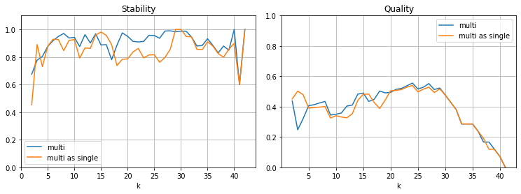
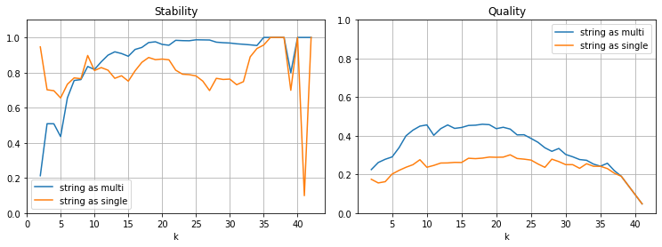

# Auswertung

## Datenset "Smartphone-Hüllen"

### Verarbeitung multi-kategorischer Attribute

| Name | Stabilität | Qualität | Erkennung: Generation | Modell |
|-|-:|-:|-:|-:|-:|
| multi            | $0.71$ | $0.44$ | $0.02$ | $0.04$ |
| multi als single | $0.61$ | $0.44$ | $0.00$ | $0.04$ |
: Clustering der Hüllen mit multi-kategorischem Attribut

| Name | Stabilität | Qualität | Erkennung: Generation | Modell |
|-|-:|-:|-:|-:|-:|
| strings als multi  | $0.91$ | $0.24$ | $0.01$ | $0.18$ |
| strings als single | $0.79$ | $0.15$ | $0.01$ | $0.08$ |
: Clustering der Hüllen mit String-Attributen

### Attribut-Auswahl

#### Vergleich nach Datentypen

#### Vergleich nach Erforderlichkeit

#### Vergleich nach menschlicher Auswahl

### Attribut-Gewichtung

## Datenset "Smartphones"

### Verarbeitung multi-kategorischer Attribute

| Name | Stabilität | Qualität | Erkennung: Generation | Modell | Duplikate | Ø |
|-|-:|-:|-:|-:|-:|-:|
| multi            | $90.5$% | $38.9$% | $39.8$% | $45.2$% | $89.2$% | $60.7$% |
| multi als single | $85.4$% | $38.5$% | $11.7$% | $30.0$% | $87.8$% | $50.7$% |
: Clustering der Smartphones mit multi-kategorischen Attributen

| Name | Stabilität | Qualität | Erkennung: Generation | Modell | Duplikate | Ø |
|-|-:|-:|-:|-:|-:|-:|
| strings als multi  | $88.2$% | $34.0$% | $64.3$% | $87.2$% |$100.0$% | $74.7$% |
| strings als single | $80.7$% | $23.7$% | $13.8$% | $58.6$% | $96.7$% | $54.7$% |
: Clustering der Smartphones mit String-Attributen

### Attribut-Auswahl

#### Vergleich nach Datentypen

#### Vergleich nach Erforderlichkeit

#### Vergleich nach menschlicher Auswahl

### Attribut-Gewichtung

## Kombiniertes Datenset

### Verwendung aller Attribute

### Verwendung gemeinsamer Attribute
