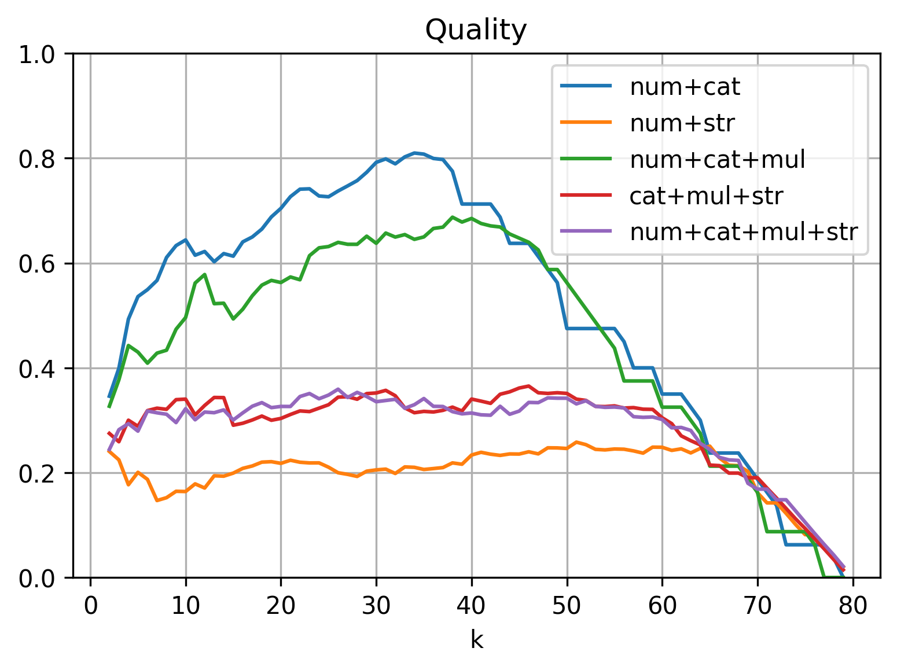

# Auswertung

## Datenset "Smartphone-Hüllen"

### Überblick

Das hergeleitete Clustering-Verfahren wurde zuerst auf die Smartphone-Hüllen des Datensets angewendet. Es enthält 80 verschiedene Produkte von 4 verschiedenen Herstellern. Die nachfolgende Tabelle zeigte einige Informationen zu den Attributen dieser Produktkategorie.

| Typ | Art | Anzahl | Ø non-`null` | Ø unique |
|-|-|-:|-:|-:|
| numerisch   | erf. | $1$ | $76.0$ |  $7.0$ |
|             | opt. | $5$ | $19.4$ |  $9.2$ |
| kategorisch | erf. | $3$ | $78.3$ |  $2.7$ |
|             | opt. | $8$ | $28.5$ |  $1.4$ |
| multi-kat.  | erf. | $1$ | $57.0$ | $10.0$ |
| string      | erf. | $4$ | $79.2$ | $69.2$ |
: Übersicht zu den Attributen der Smartphone-Hüllen

Die Smartphone-Hüllen zeichnen sich vor allem durch eine überschaubare Anzahl an 22 verschiedenen Attributen aus. In der Tabelle sind die Attribute nach ihrem Typen und der Erforderlichkeit (erforderlich oder optional) gruppiert dargestellt. Für jede Gruppe ist in der dritten Spalte die Anzahl an Attributen der entsprechenden Gruppe aufgeführt. Attribute, in denen keine einzige Wertausprägung in den Produkten vorkommt, sind bereits entfernt. Ebenso sind nur Attribute betrachtet worden, die mit dem hergeleiteten Verfahren verarbeitet werden können.

Die multi-kategorischen und String-Attribute sind allesamt erforderlich in dieser Produktgruppe. Für numerische und kategorische Werte existieren sowohl erforderliche als auch optionale Attribute.

Die Spalte "Ø non-`null`" gibt an, wie viele der $80$ Produkte im Schnitt in der jeweiligen Attribut-Art einen Wert ausweisen (also nicht `null` sind). Erforderliche Attribute liegen hier stets bei etwas unter $80$ mit Ausnahme des einen multi-kategorischen Attributs. Das heißt, dass die erforderlichen Attribute tatsächlich meistens mit Werten gefüllt sind – wenn auch nicht immer.

Die Spalte "Ø unique" gibt an, wie viele unterschiedliche Wertausprägungen im Schnitt in der jeweiligen Attribut-Art vorkommen. `null`-Werte zählen in diese Spalt nicht mit hinein. Besonders die String-Attribute weisen in praktisch jedem Produkt einen anderen Wert auf, was aber auch in der Natur dieser Attribut-Art liegt. Die multi-kategorischen und numerischen Attribute weisen im Schnitt knapp 10 unterschiedliche Wertausprägungen auf. Das liegt daran, dass das Datenset Hüllen für 11 verschiedene Smartphone-Modelle enthält. Die kategorischen weisen die geringste Vielfalt an unterschiedlichen Werten auf. Das erklärt sich daraus, dass viele dieser Attribute boolesche Werte in Akeneo sind.

### Verarbeitung multi-kategorischer Attribute

Da in der klassischen Clusteranalyse keine multi-kategorischen Attribute beschrieben sind, ist ein spezielles Verfahren zur Verarbeitung dieser Attribute erarbeitet worden. Diese Verarbeitung wird nun mit einem alternativen Ansatz verglichen. Dazu ist das Clustering nur mit dem einen multi-kategorischen Attribut (Material) im Datenset durchgeführt worden. Das erste Mal wurde die hergeleitete Verarbeitung verwendet. Beim zweiten Durchlauf sind alle multi-kategorischen Werte in kategorische umgewandelt worden (durch einfache Komma-separierte Verkettung). Die folgende Tabelle zeigt die berechneten Metriken zu beiden Clusterings:

| Verarbeitung | Stabilität | Qualität | Erkennung | |
|-|-:|-:|-:|-:|-:|
| | | | *Generation* | *Modell* |
| multi-kategorisch    | $0.71$ | $0.44$ | $0.02$ | $0.04$ |
| (single) kategorisch | $0.61$ | $0.44$ | $0.00$ | $0.04$ |
: Clustering der Hüllen mit einem multi-kategorischen Attribut

Die Ergebnisse beider Clusterings unterscheiden sich kaum voneinander. Lediglich die Stabilität ist mit der hergeleiteten Verarbeitungsart etwas höher. Insgesamt liegt die Stabilität aber recht niedrig, was daran liegen könnte, dass nur ein einziges Attribut für das Clustering verwendet worden ist mit ungefähr $10$ verschiedenen Wertausprägungen. Entsprechend sind viele Produkte komplett identisch zueinander, was zu einer schlechteren Stabilität führt. Die Qualität liegt auf einem mittleren Niveau und ist in beiden Versuchen identisch gewesen. Die Erkennung der Smartphone-Generation ($k=3$) und des -Modells ($k=11$) liegt faktisch bei $0$. Bei dem einen multi-kategorischen Attribut, welches hier verwendet wurde, handelt es sich um das Material. Das ist augenscheinlich kein gutes Attribut, um festzustellen, zu welchem Smartphone die entsprechende Hülle passt.

Als nächstes sind die gleichen Versuche mit den String-Attributen durchgeführt worden. Zuerst wurden die Strings also in Tokens umgewandelt und als multi-kategorische Attribute betrachtet und geclustert. Im zweiten Versuch blieben die Strings unverändert und wurden einfach direkt als kategorische Attribute angesehen.

| Name | Stabilität | Qualität | Erkennung | |
|-|-:|-:|-:|-:|-:|
| | | | *Generation* | *Modell* |
| Strings als multi-kat.  | $0.87$ | $0.20$ | $0.54$ | $0.16$ |
| Strings als single-kat. | $0.64$ | $0.15$ | $0.03$ |$-0.01$ |
: Clustering der Hüllen mit String-Attributen

Die Tabelle zeigt die Ergebnisse dieser Versuche. Für die Strings macht die Verarbeitung als "multi-kategorische" Attribute einen enormen Unterschied. Alle Metriken verbessern sich drastisch durch die hergeleitete Art der Verarbeitung. Das Aufteilen der Strings in Tokens und der anschließende Vergleich der Ähnlichkeit der auftretenden Tokens steigert vor allem die Erkennung der Smartphone-Generation. Bei den vier Attributen handelt sich um "Name", "Titel", "Short Description", "Short Summary". "Name" enthält eher willkürlich vergebene Zahlen- und Buchstabenkombinationen, die keinem erkennbaren Muster folgen. In den drei anderen Attributen steckt aber stets die jeweilige Smartphone-Generation, für welche die Hülle ausgelegt ist (also die Token "s20", "s21" und "s22"), was die hohe Erkennung erklärt.

Vor allem der zweite Versuch mit den String-Attributen legt nahe, dass das hergeleitete Verfahren für die Verarbeitung multi-kategorischer Attribute, sinnvolle Ergebnisse für die Clusteranalyse bringen und einen alternativen Ansatz für die Verarbeitung von String-Werten darstellen kann.

### Attribut-Auswahl

Als nächstes geht es darum, dass hergeleitete Clustering-Verfahren als ganzes zu bewerten. Dabei geht es auch um die Auswahl an Attributen. Eventuell funktioniert das Verfahren besser, wenn nur Attribute eines bestimmten Types verwendet werden etc. In allen Versuchen mit den multi-kategorischen und String-Attributen ist von hier an die hergeleitete Verarbeitung verwendet worden.

#### Vergleich nach Datentypen

Zuerst ist geprüft worden, ob bestimmte Typen von Attributen und Typen-Kombinationen besser für das Clustern des Datensets geeignet sind als andere. Insgesamt gibt es ja vier verschiedene Typen (numerisch, kategorisch, multi-kategorisch und Strings). Das Clustering wurde nun in allen möglichen Kombinationen an Attribut-Typen durchgeführt. Also zuerst wurden nur die numerischen Attribute für das Clustering verwendet, dann nur die kategorischen usw. Im letzten Durchlauf wurden schließlich alle Attribut-Typen benutzt.

Zuerst werden die Ergebnisse des Clusterings mit jeweils einem Attribut-Typ betrachtet. Die folgende Tabelle zeigt diese Ergebnisse:

| Typen | Stabilität | Qualität | Erkennung | |
|-|-:|-:|-:|-:|-:|
| | | | *Generation* | *Modell* |
| numerisch   | 0.85 | 0.43 | 0.15 | 0.45 |
| kategorisch | 0.44 | 0.39 | 0.08 | 0.12 |
| multi-kat.  | 0.71 | 0.44 | 0.02 | 0.04 |
| string      | 0.87 | 0.20 | 0.54 | 0.16 |
: Clustering der Hüllen mit jeweils einem Attribut-Typ

Die ausschließliche Verwendung numerischer Attribute liefert adäquate Werte für Stabilität und Qualität. In der Erkennung der passenden Smartphone-Generation erreicht diese Attribut-Gruppe im Vergleich sogar die besten Ergebnisse, wenn auch ein Wert von $0.45$ keine sonderlich gute Übereinstimmung anzeigt.

Die kategorischen Attribute enthalten viele `null`-Values und insgesamt sehr wenig verschiedene Wertausprägungen, was die schlechten Werte auf allen Metriken erklärt. In Kombination mit anderen Attributen könnte diese Gruppe das Clustering positiv beeinflussen. Für sich alleine genommen, eigenen sie sich aber nicht für eine effektive Clusteranalyse.

Zu dem einen multi-kategorischen Attribut (Material) wurde im vorherigen Abschnitt ausführlich analysiert, warum die Erkennungsfähigkeit hier nahe $0$ liegt. Die Stabilität ist eher mittelmäßig, die Qualität liegt aber von allen Typen hier am höchsten.

Die Strings liefern die interessantesten Ergebnisse, da sie sehr ambivalent sind. Für die Stabilität wurde hier der höchste und für die Qualität der niedrigste Wert erreicht. Die Erkennung der zur Hülle gehörenden Smartphone-Generation liefert eine im Vergleich recht hohe Übereinstimmung (was ebenfalls im vorherigen Abschnitt bereits diskutiert worden ist), die Erkennung des passenden Smartphone-Modells ist wiederum sehr schlecht.

Für sich alleine genommen scheint keine Attribut-Art sinnvolle Cluster zu produzieren. Daher werden als nächstes die Clusterings mit den verschiedenen Kombinationen von Attribut-Typen betrachtet. Da es hier sehr viele mögliche Paarungen gibt, zeigt die folgende Tabelle nur eine Auswahl der Versuche. I.d.R. sind die Versuche ausgewählt worden, welche in mindestens einer der Metriken den höchsten Wert errungen hat.

| Typen | Stabilität | Qualität | Erkennung | |
|-|-:|-:|-:|-:|-:|
| | | | *Generation* | *Modell* |
| num+kat     | 0.88 | **0.52** | 0.09 | 0.26 |
| num+str     | 0.86 | 0.20 | 0.14 | **0.46** |
| num+kat+mul | 0.93 | 0.46 | **0.18** | 0.22 |
| kat+mul+str | **0.94** | 0.29 | 0.09 | 0.10 |
| alle        | 0.92 | 0.29 | 0.12 | 0.25 |
: Clustering der Hüllen mit verschiedenen Kombinationen an Attribut-Typen

Interessant ist, dass es keine "überlegene Auswahl" an Attributen gibt, sondern je nach Metrik eine andere Kombination am besten abschneidet.

Für die Stabilität lässt sich feststellen, dass sich die Verwendung von möglichst vielen Attribut-Typen positiv auf diese Metrik auswirkt. Für die Qualität gilt dies allerdings nicht. Hier scheinen sich die Werte zu verschlechtern, sobald die String-Attribute Teil der Auswahl sind. Werden sie weggelassen, liegt die Qualität im Schnitt doppelt so hoch.

Die Übereinstimmung mit den zu den Hüllen gehörenden Smartphone-Generationen und Modelle ist in allen Versuchen sehr schlecht. In den Clusterings mit jedem Attribut-Typ allein (siehe vorherige Tabelle) konnten die numerischen am besten die Modelle erkennen und die Strings die Generationen. Die Kombination beider Attribut-Arten liefert immer noch eine recht gute Erkennung der Modelle, aber die Generationen werden nun nicht mehr richtig zugeordnet. Generell kann keine Kombination an Attributen die Generationen so zuverlässig erkennen, wie die String-Attribute für sich alleine genommen.

Die schlechte Erkennung führte zu der Erkenntnis, dass aus den Attributen der Smartphone-Hüllen wohl eher schwierig abzuleiten ist, zu welchen Smartphones sie passen. Eine Analyse der vorkommenden Attribute bestätigt diese Annahme: Unter den Attributen gibt es lediglich "Brand compatibility" (wobei hier nur "Samsung" als einziger Wert auftritt), "Maximum Screen Size" und eventuell "Height", "Width", "Depth", welche Rückschlüsse zu den passenden Smartphones bieten. Andere Attribute wie das beschriebene "Material" oder "Number of Card Pockets" bilden hingegen ganz andere Eigenschaften ab.

Daher wird die Erkennungsfähigkeit erst einmal nicht weiter betrachtet und stärkerer Fokus auf die Stabilität und Qualität gelegt.

{width=70%}

Abbildung \ref{fig:casesstab} zeigt die Stabilität der verschiedenen Typ-Kombinationen über die verschiedenen Hierarchie-Ebenen ($k$) des Clusterings.

Die Kombination aus numerischen und kategorischen Attributen erreicht auf den ersten Ebenen bis $k=38$ die höchste Stabilität, verschlechtert sich in den nachfolgenden Stufen aber drastisch. Die Kombinationen, welche auch String-Attribute enthalten, verhalten sich eher gegenteilig. Die Stabilität ist auf den niedrigeren Ebenen schlechter und gegen Ende des Top-down-Clusterings deutlich stabiler. Dieses Phänomen lässt sich mit der Menge an unterschiedlichen Wertausprägungen der Attribut-Typen erklären. Faktisch jeder String ist anders, dadurch sind die Clusterzuordnungen gegen Ende besonders deterministisch, da sich die Strings immernoch in Nuancen voneineander unterscheiden (dank der Verarbeitung als multi-kategorische Attribute). Die Produkte sind sich aber in den numerischen und kategorischen Attribute ab einer bestimmten Feinheit des Clusterings faktisch deckungsgleich (aufgrund der geringen Vielfalt an unterschiedlichen Wertausprägungen).

In der Praxis sind die oberen Ebenen der Hierarchie interessanter als die vielen kleinen Cluster gegen Ende. Daher ist die Kombination aus numerischen und kategorischen Attributen in dieser Betrachtung als die beste anzusehen.

{width=70%}

Abbildung \ref{fig:casesqual} zeigt die Qualität (also den Silhouetten-Koeffizienten) der Clusterings für die verschiedenen Ebenen ($k$). Je näher die Anzahl an Clustern an die Anzahl aller Produkte kommt, desto geringer sinkt dieser Koeffizient für alle Versuche. Das liegt daran, dass viele Punkte sehr nahe zueinander liegen, aber dennoch in unterschiedliche Cluster sortiert werden müssen (aufgrund des hierarchischen Verfahrens). Die CLuster sind somit immer schlechter voneinander getrennt (da sie faktisch "aufeinander" liegen) und die Qualität sinkt auf $0$.

Es ist eindeutig zu sehen, dass String-Attribute die Qualität sehr negativ beeinflussen. Alle Kombinationen, in denen auch die Strings verarbeitet worden sind, liefern durch die Ebenen hinweg schlechte Werte. Die Kombinationen ohne Strings sind bis zu $k=65$ stets deutlich besser bewertet. Wie bereits erwähnt, sind die hohen Hierarchie-Ebenen weniger interessant in der Praxis. Dadurch ist Verwendung der Strings im Clustering für dieses Datenset nicht zu empfehlen.

#### Zusätzliche Erkenntnisse aus den Versuchen

Am Ende des vorherigen Abschnittes ist die Qualität des Clusterings mithilfe des Silhouetten-Koeffizienten analysiert worden. Dieser Koeffizient kann genutzt werden, um die "optimale" Anzahl an Clustern zu finden. Dazu wird analysiert, für welche Anzahl an Clustern, der Koeffizient seine maximalen Werte annimmt. An diesem Punkt in der Hierarchie ist folglich die Trennung der Cluster am schärfsten.

In Abbildung \ref{fig:casesqual} ist zu erkennen, dass die Kombination aus numerischen und kategorischen Attributen ihre höchsten Werte in der Qualität zwischen $k=20$ und $k=40$ erreicht. Dadurch kam eine Vermutung auf: Vielleicht liegen die Ergebnisse für die Erkennung der Smartphone-Generation und -Modelle deshalb so niedrig, weil sich die Hüllen verschiedener Hersteller (für das gleiche Gerät) zu stark unterscheiden. U.U. ist es sinnvoller die Hüllen zuerst nach Hersteller zu gruppieren und anschließend das Clustering auf die Generationen und Modelle zu prüfen.

Die Clusterings wurden deshalb erneut auf die Erkennungsfähigkeit überprüft. Dazu wurden die Produkte auf verschiedene Arten gruppiert. Zuerst erfolgte die Gruppierung nach Hersteller ($k=4$), danach nach Hersteller und Smartphone-Generation ($k=8$) zusammen und schließlich nach Hersteller und Smartphone-Modell ($k=25$) zusammen. Die Übereinstimmung der Clusterings mit diesen Gruppierung wurde anschließend mit dem Adjusted-Rand-Index quantifiziert. Die folgenden Tabelle zeigt die Ergebnisse für ausgewählte Typen-Kombinationen:

| Typen | Hersteller | Generation | Modell |
|-|-:|-:|-:|
| | $k=4$ | $k=8$ | $k=25$ |
| numerisch   | 0.32 | 0.17 | 0.27 |
| kategorisch | 0.71 | 0.61 | 0.31 |
| multi-kat.  | 0.26 | 0.35 | 0.16 |
| string      | 0.04 | 0.43 | 0.48 |
| num+kat     | **0.76** | **0.65** | **0.61** |
| num+str     | 0.34 | 0.44 | 0.60 |
| num+kat+mul | 0.55 | 0.56 | 0.55 |
| kat+mul+str | 0.73 | 0.52 | 0.31 |
| alle        | 0.69 | 0.63 | 0.55 |
: Übereinstimmung für die Einteilung der Cluster auf Basis der Hersteller

Die Übereinstimmung mit dieser Art der Gruppierung liegt deutlich höher als mit der ursprünglich angenommenen (wo die Hersteller der Hüllen nicht berücksichtigt worden sind). Die Kombination aus numerischen und kategorischen Attributen erreicht für alle Ebenen die höchste Erkennungsfähigkeit.

Damit wird der entstandene Eindruck, dass die numerischen und kategorischen Attributen in Kombination am besten für das Clustering der Produkte geeignet sind, weiter untermauert. Durch das Clustering mit diesen Attributen ist erkannt worden, dass die Hüllen der Hersteller zueinander unterschiedlicher sind als, für welches Smartphone die jeweilige Hülle geeignet ist. Wird diese erste Ebene (Hersteller) berücksichtigt, tritt anschließend die angenommene Struktur wieder zutage. Produkte des selben Herstellers werden tatsächlich nach ihrer passenden Smartphone-Generation und -Modell geclustert. Die Übereinstimmung liegt mit $0.65$ bzw. $0.61$ zwar nicht überragend hoch, aber es wurde bereits geklärt, dass viele Attribute in den Hüllen generell weniger Rückschluss über die passenden Smartphones liefern.

#### Vergleich nach Erforderlichkeit

Nachdem die numerischen und kategorischen Attribute als beste Typen-Kombination identifiziert worden sind, stellt sich die Frage, ob sich die Metriken weiter verbessern lassen. Ein Ansatz dabei ist, die Informationen zu nutzen, welche bereits in Akeneo hinterlegt sind. In den "Families" können Attribute als erforderlich oder optional gekennzeichnet werden, was einen enormen Einfluss auf die Menge an auftretenden `null`-Values hat. Im folgenden wird analysiert, ob die Unterscheidung zwischen erforderlichen und optionalen Attributen Einfluss auf das Clustering hat.

Dazu sind zwei weitere Clusterings mit den numerischen und kategorischen Attributen durchgeführt worden. Einmal wurden nur erforderliche und einmal nur optionale Attribute verwendet. Die Ergebnisse werden nun mit dem Clustering mittels beider Arten verglichen.

{width=70%}

Abbildung \ref{fig:casesreqstab} zeigt die Stabilität für verschiedene Werte für $k$. Sobald entweder nur erforderliche oder nur optionale Attribute genutzt werden, liegt die Stabilität im Schnitt niedriger und schwankt stärker über die verschiedenen Ebenen. In Bezug auf die Stabilität ist die reduzierte Auswahl von Attributen nach ihrer Erforderlichkeit also nicht zu empfehlen.

{width=70%}

Abbildung \ref{fig:casesreqqual} zeigt die Qualität für die verschiedenen Hierarchie-Ebenen. Wenig überraschend liefern nur optionale Attribute insgesamt eine schlechtere Qualität, da es hier weniger feine Unterschiede zwischen den Produkten gibt. Im Bereich $k=8$ bis $k=25$ produzieren die erforderlichen Attribute bessere Cluster als die Verwendung aller Attribute. Nach $k=25$ sind sie aber stets schlechter bewertet. Hieraus kann keine eindeutige Empfehlung gegeben werden.

Zuletzt sei auch die modifizierte Erkennungsfähigkeit nach Hersteller betrachtet. Die folgenden Tabelle zeigt die Übereinstimmung mit der gewünschten Clustereinteilung:

| Auswahl | Hersteller | Generation | Modell |
|-|-:|-:|-:|
| | $k=4$ | $k=8$ | $k=25$ |
| alle     | 0.76 | 0.65 | 0.61 |
| nur erf. | 0.51 | 0.27 | 0.59 |
| nur opt. | 0.72 | 0.61 | 0.27 |
: Übereinstimmung für die Einteilung der Cluster auf Basis der Hersteller nach Erforderlichkeit

Auch in diesem Vergleich ergibt sich kein Vorteil, durch die Beschränkung auf ausschließlich erforderliche oder optionale Attribute.

#### Vergleich nach menschlicher Auswahl {#cases-select}

Bisher ist das Clustering relativ "pauschal" durchgeführt worden. Also es wurden einfach alle Attribute eines bestimmten Typs bzw einer bestimmten Typen-Kombination etc. für das Clustering verwendet. In der Praxis werden meistens bestimmte Ziele mit der Clusteranalyse verfolgt. Bspw. wird mit den Metriken zur Erkennungsfähigkeit geprüft, ob Hüllen, welche zu den gleichen Smartphones passen, auch in gleichen Clustern landen. Wie bereits erwähnt, enthalten die Hüllen aber viele Attribute, welche für diese Erkennung inhaltlich keinen Mehrwert liefern (wie das z.B. Material). Daher soll nun geprüft werden, ob eine "schlaue" Auswahl der Attribute, eher die erwarteten Cluster produziert.

Um den Rahmen dieser Arbeit nicht zu sprengen, ist die Auswahl aus der Einschätzung des Autors erfolgt. Die folgende Tabelle zeigt die gewählten Attribute:

| Name | Typ | erforderlich | non-`null` | unique |
|-|-|-|-:|-:|
| Title               | string      | ja   | 80 | 80 |
| Maximum screen size | numerisch   | ja   | 76 |  7 |
| Width               | numerisch   | nein | 24 | 12 |
| Height              | numerisch   | nein | 24 | 11 |
| Depth               | numerisch   | nein | 24 | 11 |
| Brand compatibility | kategorisch | ja   | 79 |  1 |
| Case type           | kategorisch | ja   | 76 |  3 |
: Ausgewählte Attribute für das Clustering der Hüllen

Die numerischen Attribute bilden die Abmessungen der Hüllen ab, was ein entscheidender Faktor ist, ob die Hülle zum jeweiligen Smartphone passt. Die "Brand compatibility" ist zwar inhaltlich sinnvoll, da das Datenset aber nur Hüllen für Smartphones von Samsung enthält, ist der Mehrwert dieses Attributs begrenzt. "Title" und "Case type" wurden als sinnvolle Ergänzungen zu den numerischen Attributen ausgewählt.

Abbildung \ref{fig:casesselect} zeigt die Stabilität und Qualität des Clusterings mit den ausgewählten Attributen im Vergleich zu der Kombination aus allen numerischen und kategorischen Attributen. Die Stabilität ist bis $k=24$ bei beiden etwa gleich hoch, danach wird die händische Auswahl deutlich instabiler. Die Qualität der menschlichen Auswahl liegt bis $k=24$ deutlich über dem bisher besten Clustering-Ansatz. Danach ist die Qualität ebenfalls durchweg schlechter.

Da in der Praxis vor allem die Ergebnisse für die niedrigen Werte von $k$ entscheidend sind, könnte die Vorauswahl von Attributen tatsächlich bessere Cluster im relevanten Bereich erzeugen. Für eine finale Entscheidung wird nun die modifizierte Erkennungsfähigkeit nach Herstellern betrachtet.

| Attribute | Hersteller | Generation | Modell |
|-|-:|-:|-:|
| | $k=4$ | $k=8$ | $k=25$ |
| num+kat | 0.76 | 0.65 | 0.61 |
| Auswahl | 0.17 | 0.12 | 0.27 |
: Übereinstimmung für die Einteilung der Cluster auf Basis der Hersteller für die menschliche Auswahl von Attributen

Die Tabelle zeigt eindeutig, dass die erwartete Erkennung der zu den Hüllen passenden Smartphones durch die menschliche Auswahl an Attributen nicht verbessert wird. Alle Werte sind deutlich schlechter, als wenn pauschal alle numerischen und kategorischen Attribute verwendet werden. Es sind anschließend noch weitere Versuche durchgeführt worden, wo bspw. nur die ausgewählten numerischen Attribute für das Clustering verwendet worden etc. Aber keine Form der händischen Auswahl an Attributen hat bessere Ergebnisse geliefert als der Pauschalansatz.

### Attribut-Gewichtung

Als finaler Ansatz ist mit verschiedenen Gewichtungen der Attribute gearbeitet worden. Dazu sind die Attribute, welche ein höheres Gewicht erhalten sollten, im Datenset entsprechend dupliziert (also mehrfach) eingefügt worden. Anschließend wurde wieder wie gewohnt das Clustering durchgeführt und die entsprechenden Metriken erhoben.

| Attribute | Gewichtung | Stabilität | Qualität | Erkennung |
|-|-|-:|-:|-:|-:|-:|
| | | | | *Hersteller* | *+Generation* | *+Modell* |
| num+kat | gleichgew.  | 0.88 | 0.52 | 0.76 | 0.65 | 0.61 |
| alle | mensch.Ausw. x2 | 0.90 | 0.26 | 0.43 | 0.49 | 0.57 |
| alle | mensch.Ausw. x3 | 0.89 | 0.26 | 0.43 | 0.33 | 0.55 |
| num+kat | mensch.Ausw. x2 | 0.85 | 0.50 | 0.43 | 0.43 | 0.63 |
| num+kat | mensch.Ausw. x3 | 0.83 | 0.49 | 0.43 | 0.43 | 0.67 |
: Clustering der Hüllen mit verschiedenen Gewichtungen der Attribute

Die Tabelle zeigt die Ergebnisse der Versuche mit verschiedenen Gewichtungen. Die erste Zeile zeigt die Ergebnisse für das bekannte Clustering mit numerischen und kategorischen Attributen ohne irgendeine Übergewichtung. Das ist die Referenz, die es zu überbieten gilt.

In Zeile zwei und drei sind für das Clustering alle Attribute verwendet worden. Zusätzlich sind die Attribute aus dem Abschnitt [menschliche Auswahl](#cases-select) doppelt bzw. dreifach gewichtet worden. Dieses Vorgehen brachte eine geringfügig bessere Stabilität, alle anderen Metriken haben sich dadurch allerdings verschlechtert.

In den letzten beiden Zeilen sind die numerischen und kategorischen Attribute für das Clustering verwendet worden, mit zusätzlicher Doppelt- bzw. Dreifachgewichtung der Attribute aus der menschlichen Auswahl. Auch hier sind alle Metriken schlechter als bei der Gleichgewichtung mit Ausnahme der Erkennung der Smartphone-Modelle, welche geringfügig besser geworden ist.

Insgesamt lässt sich durch die Übergewichtung von Attributen kein Vorteil für das Clustering erkennen.

## Datenset "Smartphones"

### Überblick

| Typ | Art | Anzahl | Ø non-`null` | Ø unique |
|-|-|-:|-:|-:|
| numerisch   | erf. |  $8$ | $41.1$ |  $5.4$ |
|             | opt. | $48$ | $18.5$ |  $3.5$ |
| kategorisch | erf. | $19$ | $37.9$ |  $1.6$ |
|             | opt. | $87$ | $26.1$ |  $1.2$ |
| multi-kat.  | erf. |  $3$ | $38.7$ |  $7.0$ |
|             | opt. | $19$ | $23.1$ |  $2.9$ |
| string      | erf. |  $5$ | $40.8$ | $24.0$ |
|             | opt. |  $6$ | $18.0$ |  $4.8$ |
: Übersicht zu den Attributen der Smartphones

### Verarbeitung multi-kategorischer Attribute

| Verarbeitung | Stabilität | Qualität | Erkennung | | |
|-|-:|-:|-:|-:|-:|
| | | | *Generation* | *Modell* | *Duplikate* |
| multi-kategorisch    | 0.91 | 0.39 | 0.40 | 0.45 | 0.89 |
| (single) kategorisch | 0.85 | 0.38 | 0.12 | 0.30 | 0.88 |
: Clustering der Smartphones mit multi-kategorischen Attributen

=> alle multi-kat

| Verarbeitung | Stabilität | Qualität | Erkennung | | |
|-|-:|-:|-:|-:|-:|
| | | | *Generation* | *Modell* | *Duplikate* |
| Strings als multi-kat.  | 0.91 | 0.34 | 0.64 | 0.87 | 1.00 |
| Strings als single-kat. | 0.80 | 0.23 | 0.14 | 0.58 | 1.00 |
: Clustering der Smartphones mit String-Attributen

### Attribut-Auswahl

#### Vergleich nach Datentypen

| Typen | Stabilität | Qualität | Erkennung | | |
|-|-:|-:|-:|-:|-:|
| | | | *Generation* | *Modell* | *Duplikate* |
| numerisch   | 0.88 | 0.43 | 0.01 | 0.75 | 0.96 |
| kategorisch | 0.96 | 0.45 | 0.65 | 0.49 | 0.81 |
| multi-kat.  | 0.91 | 0.39 | 0.40 | 0.45 | 0.89 |
| string      | 0.91 | 0.34 | 0.64 | 0.87 | 1.00 |
: Clustering der Smartphones mit jeweils einem Attribut-Typ

| Typen | Stabilität | Qualität | Erkennung | | |
|-|-:|-:|-:|-:|-:|
| | | | *Generation* | *Modell* | *Duplikate* |
| num+kat     | 0.98 | **0.43** | **0.65** | 0.71 | 0.96 |
| num+mul     | 0.94 | 0.39 | 0.16 | 0.70 | **1.00** |
| kat+str     | **0.99** | 0.40 | **0.65** | 0.42 | 0.94 |
| num+kat+str | 0.98 | 0.41 | **0.65** | 0.66 | 0.96 |
| num+mul+str | 0.92 | 0.37 | 0.16 | 0.70 | **1.00** |
| alle        | 0.92 | 0.39 | 0.16 | 0.70 | **1.00** |
: Clustering der Smartphones mit verschiedenen Kombinationen an Attribut-Typen

#### Vergleich nach Erforderlichkeit

| Auswahl | Stabilität | Qualität | Erkennung | | |
|-|-:|-:|-:|-:|-:|
| | | | *Generation* | *Modell* | *Duplikate* |
| alle     | 0.98 | 0.43 | 0.65 | 0.71 | 0.96 |
| nur erf. | 0.91 | 0.42 |-0.04 | 0.61 | 0.89 |
| nur opt. | 0.93 | 0.45 | 0.65 | 0.60 | 0.94 |
: Clustering der Smartphones mit erforderlichen und optionalen Attributen

#### Vergleich nach menschlicher Auswahl

| Name | Typ | erforderlich | non-`null` | unique |
|-|-|-|-:|-:|
| Rear camera resolution (numeric)  | numerisch   | ja   | 42 |  4 |
| Front camera resolution (numeric) | numerisch   | ja   | 42 |  3 |
| Display diagonal                  | numerisch   | ja   | 42 |  8 |
| Pixel density                     | numerisch   | nein | 37 | 11 |
| Weight                            | numerisch   | ja   | 40 | 11 |
| Height                            | numerisch   | nein | 40 | 11 |
| Width                             | numerisch   | nein | 40 |  8 |
| Depth                             | numerisch   | nein | 40 |  7 |
| Platform                          | kategorisch | ja   | 40 |  1 |
| Operating system installed        | kategorisch | ja   | 36 |  3 |
| Mobile network generation         | kategorisch | ja   | 40 |  2 |
| Native aspect ratio               | kategorisch | nein | 19 |  3 |
| Title                             | string      | ja   | 42 | 38 |
: Ausgewählte Attribute für das Clustering der Smartphones

### Attribut-Gewichtung

| Attribute | Gewichtung | Stabilität | Qualität | Erkennung |
|-|-|-:|-:|-:|-:|-:|
| | | | | *Generation* | *Modell* | *Duplikate* |
| num+kat | gleichgew.  | 0.98 | 0.43 | 0.65 | 0.71 | 0.96 |
| alle | mensch.Ausw. x2 | 0.95 | 0.39 | 0.72 | 0.70 | 1.00 |
| alle | mensch.Ausw. x3 | 0.94 | 0.39 | 0.72 | 0.70 | 1.00 |
| num+kat | mensch.Ausw. x2 | 0.96 | 0.42 | 0.52 | 0.73 | 0.96 |
| num+kat | mensch.Ausw. x3 | 0.93 | 0.41 | 0.52 | 0.67 | 0.97 |
: Clustering der Smartphones mit verschiedenen Gewichtungen der Attribute

## Kombiniertes Datenset

### Verwendung aller Attribute

| Attribute | Stabilität | Qualität | Erkennung | | | |
|-|-:|-:|-:|-:|-:|-:|
| | | | *Familie* | *Generation* | *Modell* | *Duplikate* |
| num+kat                   | 0.80 | 0.49 | 1.00 | 0.59 | 0.66 | 0.97 |
| alle & mensch.Ausw. x2    | 0.95 | 0.33 | 1.00 | 0.79 | 0.71 | 0.97 |
| num+kat & mensch.Ausw. x2 | 0.91 | 0.49 | 1.00 | 0.71 | 0.70 | 0.97 |
| strings                   | 0.88 | 0.26 | 1.00 | 0.61 | 0.58 | 1.00 |
: Clustering des gesamten Datensets

{width=70%}

{width=70%}

### Verwendung gemeinsamer Attribute

Übereinstimmung mit Generationen 0.04, Modelle 0.16

{width=70%}
